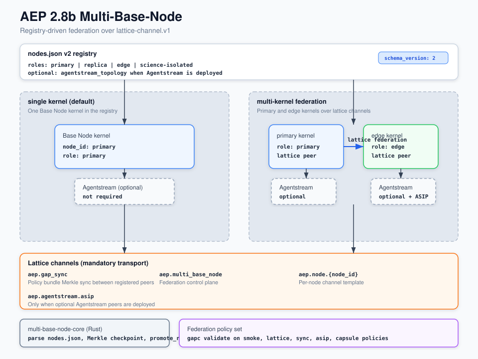

# Multi-Base-Node (2.8b)

**Status:** optional experimental surface. It is not part of the default build and it is not part of the default deployment. The default workspace member is the single Base Node kernel, so a plain build compiles that kernel only. Build or test this crate on purpose with the command in the Build section below.

Federate multiple AEP Base Node kernels from one `nodes.json` v2 registry.

## Architecture



Source: [`docs/multi-base-node-28b-architecture.svg`](./docs/multi-base-node-28b-architecture.svg)

## Component layout

| Path | Contents |
| --- | --- |
| `crate/` | `multi-base-node-core` Rust crate (registry, Merkle sync, failover helpers) |
| `docs/multi-base-node-28b.md` | Feature guide |
| `docs/multi-base-node-28b-architecture.svg` | Architecture diagram |
| `docs/multi-base-node-artifact-manifest.json` | Shipped artifact list |

## Registry files (Base Node kernel)

| Path | Purpose |
| --- | --- |
| `../AEP-Registry/nodes.json` | Example registry |
| `../AEP-Registry/schemas/nodes-registry-v2.json` | JSON schema v2 |
| `../AEP-Registry/profiles/as-single-polar.json` | Single-node default profile |

## Build

```bash
cargo test -p multi-base-node-core
```

That command is the only thing that builds the crate. Nothing in the default path depends on it, and no default run uses it.

Agentstream is optional. Federation uses lattice-channel.v1 transport.