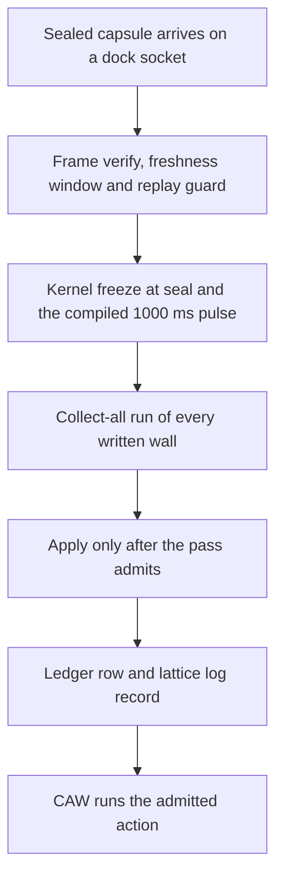

# AEP Base Node

Mandatory local governance **kernel** for every AEP 2.8 installation.

Lives at the **repository root** (`AEP-Base-Node/`), not under `AEP-Components/`. Every other component docks into Base Node; it is not a palette component.

## Architecture shape

The Base Node is a pyramid with its tip cut off. Each plane carries the one above it, so the planes widen downward. The tip is cut off because the kernel pass does not sit above the tree as an authority. It is the floor that every component docks into.

```text
            /                                            \
           /           intake and dock plane            \
           +--------------------------------------------+
         /                                                  \
        /                kernel pulse pass                 \
        +--------------------------------------------------+
      /                                                        \
     /                        wall set                        \
     +--------------------------------------------------------+
   /                                                              \
  /                         record plane                         \
  +--------------------------------------------------------------+
```

The four planes, top to bottom:

| Plane | What it carries |
|-------|-----------------|
| Intake and dock plane | Docking listeners on the inference, validation, regulation and future sockets, sealed frame verify, the freshness window, the replay guard and side channel events |
| Kernel pulse pass | Freeze at seal, the compiled 1000 ms pulse and one collect-all run of every written wall |
| Wall set | Agent permission, lattice membership, writing walls, temporal bounds, envelope walls and wall set back pressure |
| Record plane | The runtime ledger, which is the SQLite lattice log, plus derived ledger rows and the component registry |

The path a frame takes through those planes:



The executor after admit is CAW at AEP-CAW/.

## What lives here

Base Node **is** the local agent control kernel. Governance code, registry, mesh and the Hub crate live under `AEP-Base-Node/`:

| Module | Path | Role |
|--------|------|------|
| Docking servers | `AEP-Crate/src/docking/` | The facade `mod.rs` with the children serve, apply, pulse, freshness and rate for the inference, validation, regulation and future Unix sockets |
| Runtime parts | `AEP-Crate/src/dock_parts.rs` | DockingRuntime as five owned parts named io, keys, defence, admit and record |
| Dock keys | `AEP-Crate/src/dock_keys.rs` | Facade over `dock_keys_store.rs` for load, permissions and the refusal of a silent regen and `dock_keys_provision.rs` for the operator mint and the first mint of the data-dock key. Secret files are mode 0600 |
| Official log | `AEP-Crate/src/dock_log.rs` | The one aep-base-node log with a closed set of event ids and redaction of keys, seal material and grants |
| Task manifests | `AEP-Crate/src/task_manifest.rs` | UCB agent contracts (`AEP_TASK_MANIFEST_DIR`) |
| CORRECTWRITING_EN kernel | `AEP-Crate/src/correctwriting_en.rs` | writing.gap enforcement (`no_em_dashes`, `no_en_dashes`, `no_dash_substitutes`, `no_minus_as_dash`, `no_double_hyphen`, `no_oxford_comma`) |
| Side-channel monitor | `AEP-Crate/src/side_channel_monitor.rs` | Anomaly events on validation dock |
| Runtime ledger | `AEP-Crate/src/lattice_log.rs` | The one named runtime ledger. dynAEP event export over the `action-lattice.db` store plus the `aep-lattice-log` CLI. Every other ledger surface is a derived view or a capability |
| Data Dock HTTP | `AEP-Crate/src/data_dock.rs` | JSON on 8413 over already-admitted lattice records where frontend writes are sealed on the server and then enter the four existing docks. See [`DATA-DOCK.md`](../AEP-User-Experience/docs/DATA-DOCK.md) |
| Agent Control Hub | `AEP-Agent-Control-Hub/crate` | Kernel extension. The daemon loads the crate and binds GAP session, mount and agent-permission state. |

Register new components in **`AEP-Base-Node/AEP-Registry/catalog.json`** + **`AEP-Base-Node/AEP-Registry/components/*.json`**. See [`AEP-Registry/README.md`](AEP-Registry/README.md) for manifest schema and error categories.

## Component layout

| Path | Contents |
|------|----------|
| `AEP-Crate/` | `aep-base-node` Rust crate + `aep-lattice-log` CLI binary. Nested rust leaf crate/ under a product stays. |
| `AEP-Docks/` | Live dock products ucb and universal-connect. Spec table names kernel admit dock. |
| `AEP-Potomitan/` | POTOMITAN mesh peer registry (`aep-potomitan` crate) |
| `AEP-Multi-Base-Node/` | Multi-base-node (2.8b) mode: federate multiple Base Node kernels (optional experimental surface, not in the default build) |
| `AEP-Registry/` | Component catalog + manifests (`catalog.json`, `components/*.json`) |
| `AEP-Agent-Control-Hub/` | Kernel extension. The daemon loads the crate and binds GAP session, mount and agent-permission state. |

## Docking ports

| Port | Path suffix | Priority |
|------|-------------|----------|
| Inference Engine | `/inference` | High |
| kernel admit | `/validation` | High |
| Future Features (reserved internal) | `/future` | High |
| Regulation Module (LRPs) | `/regulation` | Medium |

All traffic uses Lattice Channels with PQEncryptedCapsule encryption.

## Kernel pulse

Two compiled clocks live in `aep-base-node-pulse`. Pulse hold is the wait after a sealed capsule (the encrypted frame on the wire) is opened: Base Node freezes the clock at seal, waits 1000 ms, then runs every check together and only then carries out the allowed action. Putting a capsule on the dock is not that check because after the wait the client asks for the result by the capsule hash so a deny names the closed walls and an allow returns an event id. Allowed clock drift is 50 ms against the freeze which is why a 1000 ms hold still meets drift while a capsule held longer than 5000 ms is aged out.

Wire sent_at freshness is the other clock. Before open, `frame_is_fresh` checks `sent_at_unix` against `MAX_FRAME_AGE_SECS` (300) and `MAX_FRAME_FUTURE_SKEW_SECS` (60). The wire window is wider because it covers transit before open while pulse age covers hold after freeze so five seconds of pulse age is not the 300 second wire window.

The wait is the compiled constant `PULSE_MS` in `AEP-Components/base-node-pulse/crate`. Wire constants `MAX_FRAME_AGE_SECS` and `MAX_FRAME_FUTURE_SKEW_SECS` are compiled beside it. There is no environment variable and no `pulse_ms` key in `dynaep-config.yaml`. TypeScript dynAEP remains a standalone component and does not own this wait. The 1000 ms figures in dynAEP timekeeping are NTP slew bounds and LARGE_STEP clock-sync caps rather than the kernel wait so LARGE_STEP must not be treated as this wait.

### How the wait can be changed in theory

A builder who wants a different wait edits the compiled `PULSE_MS` constant and rebuilds Base Node. Freeze-at-seal must stay so the hold is judged against the freeze rather than a moving clock. Allowed drift must not be set to the wait length: crate tests require `MAX_DRIFT_MS != PULSE_MS` and reject a 1000 ms drift default so `MAX_DRIFT_MS` must not be set to 1000. Age must stay longer than the wait because if `PULSE_MS` were greater than `MAX_AGE_MS` (5000) capsules would expire before they became ready so pulse age 5000 must not be replaced with 300 seconds. Current crate tests also pin `PULSE_MS == 1000` so a theoretical rebuild must update those pins. This is a kernel rebuild rather than a yaml or env toggle.

## Operator

`aep-base-node --health` prints the BaseNodeHealth JSON without binding any dock. The exit code is 0 for ok, 1 for degraded and 2 for error, so a script can gate on it. The flag cannot be combined with `--daemon` or `--self-test`.

The status comes from one rollup that the daemon ready log and the Data Dock `GET /health` share. It is `error` when the lattice ledger is closed and `degraded` when the dock sockets are missing, the Agent Control Hub is not loaded or the mesh peer file failed to load. Any other state is `ok`. The report also carries `sqlite_closed`, `last_tls_handshake_err` and `drain_aborted_tasks`.

The daemon listens on four unix docks for inference, validation, regulation and future. UCB remains on 8412 and Data Dock serves HTTP JSON on 8413 as a surface in front of those docks rather than a fifth dock. Data Dock binds loopback by default and needs `DATA_DOCK_API_KEY` on any other host. `DATA_DOCK=0` turns the HTTP surface off. See [`DATA-DOCK.md`](../AEP-User-Experience/docs/DATA-DOCK.md) for the routes.

The daemon logs ready only when the status is ok. A bind failure or an error status after bind drains the docks and exits 2. SIGTERM or SIGINT drains, which joins tasks for up to 2 seconds and aborts the rest, removes the sockets, closes SQLite and exits 0. A refused TLS handshake is logged and stored for health but never stops the daemon.

The official log reads its filter from `AEP_LOG`, then `RUST_LOG` and falls back to `info`. It always writes to stderr. `AEP_LOG_JSON=1` switches to JSON lines and `AEP_LOG_FILE=1` also appends to `$AEP_DATA/log/aep-base-node.log` with mode 0600 in a 0700 folder, refusing a world-writable parent the same way as the lattice database.

## Build

```bash
cargo build --release -p aep-base-node
# binaries: rust/target/release/aep-base-node, aep-lattice-log
```

The default build is the single Base Node kernel. Other workspace crates, such as the multi base node, are built on purpose and they are not part of the default build or the default deployment.

Verify the kernel with `cargo test -p aep-base-node --lib`. The same command runs in `.github/workflows/base-node.yml` on every push and pull request.
