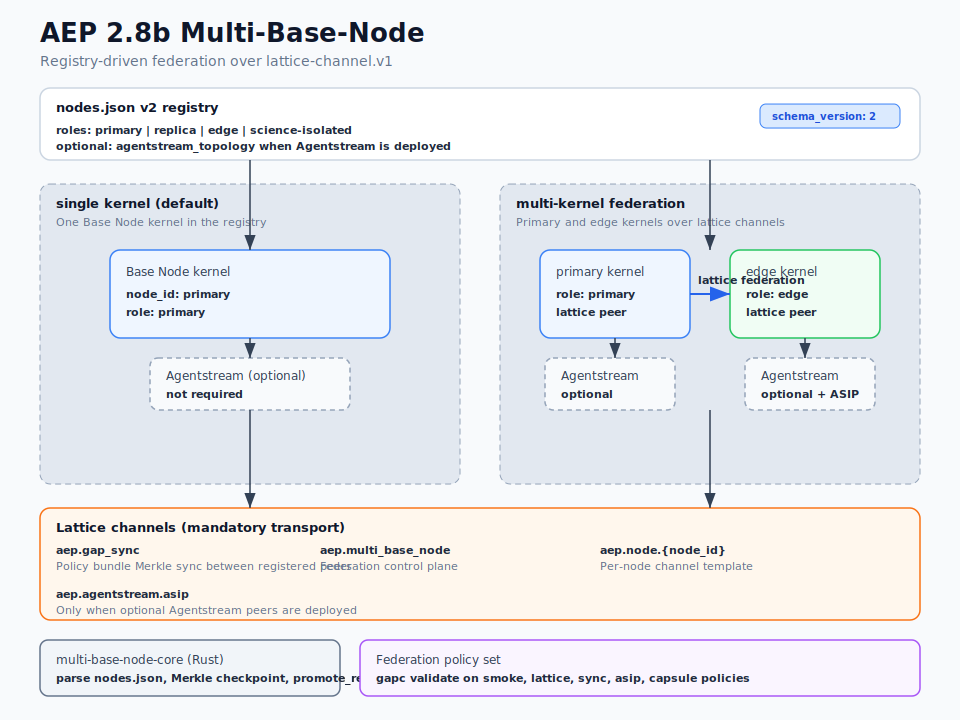

# AEP 2.8b Multi-Base-Node

**Status:** shipped on `main`.

## Architecture



Source: [`multi-base-node-28b-architecture.svg`](./multi-base-node-28b-architecture.svg)

## What 2.8b is

Governed orchestration of **multiple AEP Base Node kernels** on the normal network:

- `nodes.json` schema v2 registry
- Roles: `primary`, `replica`, `edge`, `science-isolated`
- Policy bundle Merkle sync over `ex.aep.gap_sync`
- Lattice-channel federation between nodes

## What 2.8b is NOT

- **Not raw localhost bypass** between engines (use `lattice-channel.v1`).

## Optional Agentstream integration

Agentstream is **optional**. A Base Node kernel can run multi-base-node federation without any Agentstream instance.

When Agentstream is present, `nodes.json` may declare a topology:

| Topology | ID | Use |
| --- | --- | --- |
| Single | `as-single` | One optional Agentstream instance bound to a node |
| Multi | `as-federated` | Multiple optional instances coordinated via ASIP |

## Single-node default profile

File: `AEP-Base-Node/registry/profiles/as-single-polar.json`

Single `primary` node, federation disabled by default. The filename is legacy naming only.

## Registry files

| File | Purpose |
| --- | --- |
| `AEP-Base-Node/registry/nodes.json` | Registry example (single primary) |
| `AEP-Base-Node/registry/schemas/nodes-registry-v2.json` | JSON schema v2 |

## Rust crate

`AEP-Base-Node/multi-base-node/crate/` (`multi-base-node-core`)

```bash
cargo test -p multi-base-node-core
```

Public API: parse/load/save `nodes.json`, Merkle `gap_bundle_checkpoint`, `promote_replica`.

Lattice helpers:

- `FEDERATION_CHANNEL` = `ex.aep.multi_base_node`
- `GAP_SYNC_CHANNEL` = `ex.aep.gap_sync`
- `node_channel(node_id)` = `ex.aep.node.{node_id}`

## Federation policies

Instruction policies (`.gap` documents) in this repo:

- `AEP-Components/gap/policies/reference/multi-base-node-federation-smoke.gap`
- `AEP-Components/gap/policies/reference/multi-base-node-federation-lattice-v1.gap`
- `AEP-Components/gap/policies/reference/multi-base-node-federation-asip-v1.gap`
- `AEP-Components/gap/policies/reference/multi-base-node-federation-gap-sync-v1.gap`
- `AEP-Components/gap/policies/reference/multi-base-node-federation-capsule-v1.gap`

Validated with `gapc validate` against `gap-meta-schema-v1.2.json`.

## Shipped artifacts

`AEP-Base-Node/multi-base-node/docs/multi-base-node-artifact-manifest.json` lists all shipped 2.8b artifacts.