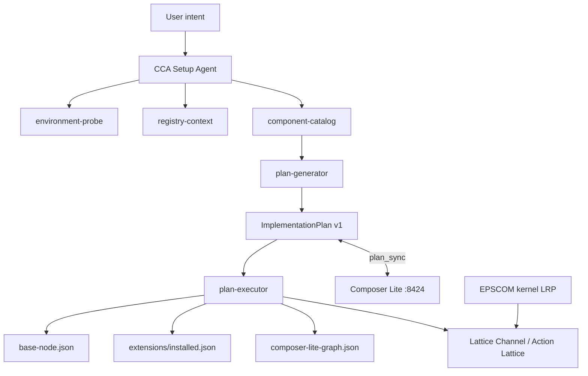

# CCA - Central Setup Agent

**CCA (Central Setup Agent)** is the AEP 2.8 deployment architect. After Docker deploy and Base Node startup, CCA probes the environment, loads the full component registry, accepts natural-language deployment intent and produces an **ImplementationPlan** that setup-agent (or `plan-executor`) can activate. Composer Lite is the visual editor for the same plan format.

| Property | Value |
|----------|-------|
| Component ID | `cca` |
| Kind | `agent` |
| Manifest | `AEP-Base-Node/registry/components/cca.json` |
| CLI | `aep-cca` (Docker: `docker compose exec aep aep-cca ...`) |
| Data dir | `AEP_DATA` (default `/data/aep`) |
| Active plan | `{AEP_DATA}/plans/active.json` |
| Composer graph | `{AEP_DATA}/composer-lite-graph.json` |

---

## AEP CAW Framework (core)

**CAW (Containerized Agentic Workflows)** is Execution-Layer Security integrated as a core Base Node capability (`caw-framework`, `default_enabled: true`). Forked from agentsh (Apache 2.0), renamed to `aep-caw`.

| Layer | Component | Role |
|-------|-----------|------|
| Execution | `aep-caw` | Shell, file, network, process, DB wire enforcement |
| Protocol | Base Node + lattice | LRP, evidence ledger, EPSCOM |
| Planning | CCA | Enables CAW in every coding-agent plan |

See `AEP-Components/caw-framework/README.md`.

## What CCA does

1. **Environment probe** - CPU, RAM, disk, GPU, Docker detection, constraint flags
2. **Registry load** - all 59 catalog entries, 58 bundled manifests with `cca` blocks
3. **Intent matching** - dynamic rules from every manifest (`use_when`, capabilities, LRP ids)
4. **Plan synthesis** - rule-based (always available) plus optional LLM refinement
5. **Plan execution** - LRP sync, connector wiring, policy sections, lattice registration
6. **Graph sync** - bidirectional sync with Composer Lite canvas

---

## Architecture



### Default deployment model

| Topic | Default in AEP 2.8 public tier |
|-------|--------------------------------|
| Validation engine | `validation_engine.mode = "none"` - no dedicated validation engine unless operator opts in |
| CCA dock placement | CCA is **not** permanently on the validation dock |
| Writing rules | Enforced by **EPSCOM kernel** (`epscom-core` LRP, priority 255) via `aep-lattice-log` |
| `writing.gap` | Documentation lint (CC-16) and kernel enforcement (CC-17) - **not** an LRP slot |
| LRP slots | Legacy nation-state regulation providers only (GDPR, HIPAA, EU AI Act, commerce, etc.) |
| Inter-node traffic | Lattice channels only - `security.lattice_strict` must be `true` |

---

## Quick start

### Docker (recommended)

```bash
docker compose -f docker-compose.public.yml up -d
docker compose exec aep aep-cca probe
docker compose exec aep aep-cca plan --intent "3 coding agents, Postgres evidence, EU AI Act compliance"
docker compose exec aep aep-cca execute
open http://localhost:8424
```

### Local source

```bash
export AEP_DATA=/tmp/aep-data
node AEP-Components/cca/cca.mjs plan --intent "UCB for LangGraph agents"
node AEP-Components/cca/cca.mjs execute
```

---

## CLI reference

| Command | Description |
|---------|-------------|
| `aep-cca probe` | Print `EnvironmentProfile` JSON (CPU, RAM, disk, GPU, constraints) |
| `aep-cca context` | Print full registry knowledge bundle (components, docks, environment, **gap**) |
| `aep-cca gap` | Print GAP language summary (meta-schema, policies, subprotocols) |
| `aep-cca plan --intent "..."` | Generate and save `{AEP_DATA}/plans/active.json` |
| `aep-cca plan --intent "..." --execute` | Generate then execute in one step |
| `aep-cca execute` | Execute the current active plan |
| `aep-cca validate` | Validate active plan against registry and environment (exit 1 on failure) |
| `aep-cca chat --intent "..."` | Interactive chat (LLM when configured, rule-based fallback) |

### Options

| Flag | Description |
|------|-------------|
| `--data-dir=PATH` | Override `AEP_DATA` |
| `--execute` | With `plan`, run executor after generation |
| `--non-interactive` | Reserved for scripted flows |

---

## HTTP API (Composer Lite)

Composer Lite serves CCA at port **8424** (`COMPOSER_LITE_PORT`).

| Endpoint | Method | Description |
|----------|--------|-------------|
| `/api/cca` | GET | Public state, environment summary, active plan metadata |
| `/api/cca/context` | GET | Full registry knowledge bundle |
| `/api/cca/environment` | GET | `EnvironmentProfile` only |
| `/api/cca/plan` | GET | Load active `ImplementationPlan` |
| `/api/cca/plan` | PUT | Save a plan (validate first) |
| `/api/cca/plan/validate` | POST | Validate plan body |
| `/api/cca/plan/execute` | POST | Execute validated plan |
| `/api/cca/chat` | POST | Chat with optional graph context; returns plan + graph suggestion |
| `/api/graph` | PUT | Save canvas graph; with `plan_sync: true` merges into active plan |

### Chat request example

```bash
curl -s -X POST http://localhost:8424/api/cca/chat \
  -H 'Content-Type: application/json' \
  -d '{"message":"Postgres evidence store and SOC 2 Type II compliance","history":[]}'
```

### Graph-plan sync

Composer auto-saves with `plan_sync: true`. When the user edits the canvas, component nodes with `data.component_id` or `data.registry_id` enable matching entries in `{AEP_DATA}/plans/active.json`.

---

## ImplementationPlan v1

Schema: `AEP-Base-Node/registry/schemas/implementation-plan-v1.json`

```json
{
  "plan_version": "1",
  "created_by": "cca",
  "created_at": "2026-06-23T12:00:00.000Z",
  "user_intent": "3 coding agents, Postgres, EU AI Act",
  "environment_snapshot": {},
  "components": [
    { "id": "connector-postgres", "enabled": true, "reason": "Matched user intent", "config": {} }
  ],
  "lrps": ["eu-ai-act"],
  "inference": {
    "provider": "openrouter",
    "model": "anthropic/claude-3.5-sonnet",
    "base_url": "https://openrouter.ai/api/v1"
  },
  "topology": {
    "nodes": [{ "id": "lattice-hub", "type": "lattice", "label": "Action Lattice Hub", "x": 360, "y": 220 }],
    "edges": [{ "id": "e-val-hub", "from": "dock-validation", "to": "lattice-hub", "channel": "lattice-channel-default" }]
  },
  "connectors": { "postgres": { "host": "postgres", "port": 5432, "database": "aep_evidence" } },
  "policy_overrides": {},
  "security": { "lattice_strict": true, "internet_up": true, "ucb_enabled": false },
  "warnings": []
}
```

### Required fields

`plan_version`, `created_by`, `created_at`, `user_intent`, `components`, `lrps`, `inference`, `topology`, `security`

### Security rules

- `security.lattice_strict` **must** be `true`
- Topology edges must not set `transport: "raw_http"` or `bypass_lattice: true`
- All LLM calls from CCA use `latticeGatedFetch` through the inference dock

---

## Component catalog coverage

CCA reads every bundled manifest via `component-catalog.mjs`:

| Mode | Trigger phrases | Behavior |
|------|-----------------|----------|
| Full stack | `full AEP`, `all components`, `100% coverage`, `complete stack` | Enables all 58 bundled non-template components |
| Intent rules | Per-manifest `cca.use_when`, `capabilities`, `lrp_id`, component name | Adds matching components and `pairs_with` dependencies |
| Default enabled | Catalog `default_enabled: true` | Always included unless explicitly disabled |

### Example intents

| User says | Components enabled (sample) |
|-----------|----------------------------|
| `Postgres evidence and EU AI Act` | `connector-postgres`, `eu-ai-act` |
| `Shopify commerce checkout` | `commerce-subprotocol`, `economics` |
| `UCB LangGraph MCP agents` | `ucb` |
| `SOC 2 Type II compliance` | `soc2-type2` |
| `NIST AI RMF` | `nist-ai-rmf` |
| `ISO 42001` | `iso-42001` |
| `WASM policy gap eval` | `wasm-policy-sandbox`, `wasm-policy-node` |
| `Run conformance pre-release` | `conformance-runner` |
| `Deploy full AEP 100% coverage` | All 58 bundled components |

### Topology node types

| Type | Used for |
|------|----------|
| `lattice` | Action Lattice hub |
| `dock_validation` | Validation engine dock (present even when mode is `none`) |
| `dock_inference` | Inference dock |
| `dock_regulation` | Regulation module dock (when LRP packs enabled) |
| `agent` | Autonomous agent nodes |
| `connector` | Postgres and other connectors |
| `ucb` | Universal Connect Bridge |
| `wasm_policy` | WASM GAP policy evaluation |
| `regulation` | Compliance and regulation packs |
| `component` | Generic AEP component nodes |
| `data_input` / `data_output` | Storage import/export |

Infrastructure libraries (`lattice-crypto`, `lattice-channel`, `lattice-memory`, `lattice-transport`, `lattice-client`, `aep-typescript-sdk`) are enabled in the plan but omitted from canvas topology to reduce clutter.

---

## Plan execution

`plan-executor.mjs` runs after validation:

1. Wait for docking sockets and ping all docks
2. Collect `setup_hooks` from enabled manifests (LRP sync, policy sections)
3. Write `extensions/installed.json`
4. Build `base-node.json` (LRPs, connectors, policy sections, inference)
5. Enable `commerce.enabled: true` when `commerce-subprotocol` is in the plan
6. Register Base Node and inference engine on lattice
7. Save active plan and sync Composer graph via `plan-to-graph.mjs`
8. Run health check on Base Node binary
9. Optionally run conformance runner when `conformance-runner` is enabled
10. Request daemon reload

### Executor options

| Option | Default | Description |
|--------|---------|-------------|
| `runConformance` | `true` | Run `conformance/runner/run.sh` when conformance-runner enabled |
| `forceConformance` | `false` | Continue activation even if conformance fails |
| `skipHealth` | `false` | Skip Base Node health probe |
| `force` | `false` | Execute despite plan validation errors |
| `validationEngine` | `{ id: "none" }` | Validation engine install plan |

---

## Module reference

| Module | Role |
|--------|------|
| `cca.mjs` | CLI entrypoint |
| `lib/environment-probe.mjs` | Hardware and constraint detection |
| `lib/registry-context.mjs` | Catalog + manifests + prompt formatting |
| `lib/component-catalog.mjs` | Dynamic intent rules, topology builder, graph sync |
| `lib/plan-generator.mjs` | Rule-based plan synthesis |
| `lib/plan-schema.mjs` | Plan validation against registry and environment |
| `lib/plan-executor.mjs` | Activation, config write, LRP sync |
| `lib/plan-to-graph.mjs` | ImplementationPlan to Composer graph |
| `lib/graph-to-plan.mjs` | Composer graph edits back to plan |
| `lib/chat.mjs` | LLM chat with rule-based fallback |
| `lib/cca-prompt.mjs` | System prompt builder with GAP + EPSCOM writing rules |
| `lib/gap-context.mjs` | GAP meta-schema, reference policies, prompt section |
| `lib/dynaep-context.mjs` | dynAEP protocol layout, SDK paths, observers, lattice registry |
| `lib/policy-system-context.mjs` | AEP-Policy-System reference GAPs and regulation LRP catalog |

---

## Inference providers

| Provider | When used |
|----------|-----------|
| `rule-based` | No API key, LLM failure or `--no-llm` |
| `openrouter` | Cloud LLM (default on low-RAM hosts) |
| `llama_cpp` | Local inference when GPU or RAM sufficient |
| `custom` | Operator-provided OpenAI-compatible endpoint |

Configure via Composer `/api/inference` or `{AEP_DATA}/inference-engine.env`.

---

## EPSCOM writing enforcement

All CCA prose output (chat replies, plan strings) passes through EPSCOM kernel lint via `aep-lattice-log`:

- No em-dashes, en-dashes or Unicode dash substitutes
- No double-hyphen (` -- `) as a sentence separator in prose
- No Oxford commas (`foo, bar, and baz` becomes `foo, bar and baz`)

This is kernel-level enforcement (`epscom-core`), not validation-dock routing and not an LRP registration.

---

## Testing

Conformance checks (CC-18, CC-19):

```bash
AEP-Components/conformance/runner/run.sh
```

Or harness-only:

```bash
cd AEP-Components/conformance/harness && npm install
./node_modules/.bin/vitest run
```

---

## Troubleshooting

| Symptom | Likely cause | Fix |
|---------|--------------|-----|
| `No active plan` | Plan not generated | `aep-cca plan --intent "..."` |
| `Dock ping failed` | Base Node not running | Start daemon, check `AEP_SOCKET_BASE` |
| `LLM unavailable` | Missing API key | Set `OPENROUTER_API_KEY` or use rule-based mode |
| `Plan validation failed` | Unknown component or RAM too low | `aep-cca validate` for errors; adjust intent |
| Graph edits lost in plan | `plan_sync` not sent | Composer sends `plan_sync: true` on save (default since 2.8) |
| Commerce disabled after execute | Policy default `enabled: false` | Fixed: executor sets `commerce.enabled: true` when commerce LRP active |
| Writing lint failures | EPSCOM kernel | Remove em-dashes and Oxford commas from output strings |

---

## Related docs

| Document | Topic |
|----------|-------|
| [AGENTS.md](./AGENTS.md) | Agent operating instructions for AI assistants |
| [../composer-lite/README.md](../composer-lite/README.md) | Visual canvas and API |
| [../setup-agent/README.md](../setup-agent/README.md) | Legacy interactive setup flow |
| [../../AEP-NOSHIP/docs/SETUP-AGENT.md](../../AEP-NOSHIP/docs/SETUP-AGENT.md) | Full setup agent guide |
| [../../AEP-NOSHIP/docs/DOCKING-PORTS.md](../../AEP-NOSHIP/docs/DOCKING-PORTS.md) | Dock socket layout |
| [../../AEP-Base-Node/registry/README.md](../../AEP-Base-Node/registry/README.md) | Component registry |
| [../../plans/PHASE-10-CCA-COMPONENT-PLATFORM.md](../../plans/PHASE-10-CCA-COMPONENT-PLATFORM.md) | Implementation history |

---

## Registry entry

See `AEP-Base-Node/registry/components/cca.json` for capabilities, actions and conformance test pointers.