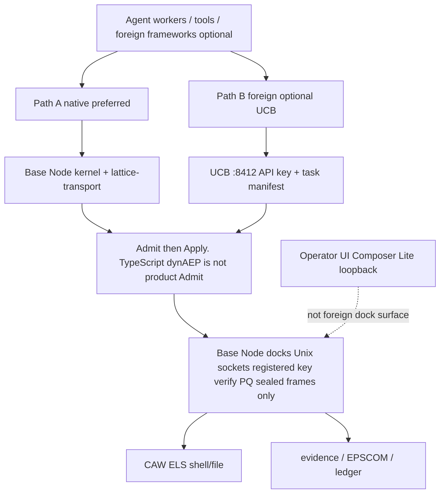

# AEP 2.8.5 Secure Deployment Guide

**How the public open-source AEP 2.8.5 protocol is supposed to be deployed securely**  
**Audience:** operators installing AEP 2.8.5 from Docker or a verified source clone or attaching foreign agent stacks  
**Updated:** 2026-09-05
**Public repository:** https://github.com/thePM001/AEP-agent-element-protocol
**GitHub is a public mirror.**

## 1. Mental model (read first)

AEP 2.8.5 is the public open-source Agent Element Protocol. **Base Node is the kernel.** TypeScript dynAEP is not product Admit. **CAW** is host execution-layer security for shell and file. **Composer Lite** is the operator / CCA plane. CAW is an execution companion and is not a protocol component.

You do **not** invent a second protocol kernel. You run Base Node as the local kernel. TypeScript processEvent is not product Admit. Foreign agent frameworks (LangGraph, CrewAI, custom MCP and similar) are optional attach surfaces. They connect into AEP. They are not a substitute for Base Node Admit.

### 1.1 Reference architecture diagram

Canonical AEP 2.8.5 stack layout (operator surfaces, Path B UCB, lattice transport, docks, hyperlattice wrap, Base Node kernel, protocol components). Same diagram as the repository README. GitHub is a public mirror.

<p align="center" style="background-color:#ffffff;padding:16px;">
  <a href="../../docs/architecture/aep-28-architecture.png" target="_blank" rel="noopener" title="Click to open full-size AEP 2.8 architecture diagram">
    
  </a>
</p>

| Asset | Path |
| --- | --- |
| PNG (full size) | [`docs/architecture/aep-28-architecture.png`](../../docs/architecture/aep-28-architecture.png) |
| Mermaid source | [`docs/architecture/aep-28-architecture.mmd`](../../docs/architecture/aep-28-architecture.mmd) |

How to read it for secure deploy:

1. **Operator plane** (Composer Lite, CCA, harness, wizard) is not the foreign-agent API surface.
2. **Path B** is UCB only (ingress/egress airlock), then lattice-transport. Never raw docks to foreign stacks.
3. **Path A** is Base Node plus lattice-gated SDK clients sealing frames on lattice-transport into Base Node docks. TypeScript dynAEP is not product Admit.
4. **One hyperlattice wrap** plus Base Node kernel and protocol components is the admit path. Nothing bypasses sealed LatticeChannel frames in production.

### 1.2 Connect model (Path A / Path B)



ASCII fallback (same model):

```
 Agent workers / tools / foreign frameworks (optional)
              |
     +--------+------------------+
     |                           |
     v                           v
 Path A - native                 Path B - foreign (optional UCB)
 Base Node kernel + AEP SDKs               UCB :8412
 lattice-transport               API key + task manifest
     |                           |
     +--------+------------------+
              v
     Base Node Admit then Apply (TypeScript dynAEP is not product Admit)
              |
              v
     Base Node docks (Unix sockets) - registered key verify
     PQ sealed LatticeChannel frames only
              |
     +--------+--------+
     v                 v
  CAW ELS          evidence / EPSCOM / ledger
  (shell/file)     (audit plane)

 Operator UI: Composer Lite (loopback; not foreign dock surface)
```

**Rules of the road:**

1. **Base Node is the kernel.** Enable and operate it as the Admit then Apply path for agent and system events under AEP 2.8.5. TypeScript dynAEP is not product Admit.
2. **Base Node is mandatory** as the local kernel for docks, identity and sealed lattice transport.
3. **Connect workers via Path A or B** (section 2.2). Never hand foreign stacks raw dock sockets.
4. **CAW** confines host shell/file when coding or shell workloads are in scope.
5. **Composer Lite** is for operators and CCA, not the internet agent API.
6. Keep lattice strict; do not disable sealed-frame docking requirements.

Canonical kernel and protocol material in this tree:

- `AEP-Components/dynAEP/` (protocol + bridge + registries)
- `internal-sdk/AEP-SDKs/typescript/dynaep/` (governance stack clients)
- README: Base Node is the kernel. TypeScript dynAEP is not product Admit.

## 2. Minimum secure baseline (single host)

### 2.1 Base Node kernel (required)

- Install and run the AEP 2.8.5 stack so **Base Node** is active as the kernel. TypeScript dynAEP is not product Admit.
- Use production lattice governance defaults where applicable (`lattice.governance` / filter modes documented in `AEP-Components/dynAEP/CONFIG.md`).
- Lattice-addressed events with `action_path` must pass the Action Lattice before downstream stages when governance is on.
- Temporal authority (dynAEP-TA) and perception governance (dynAEP-TA-P) apply as configured; do not let agents mint ungoverned clocks for governed events.

### 2.2 How workers and foreign stacks connect to AEP

#### Path A - Native (Base Node + lattice; preferred)

Use for AEP-aware agents and anything that can load AEP lattice-gated clients.

1. Run **Base Node** so docking sockets exist under `AEP_DATA` (or your configured socket base).
2. Run processes under **Base Node** Admit then Apply so events hit the kernel and related stages as configured. TypeScript dynAEP is not product Admit.
3. Use **AEP SDKs** or **lattice-transport** to seal frames and send them to Base Node docks (validation, inference, regulation, future-features as required).
4. Register agent identity and signing material the Base Node expects. Frames must carry a verifiable signer bound to a registered agent; unbound or plain wire is rejected.
5. Prefer **lattice-gated** outbound HTTP for connectors (do not set `AEP_LATTICE_STRICT=0` in production).
6. If agents use shell or host tools, enable **CAW**.

Canonical client entry points:

- `AEP-Components/dynAEP/` and `internal-sdk/AEP-SDKs/typescript/dynaep/`
- `AEP-Components/lattice-channels/lib/lattice-transport.mjs`
- `internal-sdk/AEP-SDKs/` language clients
- Base Node dock verify: `AEP-Base-Node/crate/src/docking.rs`

**Do not:** open dock Unix sockets as raw JSON side-channels (`{"ping":true}`, plain `event`, plain `register_lrp`). Those are rejected by design.

#### Path B - Foreign stack (optional UCB)

Use when a **non-AEP** framework must attach and must not receive raw lattice sockets.

1. Run **UCB** bound to loopback or a private interface.
2. Configure a strong `UCB_API_KEY`.
3. Supply a **task manifest** per foreign agent or integration. No manifest => reject (422).
4. Foreign traffic enters UCB; UCB uses lattice transport internally toward Base Node. Do not bypass UCB by mounting dock sockets into the foreign stack.
5. If you do not need foreign attach: `UCB=0` and do not run UCB.

UCB surface: `AEP-Docks/ucb/`.

#### Choosing a path

| Situation | Connect path |
| --- | --- |
| AEP-aware agents under dynAEP | **Path A (native)** |
| Foreign stack (MCP, custom HTTP, non-AEP orchestrator) | **Path B (UCB)** |
| Both | Path A for native AEP/dynAEP workers; Path B only for foreign attach |

#### What is not the product kernel

Process schedulers, LLM vendor SDKs and generic orchestrators are **not** the AEP protocol kernel. They may host model calls or tools, but **event governance under AEP 2.8.5 still goes through Base Node Admit** (Path A) or UCB into the lattice (Path B). OS process isolation around worker PIDs remains operator-owned host hygiene. It does not replace Base Node. TypeScript dynAEP is not product Admit.

### 2.3 Base Node

- Run Base Node from the Docker image or verified source.
- Keep docking sockets on a private path under `AEP_DATA` (not world-writable tmp in multi-user hosts).
- Do not disable lattice channel requirements.
- Confirm plain wire is rejected: docks must refuse `{"ping":true}` style payloads.

### 2.4 Network bind

| Service | Secure default | Notes |
| --- | --- | --- |
| Composer Lite | `127.0.0.1` | Compose files default to loopback; only open `0.0.0.0` behind a reverse proxy with auth |
| UCB | `127.0.0.1` (Rust default) | Do not run deprecated JS UCB server on all interfaces |
| Docks | Unix sockets | Not HTTP on the public interface |

### 2.5 Composer Lite

```bash
export COMPOSER_LITE_HOST=127.0.0.1
export COMPOSER_LITE_TERMINAL=0          # keep off unless you accept operator-host shell risk
export COMPOSER_LITE_SETUP_TOKEN=...    # required for any non-loopback access
```

- Prefer loopback + SSH tunnel for remote operators.
- Never put setup tokens in shared URLs long-term (query string leaks).
- Interactive shell is **debug-only**, not production foreign-agent access.

### 2.6 UCB (foreign attach)

Enable only if you need non-AEP stacks (Path B):

```bash
export UCB=1
export UCB_API_KEY=...
```

- Every ingest needs a **task manifest**.
- No manifest => reject (422).
- If you do not need foreign attach: `UCB=0` and do not run UCB.

### 2.7 CAW (execution layer)

- Enable CAW for coding agents / shell workloads via CCA plans (`default_enabled` in catalog).
- Prefer enforce mode with a non-nil policy engine.
- Seccomp path resolve failures **deny** (fail closed).
- soft_delete without FUSE/ptrace trash **denies** destructive ops on seccomp-only path.
- Do not run production coding agents without CAW when shell is in scope.
- CAW is host ELS. It does not replace **Base Node** as the kernel. TypeScript dynAEP is not product Admit.

### 2.8 Lattice strict and egress

- Keep lattice-gated outbound paths on for connectors and SDKs that use lattice-gated fetch.
- Do not set `AEP_LATTICE_STRICT=0` in production.
- Prefer UCD for controlled egress airlock when outbound HTTP is required.

## 3. Secure profiles

### Profile A: Lab / single operator laptop

- **Base Node** on the local host (Path A). TypeScript dynAEP is not product Admit.
- Composer on loopback.
- UCB off unless testing foreign attach (Path B).
- CAW on for any shell agent work.
- Interactive shell feature off.

### Profile B: Production (native AEP only)

- **Base Node** as kernel. Docks private. TypeScript dynAEP is not product Admit.
- Workers on **Path A** only.
- UCB **disabled**.
- Composer loopback or reverse proxy with token.
- CAW enforce for coding agents.
- Lattice strict on.

### Profile C: Production with foreign stacks

- Same as B for native Base Node / AEP workers (Path A). TypeScript dynAEP is not product Admit.
- UCB on loopback or private interface for foreign stacks (Path B).
- Strong UCB_API_KEY, rotated.
- Manifest required per foreign agent.
- Monitor UCB audit and dock side-channel anomalies.

## 4. What not to do

1. Treat a generic orchestrator or LLM SDK as a replacement for **Base Node**.
2. Skip Base Node and expect protocol admit without docks and sealed frames.
3. Run agents free on the host with no Path A or Path B into AEP.
4. Mount Base Node dock sockets into a foreign stack to skip UCB.
5. Bind Composer or UCB to all interfaces without auth and network policy.
6. Give foreign agents raw lattice socket paths.
7. Treat client-supplied wire trust_score as authorization (BM-07 forbids this).
8. Enable Composer interactive shell on a multi-user host without Origin policy and token.
9. Claim ML-DSA trust-bundle authenticity without configured crypto verify.
10. Disable CAW for coding agents and still claim host ELS.

## 5. Verification checklist

```bash
# Base Node kernel path is active for lattice-addressed events. TypeScript dynAEP is not product Admit
# Base Node docks refuse plain ping
# Workers reach AEP only via Path A (Base Node/lattice) or Path B (UCB)
# Composer loopback
# UCB without key returns 401 when UCB is enabled
# Composer without token from non-loopback returns 403 for mutating routes
# CAW: resolve-fail and soft_delete paths deny under enforce
```

## 6. Mapping to source

| Concern | Path |
| --- | --- |
| Reference architecture diagram | `docs/architecture/aep-28-architecture.png` (source `.mmd`) |
| Base Node kernel. TypeScript dynAEP is not product Admit | `AEP-Base-Node/`, `AEP-Components/dynAEP/`, `internal-sdk/AEP-SDKs/typescript/dynaep/` |
| dynAEP config | `AEP-Components/dynAEP/CONFIG.md` |
| Dock admit / plain reject | `AEP-Base-Node/crate/src/docking.rs` |
| BM-07 trust | `attested_trust_score` in docking.rs |
| Lattice client | `AEP-Components/lattice-channels/lib/lattice-transport.mjs` |
| SDKs | `internal-sdk/AEP-SDKs/` |
| UCB auth | `AEP-Docks/ucb/crate/src/auth.rs`, `http.rs` |
| CAW file/unix fail-closed | `AEP-Components/caw-framework/internal/netmonitor/unix/` |
| Policy | `AEP-Policy-System/lattice-channel-mandatory.gap` |

## 7. Change control

Deploy profile changes (public bind, UCB on, shell on, connect path) require operator approval. Do not treat OSS compose defaults as production without this guide.
