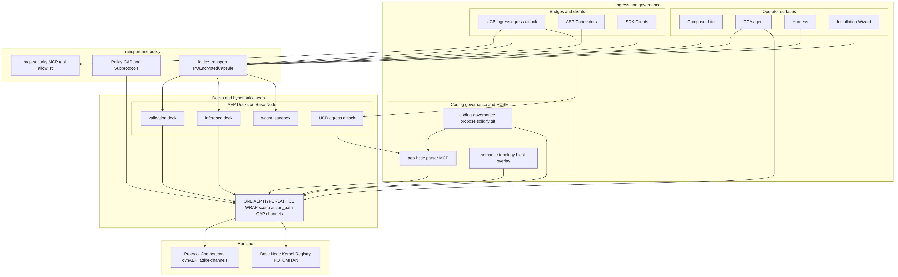
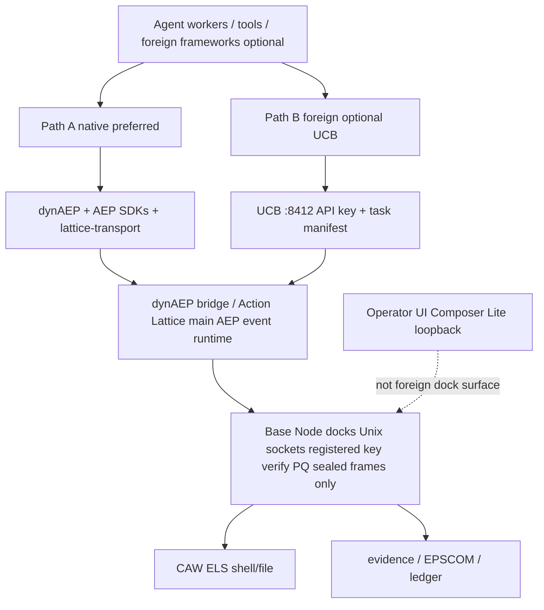

# AEP 2.8 Secure Deployment Guide

**How the public open-source AEP 2.8 protocol is supposed to be deployed securely**  
**Audience:** operators installing AEP 2.8 from Docker or a verified source clone, or attaching foreign agent stacks  
**Updated:** 2026-07-27

## 1. Mental model (read first)

AEP 2.8 is the public open-source Agent Element Protocol. **dynAEP is the main AEP runtime** for real-time event governance (Action Lattice, bridge, temporal authority, perception governance). It ships in this tree as a first-class component and SDK stack. **Base Node is the local kernel** (docks, registry, lattice channels). **CAW** is host execution-layer security for shell and file. **Composer Lite** is the operator / CCA plane.

You do **not** invent a second "AEP protocol runtime" to replace dynAEP. You **run dynAEP** (via the Base Node / component install path and/or `AEP-SDKs/typescript/dynaep`) as the governed event runtime. Foreign agent frameworks (LangGraph, CrewAI, custom MCP, and similar) are optional attach surfaces; they connect into AEP. They are not a substitute for dynAEP.

### 1.1 Reference architecture diagram

Canonical AEP 2.8 stack layout (operator surfaces, Path B UCB, lattice transport, docks, hyperlattice wrap, Base Node kernel, dynAEP runtime components). Same diagram as the repository README.

<p align="center" style="background-color:#ffffff;padding:16px;">
  <a href="../../docs/architecture/aep-28-architecture.png" target="_blank" rel="noopener" title="Click to open full-size AEP 2.8 architecture diagram">
    
  </a>
</p>

| Asset | Path |
| --- | --- |
| PNG (full size) | [`docs/architecture/aep-28-architecture.png`](../../docs/architecture/aep-28-architecture.png) |
| Mermaid source | [`docs/architecture/aep-28-architecture.mmd`](../../docs/architecture/aep-28-architecture.mmd) |

How to read it for secure deploy:

1. **Operator plane** (Composer Lite, CCA, harness, wizard) is not the foreign-agent API surface.
2. **Path B** is UCB only (ingress/egress airlock), then lattice-transport. Never raw docks to foreign stacks.
3. **Path A** is SDK / connectors / dynAEP clients sealing frames on lattice-transport into Base Node docks.
4. **One hyperlattice wrap** plus Base Node kernel and protocol components (including **dynAEP**) are the admit path. Nothing bypasses sealed LatticeChannel frames in production.

### 1.2 Connect model (Path A / Path B)



ASCII fallback (same model):

```
 Agent workers / tools / foreign frameworks (optional)
              |
     +--------+------------------+
     |                           |
     v                           v
 Path A - native                 Path B - foreign (optional UCB)
 dynAEP + AEP SDKs               UCB :8412
 lattice-transport               API key + task manifest
     |                           |
     +--------+------------------+
              v
     dynAEP bridge / Action Lattice (main AEP event runtime)
              |
              v
     Base Node docks (Unix sockets) - registered key verify
     PQ sealed LatticeChannel frames only
              |
     +--------+--------+
     v                 v
  CAW ELS          evidence / EPSCOM / ledger
  (shell/file)     (audit plane)

 Operator UI: Composer Lite (loopback; not foreign dock surface)
```

**Rules of the road:**

1. **dynAEP is the main AEP runtime.** Enable and operate it as the event governance path for agent and system events under AEP 2.8.
2. **Base Node is mandatory** as the local kernel for docks, identity and sealed lattice transport.
3. **Connect workers via Path A or B** (section 2.2). Never hand foreign stacks raw dock sockets.
4. **CAW** confines host shell/file when coding or shell workloads are in scope.
5. **Composer Lite** is for operators and CCA, not the internet agent API.
6. Keep lattice strict; do not disable sealed-frame docking requirements.

Canonical dynAEP material in this tree:

- `AEP-Components/dynAEP/` (protocol + bridge + registries)
- `AEP-SDKs/typescript/dynaep/` (governance stack clients)
- README: dynAEP 1.0 hyperlattice runtime merged into AEP 2.8

## 2. Minimum secure baseline (single host)

### 2.1 dynAEP runtime (required)

- Install and run the AEP 2.8 stack so **dynAEP** is active (component path and/or TypeScript dynaep SDK path used by your governed processes).
- Use production lattice governance defaults where applicable (`lattice.governance` / filter modes documented in `AEP-Components/dynAEP/CONFIG.md`).
- Lattice-addressed events with `action_path` must pass the Action Lattice before downstream stages when governance is on.
- Temporal authority (dynAEP-TA) and perception governance (dynAEP-TA-P) apply as configured; do not let agents mint ungoverned clocks for governed events.

### 2.2 How workers and foreign stacks connect to AEP

#### Path A - Native (dynAEP + lattice; preferred)

Use for AEP-aware agents and anything that can load AEP / dynAEP clients.

1. Run **Base Node** so docking sockets exist under `AEP_DATA` (or your configured socket base).
2. Run processes under **dynAEP** governance (bridge / filter / SDK) so events hit the Action Lattice and related stages as configured.
3. Use **AEP SDKs** or **lattice-transport** to seal frames and send them to Base Node docks (validation, inference, regulation, future-features as required).
4. Register agent identity and signing material the Base Node expects. Frames must carry a verifiable signer bound to a registered agent; unbound or plain wire is rejected.
5. Prefer **lattice-gated** outbound HTTP for connectors (do not set `AEP_LATTICE_STRICT=0` in production).
6. If agents use shell or host tools, enable **CAW**.

Canonical client entry points:

- `AEP-Components/dynAEP/` and `AEP-SDKs/typescript/dynaep/`
- `AEP-Components/lattice-channels/lib/lattice-transport.mjs`
- `AEP-SDKs/` language clients
- Base Node dock verify: `AEP-Base-Node/crate/src/docking.rs`

**Do not:** open dock Unix sockets as raw JSON side-channels (`{"ping":true}`, plain `event`, plain `register_lrp`). Those are rejected by design.

#### Path B - Foreign stack (optional UCB)

Use when a **non-AEP** framework must attach and must not receive raw lattice sockets.

1. Run **UCB** bound to loopback or a private interface.
2. Configure a strong `UCB_API_KEY`.
3. Supply a **task manifest** per foreign agent or integration. No manifest => reject (422).
4. Foreign traffic enters UCB; UCB uses lattice transport internally toward Base Node. Do not bypass UCB by mounting dock sockets into the foreign stack.
5. If you do not need foreign attach: `UCB=0` and do not run UCB.

UCB surface: `AEP-Docks/ucb/`.

#### Choosing a path

| Situation | Connect path |
| --- | --- |
| AEP-aware agents under dynAEP | **Path A (native)** |
| Foreign stack (MCP, custom HTTP, non-AEP orchestrator) | **Path B (UCB)** |
| Both | Path A for native AEP/dynAEP workers; Path B only for foreign attach |

#### What is not dynAEP

Process schedulers, LLM vendor SDKs and generic orchestrators are **not** the AEP protocol runtime. They may host model calls or tools, but **event governance under AEP 2.8 still goes through dynAEP** (Path A) or UCB into the lattice (Path B). OS process isolation around worker PIDs remains operator-owned host hygiene; it does not replace dynAEP.

### 2.3 Base Node

- Run Base Node from the Docker image or verified source.
- Keep docking sockets on a private path under `AEP_DATA` (not world-writable tmp in multi-user hosts).
- Do not disable lattice channel requirements.
- Confirm plain wire is rejected: docks must refuse `{"ping":true}` style payloads.

### 2.4 Network bind

| Service | Secure default | Notes |
| --- | --- | --- |
| Composer Lite | `127.0.0.1` | Compose files default to loopback; only open `0.0.0.0` behind a reverse proxy with auth |
| UCB | `127.0.0.1` (Rust default) | Do not run deprecated JS UCB server on all interfaces |
| Docks | Unix sockets | Not HTTP on the public interface |

### 2.5 Composer Lite

```bash
export COMPOSER_LITE_HOST=127.0.0.1
export COMPOSER_LITE_TERMINAL=0          # keep off unless you accept operator-host shell risk
export COMPOSER_LITE_SETUP_TOKEN=...    # required for any non-loopback access
```

- Prefer loopback + SSH tunnel for remote operators.
- Never put setup tokens in shared URLs long-term (query string leaks).
- Interactive shell is **debug-only**, not production foreign-agent access.

### 2.6 UCB (foreign attach)

Enable only if you need non-AEP stacks (Path B):

```bash
export UCB=1
export UCB_API_KEY=...
```

- Every ingest needs a **task manifest**.
- No manifest => reject (422).
- If you do not need foreign attach: `UCB=0` and do not run UCB.

### 2.7 CAW (execution layer)

- Enable CAW for coding agents / shell workloads via CCA plans (`default_enabled` in catalog).
- Prefer enforce mode with a non-nil policy engine.
- Seccomp path resolve failures **deny** (fail closed).
- soft_delete without FUSE/ptrace trash **denies** destructive ops on seccomp-only path.
- Do not run production coding agents without CAW when shell is in scope.
- CAW is host ELS. It does not replace **dynAEP** as the event governance runtime.

### 2.8 Lattice strict and egress

- Keep lattice-gated outbound paths on for connectors and SDKs that use lattice-gated fetch.
- Do not set `AEP_LATTICE_STRICT=0` in production.
- Prefer UCD for controlled egress airlock when outbound HTTP is required.

## 3. Secure profiles

### Profile A: Lab / single operator laptop

- **dynAEP** + Base Node on the local host (Path A).
- Composer on loopback.
- UCB off unless testing foreign attach (Path B).
- CAW on for any shell agent work.
- Interactive shell feature off.

### Profile B: Production (native AEP only)

- **dynAEP** as main event runtime; Base Node docks private.
- Workers on **Path A** only.
- UCB **disabled**.
- Composer loopback or reverse proxy with token.
- CAW enforce for coding agents.
- Lattice strict on.

### Profile C: Production with foreign stacks

- Same as B for native dynAEP/AEP workers (Path A).
- UCB on loopback or private interface for foreign stacks (Path B).
- Strong UCB_API_KEY, rotated.
- Manifest required per foreign agent.
- Monitor UCB audit and dock side-channel anomalies.

## 4. What not to do

1. Treat a generic orchestrator or LLM SDK as a replacement for **dynAEP**.
2. Skip Base Node and expect protocol admit without docks and sealed frames.
3. Run agents free on the host with no Path A or Path B into AEP.
4. Mount Base Node dock sockets into a foreign stack to skip UCB.
5. Bind Composer or UCB to all interfaces without auth and network policy.
6. Give foreign agents raw lattice socket paths.
7. Treat client-supplied wire trust_score as authorization (BM-07 forbids this).
8. Enable Composer interactive shell on a multi-user host without Origin policy and token.
9. Claim ML-DSA trust-bundle authenticity without configured crypto verify.
10. Disable CAW for coding agents and still claim host ELS.

## 5. Verification checklist

```bash
# dynAEP governance path is active for lattice-addressed events
# Base Node docks refuse plain ping
# Workers reach AEP only via Path A (dynAEP/lattice) or Path B (UCB)
# Composer loopback
# UCB without key returns 401 when UCB is enabled
# Composer without token from non-loopback returns 403 for mutating routes
# CAW: resolve-fail and soft_delete paths deny under enforce
```

## 6. Mapping to source

| Concern | Path |
| --- | --- |
| Reference architecture diagram | `docs/architecture/aep-28-architecture.png` (source `.mmd`) |
| dynAEP main runtime | `AEP-Components/dynAEP/`, `AEP-SDKs/typescript/dynaep/` |
| dynAEP config | `AEP-Components/dynAEP/CONFIG.md` |
| Dock admit / plain reject | `AEP-Base-Node/crate/src/docking.rs` |
| BM-07 trust | `attested_trust_score` in docking.rs |
| Lattice client | `AEP-Components/lattice-channels/lib/lattice-transport.mjs` |
| SDKs | `AEP-SDKs/` |
| UCB auth | `AEP-Docks/ucb/crate/src/auth.rs`, `http.rs` |
| CAW file/unix fail-closed | `AEP-Components/caw-framework/internal/netmonitor/unix/` |
| Policy | `AEP-Policy-System/lattice-channel-mandatory.gap` |

## 7. Change control

Deploy profile changes (public bind, UCB on, shell on, connect path) require operator approval. Do not treat OSS compose defaults as production without this guide.
