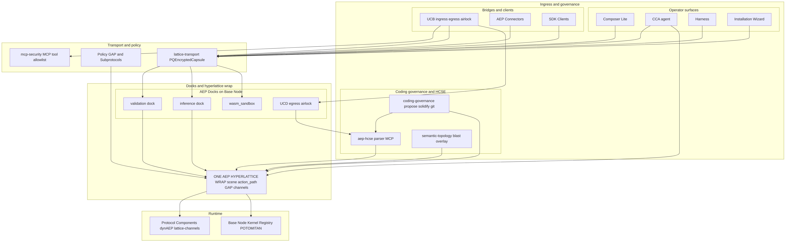
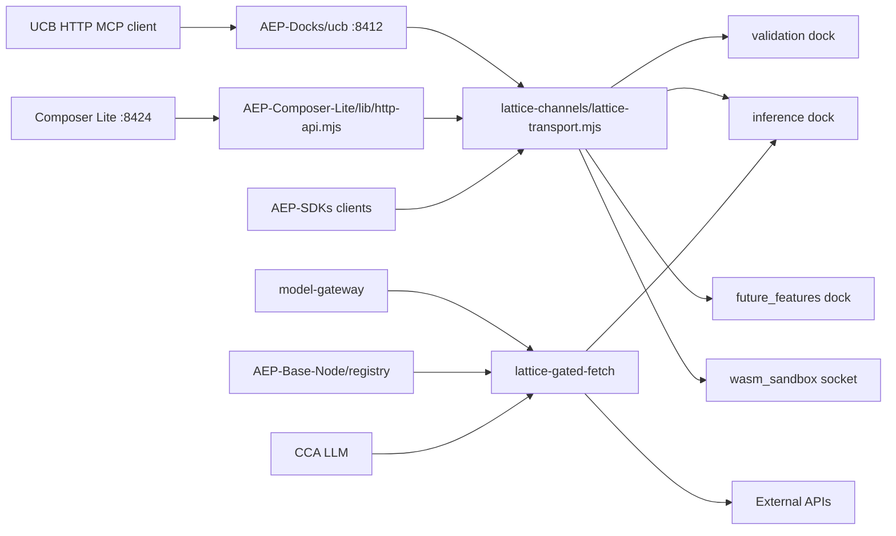
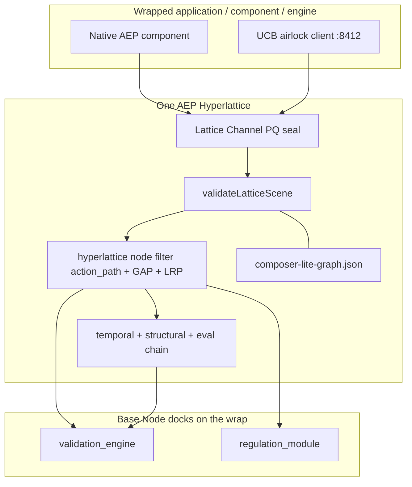
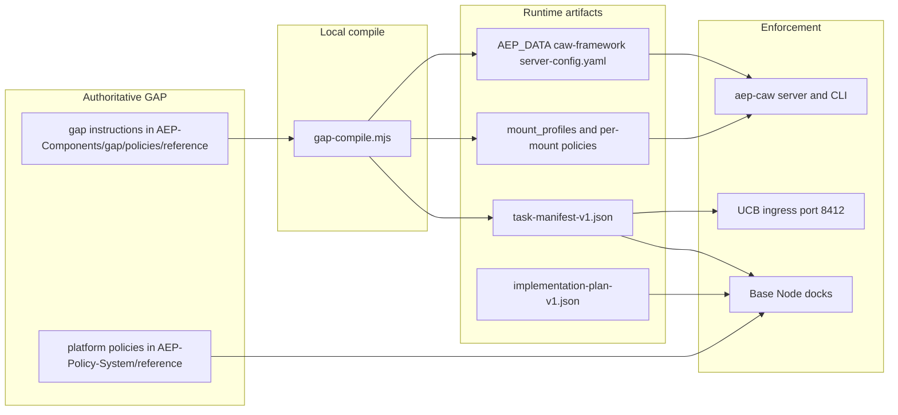

# AEP 2.8 - Agent Element Protocol

**120+ Features. One Ultimate AI Agent Control Protocol.**

**Version 2.8.0** - Forked from `NLA-AEP-2.75-open-protocol`  
**Author:** thePM_001 ([https://x.com/thePM_001](https://x.com/thePM_001))  
**Licence:** Apache-2.0  
**Public repository:** [https://github.com/thePM001/AEP-agent-element-protocol](https://github.com/thePM001/AEP-agent-element-protocol)

AEP 2.8 merges **dynAEP 1.0** (hyperlattice runtime: `action_path` filter, temporal authority, bridge) into the main repository and adds a mandatory local **AEP Base Node** kernel with Lattice Channels, AgentMesh identity, POTOMITAN mesh fallback, **CAW Framework** execution sandboxes (`aep-caw`), and the **Agent Composer** (ships as **Composer Lite**, WASM visual canvas on port **8424**).

This is the **public open-source tier**. The Docker image ships the full offline protocol including dynAEP, source-built SDK clients, conformance runner and component registry. No remote server connection is required at runtime. **NPM registry distribution is forbidden due to NPM supply-chain attack risks** - use Docker or a verified source clone.

---

## Architecture

**Base Node is the kernel. Everything else is an SDK client, a runtime installer or a protocol component.**

Each governed system gets **one AEP Hyperlattice wrap** (scene graph + `action_path` registry + GAP policy bindings + Lattice Channel transport). `validateLatticeScene()` proves the topological matrix for **every** system type (agents, services, workflows, APIs, infrastructure), not UI only. No action crosses the wrap without hyperlattice validation.

<p align="center" style="background-color:#ffffff;padding:16px;">
  <a href="docs/architecture/aep-28-architecture.png" target="_blank" rel="noopener" title="Click to open zoomable full-size diagram">
    
  </a>
</p>

| Layer | What it is | Canonical path |
|-------|------------|----------------|
| **Kernel** | Mandatory local governance daemon | [`AEP-Base-Node/`](AEP-Base-Node/) |
| **Hyperlattice wrap** | One mechanism per system: scene + `action_path` + GAP + channels | [`AEP-Components/hyperlattice/`](AEP-Components/hyperlattice/) |
| **Docks** | UCD egress airlock, validation/inference/wasm docks; **UCB optional** | [`AEP-Docks/`](AEP-Docks/) |
| **UCB airlock (optional)** | Foreign MCP/HTTP attach only; manifest gate; no invented contracts | [`AEP-Docks/ucb/`](AEP-Docks/ucb/) |
| **Connectors** | Application connectors (Slack, Jira, AWS, …) | [`AEP-Connectors/`](AEP-Connectors/) |
| **Coding governance** | Propose, blast radius, solidify, git stays substrate | [`AEP-Components/coding-governance/`](AEP-Components/coding-governance/), [`AEP-Subprotocols/coding-governance/`](AEP-Subprotocols/coding-governance/) |
| **HCSE parser** | aep-hcse parser MCP: symbol graph and detect_changes | [`AEP-Components/hcse/`](AEP-Components/hcse/) |
| **Protocol components** | Runtime installers (dynAEP, channels, graph-engine, …) | [`AEP-Components/`](AEP-Components/) |
| **SDK clients** | Thin lattice-gated language bindings | [`AEP-SDKs/`](AEP-SDKs/) |
| **CCA agent** | Central Setup Agent: probe, plan, execute deployment | [`AEP-Components/cca/`](AEP-Components/cca/) |
| **CAW Framework** | Execution-layer sandboxes: shell shims, seccomp, mounts, LLM proxy, lattice audit | [`AEP-Components/caw-framework/`](AEP-Components/caw-framework/) |
| **Operators** | Agent Composer (Composer Lite), CCA agent, harness, installation wizard | [`AEP-Composer-Lite/`](AEP-Composer-Lite/), [`AEP-User-Experience/`](AEP-User-Experience/), [`AEP-Components/wizard/`](AEP-Components/wizard/) |
| **Policy** | GAP nodes, presets, subprotocol validators | [`AEP-Policy-System/`](AEP-Policy-System/), [`AEP-Subprotocols/`](AEP-Subprotocols/) |

**Flow:** Composer Lite and CCA agent seal frames via `lattice-transport`. CCA loads the registry, synthesizes ImplementationPlans and activates components against the hyperlattice wrap. **CAW sandboxes** (`aep-caw`) enforce GAP-authored profiles on the host for coding agents and shell workloads (see [GAP-centric policies and CAW sandboxes](#gap-centric-policies-and-caw-sandboxes)). The installation wizard bootstraps Base Node before CCA takes over. Connectors and SDKs use the same transport. UCB ingress airlock gates entry with `mcp-security`. HCSE parser installs via UCD egress airlock. Coding governance runs propose, blast radius and solidify on the same wrap. Docks receive PQEncryptedCapsule frames only. Policy loads at boot; nothing runs ungoverned.

---

## Canonical repository layout (2.8)

| Directory | Role |
|-----------|------|
| [`AEP-Base-Node/`](AEP-Base-Node/) | **Kernel**: daemon, registry, POTOMITAN, agent-control-extreme |
| [`AEP-Components/`](AEP-Components/) | Protocol components (dynAEP, **caw-framework**, lattice-channels, graph-engine, aep-comm, economics, scanners, fleet, …) |
| [`AEP-Composer-Lite/`](AEP-Composer-Lite/) | **Agent Composer** (Composer Lite): WASM visual canvas on **:8424** |
| [`AEP-SDKs/`](AEP-SDKs/) | Language SDKs: thin lattice-gated clients (not components) |
| [`AEP-User-Experience/`](AEP-User-Experience/) | Harness, operator scripts, AEP-main-skill |
| [`AEP-Connectors/`](AEP-Connectors/) | Application connectors (Slack, Jira, AWS, …) |
| [`AEP-Docks/`](AEP-Docks/) | UCB + UCD socket dock specs and servers |
| [`AEP-Policy-System/`](AEP-Policy-System/) | GAP policies, presets, policy-builder, schema-builder |
| [`AEP-Subprotocols/`](AEP-Subprotocols/) | Regulation subprotocol Rust crates (UI, commerce, workflows, API, events, IaC) |
| [`AEP-Research-Paper/`](AEP-Research-Paper/) | DAL-AEP research paper assets (PDF + OTS proof) |

Root keeps only workspace tooling: `Cargo.toml`, `Dockerfile`, `docker-compose.yml`, `docker-compose.public.yml`, `.env.example`, `CHANGELOG.md`, `LICENSE`, `BIOSECURITY.md`, `vitest.config.ts`.

Internal engineering assets (tests, plans, internal docs) are excluded from runtime images and public distribution per `AEP-Policy-System/reference/aep-noship-distribution.gap`.

---

## LatticeChannel security (mandatory)

- **Transport:** every SDK, IDE, wizard, setup-agent and runtime module communicates with protocol components **only** via `PQEncryptedCapsule` **Lattice Channels** (docking sockets carry sealed frames only).
- **No bypass:** plain `{ping}`, `{event}` and `{register_lrp}` wire formats are rejected and logged as side-channel anomalies.
- **Scene validation:** `validateLatticeScene()` runs on every config load for **all system types**. Topological lattice matrix proof is mandatory before actions are accepted.
- **Deploy:** Base Node Rust kernel is **containerized** (Docker) or docked to an AEP Validation Engine module.
- **Shared transport:** JS/MJS/TS clients use [`AEP-Components/lattice-channels/lib/lattice-transport.mjs`](AEP-Components/lattice-channels/lib/lattice-transport.mjs) to seal frames via `aep-lattice-log build-frame`.



| Path | Wire format | Notes |
|------|-------------|-------|
| Docking ports | `{frame: LatticeChannelFrame}` | Plain ping/event/register_lrp rejected |
| WASM sandbox | Unix socket `wasm_sandbox` | Evaluate via seal+record+digest |
| Outbound HTTP | Lattice-gated via inference dock | Audit frame before fetch |
| UCB airlock (optional) | UCB HTTP/MCP on `:8412` | **Only for non-AEP foreign stacks.** API-key auth; manifest required; no fallback synthesis |
| Policy | `AEP-Policy-System/lattice-channel-mandatory.gap` | `AEP_LATTICE_STRICT=1` at runtime |

---

## What is new in AEP v2.8 ?

| Component | Path | Purpose |
|-----------|------|---------|
| **AEP Base Node** | `AEP-Base-Node/crate/` | Mandatory local governance daemon with docking ports |
| **Lattice Channels** | `AEP-Components/lattice-channels/crate/` | PQEncryptedCapsule frames (ML-KEM + AES-256-GCM + ML-DSA) |
| **AgentMesh** | `AEP-Components/agentmesh/crate/` | SPIFFE / DID / mTLS identity on lattice transport |
| **Lattice Memory** | `AEP-Components/lattice-memory/crate/` | Attractor store (sqlite-vec + USearch) |
| **POTOMITAN** | `AEP-Base-Node/potomitan/` | Mesh fallback when normal internet is unavailable |
| **dynAEP 1.0** | `AEP-Components/dynAEP/` | Hyperlattice runtime: `action_path` filter, temporal authority, bridge (merged from standalone repo) |
| **Installation Wizard** | `AEP-Components/wizard/install-wizard.mjs` + **visual UI** at `/install` on Composer Lite | Phase 1 Base Node installer (CLI + web wizard) |
| **Setup Agent** | `AEP-Components/cca/setup-agent.mjs` | Post-install activation and inference config |
| **Agent Composer (Composer Lite)** | `AEP-Composer-Lite/` | Experimental WASM composer canvas (`:8424`) for operator extension |
| **Component registry** | `AEP-Base-Node/registry/` | Offline catalog + optional extension merge |
| **Subprotocol registry** | `AEP-Subprotocols/` | Rust domain validators (UI, commerce, workflows, API, events, IaC, MCP) |
| **Conformance runner** | `AEP-Components/conformance/` | CC-01..CC-15 public tier compliance battery |
| **WASM sandbox** | `AEP-Components/wasm/crate/` | Policy eval via lattice socket (no HTTP bypass) |
| **UCB (optional)** | `AEP-Docks/ucb/` | Universal Connect Bridge for **foreign** stacks only (`:8412`). Native AEP skips UCB. Set `UCB=0` to disable. |
| **CAW framework** | `AEP-Components/caw-framework/` | Execution-layer sandbox (`aep-caw`); profiles authored in GAP, compiled locally |
| **GAP language** | `AEP-Components/gap/` | Governed Agentic Programming: policies, sandbox profiles, manifest/plan templates |
| **TypeScript SDKs** | `AEP-SDKs/typescript/` | `aep-protocol` + `dynaep` governance stack |

---

## Inherited from 2.75e: 100+ protocol features

AEP 2.8 **inherits** the full 2.75e governance stack. Components are extracted from the monolith into `AEP-Components/` with registry manifests under `AEP-Base-Node/registry/components/`. SDKs re-export them from `AEP-SDKs/`.

### Governance and control

| Feature | Component path |
|---------|----------------|
| 15-step evaluation chain | `AEP-Components/evaluation-chain/` |
| 11 content scanners (PII, secrets, injection, jailbreak, toxicity, URLs, data quality, predictions, brand, regulatory, temporal) | `AEP-Components/scanners/` |
| 4 trust rings (sandbox, user, system, enterprise) | `AEP-Components/trust-rings/` |
| Evidence ledger (SHA-256 hash chain + Merkle proofs) | `AEP-Components/evidence-ledger/` |
| Kill switches and rollback | `AEP-Components/recovery/` |
| Covenants (permit/forbid/require) | `AEP-Components/covenant/` |
| Intent drift detection | `AEP-Components/intent/` |

### Policy system

| Feature | Path |
|---------|------|
| Hyperlattice GAP policy nodes | `AEP-Policy-System/reference/` |
| Policy Builder (invariant detection, Rego generation) | `AEP-Policy-System/policy-builder/` |
| Schema Builder (MLE, spectral analysis, permissiveness, Louvain) | `AEP-Policy-System/schema-builder/` |
| OPA Rego + Cedar transpilers | `AEP-Components/policy-engine/` |
| YAML policy importer | `AEP-Components/policy-engine/lib/policy/importer/` |
| Built-in presets (strict, standard, relaxed, audit) | `AEP-Policy-System/*.policy.yaml` |

### Agent operations

| Feature | Path |
|---------|------|
| Agent identity (Ed25519, challenge-response) | `AEP-Components/identity/` |
| Data permission system | `AEP-Components/permissions/` |
| Fleet governance (limits, cost caps, drift) | `AEP-Components/fleet/` |
| Multi-agent collaboration (supervisor, debate, delegation) | `AEP-Components/fleet/lib/collaboration/` |
| Model gateway (governed LLM calls, streaming abort) | `AEP-Components/model-gateway/` |
| CAW execution sandboxes (shell, file, network, LLM proxy) | `AEP-Components/caw-framework/` |
| Recovery engine (soft violation retry) | `AEP-Components/recovery/` |
| Interactive assistant | `AEP-Components/aepassist/` |

### Cost economics (v2.75e)

Nine modules under [`AEP-Components/economics/lib/`](AEP-Components/economics/):

| Module | Role |
|--------|------|
| `balance.ts` | Provider-weighted, balanced-latency, model-weighted, model-latency strategies |
| `model-mapping.ts` | Canonical model names to provider-specific IDs |
| `pricing.ts` | Embedded per-million-token price catalog (10+ providers) |
| `cost-estimator.ts` | Pre-dispatch token and micro-USD estimation |
| `budget.ts` | Deny/warn/quota modes with daily/monthly rotation |
| `x402.ts` | HTTP 402 nanopayment verify/settle (exact/upto/batch-settlement) |
| `concurrency.ts` | Token-based semaphore against cost spikes |
| `fallback.ts` | Health-monitored provider failover |

Harness reference: `AEP-User-Experience/harness/`. **Wired:** `GovernedModelGateway` accepts `economics` deps (price catalog, budget, concurrency, fallback) via `economics/lib/gateway-integration.ts`.

### Security and infrastructure

| Feature | Path |
|---------|------|
| MCP security gateway | `AEP-Components/mcp-security/` |
| Intercept proxy | `AEP-Components/intercept/` |
| Merkle-tree audit / proof bundles | `AEP-Components/proof-bundle/` |
| OTEL telemetry | `AEP-Components/telemetry/` |
| Lattice crypto (PQ signatures) | `AEP-Components/lattice-crypto/` |

### Developer experience

| Tool | Path |
|------|------|
| CLI (`aep doctor`, `verify`, `lint-policy`, `red-team`, policy commands) | `AEP-SDKs/typescript/aep-protocol/` |
| Schema / policy builder CLIs | `AEP-Policy-System/schema-builder/`, `policy-builder/` |
| TypeScript programmatic SDK | `AEP-SDKs/typescript/aep-protocol/` |
| dynAEP hyperlattice runtime (bridge + filter) | `AEP-SDKs/typescript/dynaep/` |
| Produce all SDKs | `node AEP-User-Experience/scripts/produce-aep-sdks.mjs` |

---

## AEP-Graph Orchestration

Stateful persistent workflow engine built on the AEP scene graph with vector-clock causal ordering from dynAEP.

**Path:** [`AEP-Components/graph-engine/lib/graph/`](AEP-Components/graph-engine/lib/graph/)  
**API:** `GraphEngine`, `createGraphEngine()`: validate, detectCycles, execute with checkpoints and vector clocks.

### Node types

| Type | Purpose |
|------|---------|
| Action | Execute agent tools or operations |
| Decision | Evaluate GAP policies for branching |
| Wait | Human-in-the-loop approval gates |
| Parallel | Concurrent execution with join synchronization |
| Loop | Cyclic execution with iteration bounds and exit conditions |

### Features

- Cyclic execution with bounded loop detection
- Checkpoints at every node for resume-after-failure
- Human-in-the-loop branch points with timeout escalation
- Native retry with configurable backoff (linear, exponential, Fibonacci)
- Conditional branching via GAP policy evaluation
- Persistence to lattice memory fabric; vector clocks for causal consistency

```typescript
import { GraphEngine } from "./AEP-Components/graph-engine/lib/graph/index.js";

const graph = new GraphEngine({ entryNodeId: "start" });
graph.addNode({ id: "start", type: "action", next: ["review"] });
graph.addNode({ id: "review", type: "decision", next: [], branches: { approve: "deploy", reject: "stop" } });
graph.addNode({ id: "deploy", type: "action", next: [] });
graph.addNode({ id: "stop", type: "action", next: [] });
graph.validate();
await graph.execute({ input: context });
```

---

## AEP-Comm universal orchestration

Full universal orchestration layer for agent discovery, messaging and delegation.

**Core modules:** [`AEP-Components/aep-comm/lib/`](AEP-Components/aep-comm/) (discovery, messaging, delegate, orchestration)

| Module | Surface | Purpose |
|--------|---------|---------|
| `agent-card.ts` | Agent card | Standardized agent capability description |
| `task-lifecycle.ts` | Task lifecycle | 8-state task management with push notifications |
| `human-in-the-loop.ts` | Human gate | Approval gates for sensitive actions |
| `resource-protocol.ts` | Resource MCP | Resource listing and access |
| `prompt-templates.ts` | Prompt MCP | Parameterized prompt construction |
| `code-sandbox.ts` | Code sandbox | Isolated code execution with policy control |

| `discovery/dht.ts` | - | In-memory DHT with TTL expiry |
| `discovery/registry.ts` | - | Agent discovery registry |
| `discovery/gossip.ts` | - | Periodic peer health exchange |
| `messaging/router.ts` | - | A2A-like routing with lattice `action_path` |
| `messaging/envelope.ts` | - | JSON-LD message format |
| `messaging/inbox.ts` | - | Per-agent priority queue |
| `messaging/transports/ws-transport.ts` | - | WebSocket lifecycle |
| `messaging/transports/sse-transport.ts` | - | SSE + POST fallback metadata |
| `delegate/resolver.ts` | - | Task delegation with retry |

**Harness:** [`AEP-User-Experience/aep-comm-harness.ts`](AEP-User-Experience/aep-comm-harness.ts) imports all modules from `AEP-Components/aep-comm/lib/`.

**Evidence backend:** [`AEP-Components/evidence-ledger/lib/evidence/agentstream-backend.ts`](AEP-Components/evidence-ledger/lib/evidence/agentstream-backend.ts) (paid NLA Agentstream add-on).

---

## What AEP does

AEP is a **3-layer governance architecture**: Structure (what exists and where), Behaviour (what each element may do), Skin (how it looks). Changing one layer never requires changing another.

Beyond UI, the same separation maps to workflows, REST APIs, ML pipelines, event systems, infrastructure as code, smart contracts and agentic commerce: **agents propose, AEP validates, only compliant output executes.**

Every agent action passes through a deterministic **15-step evaluation chain** (allow or deny, no ambiguity).

The mathematical foundation is the **Deterministic Adjudication Lattice (DAL)**. Lattice memory stores validated outputs as immutable attractors; known-good proposals match attractors and skip cold-path validation. See [`AEP-Research-Paper/`](AEP-Research-Paper/) for the formal specification.

AEP v2.75+ extends governance to the governance layer itself: Schema Builder (MLE, Fiedler connectivity, permissiveness entropy, Louvain communities) and Policy Builder (invariant detection, Rego generation, coverage tracking).

### Three-layer architecture (UI subprotocol)

| Layer | File | Responsibility |
|-------|------|----------------|
| Structure | `AEP-Subprotocols/ui/aep-scene.json` | Scene graph, topological IDs (`XX-NNNNN`), z-band hierarchy |
| Behaviour | `AEP-Subprotocols/ui/aep-registry.yaml` | Component registry, states, constraints, forbidden patterns |
| Skin | `AEP-Subprotocols/ui/aep-theme.yaml` | Colours, fonts, spacing via `skin_binding` only |

**Z-band rule:** each element type has a fixed z-index band (Shell 0-9, Panel 10-19, …, Tooltip 80-89). Violations are rejected mathematically.

### 15-step evaluation chain

| Step | Name | Description |
|------|------|-------------|
| 0 | Task scope | Action within subtask scope |
| 1 | Session state | Session active and valid |
| 2 | Ring capability | Agent ring permits operation |
| 3 | System rate limit | Planetwide cap not exceeded |
| 4 | Session rate limit | Per-session cap not exceeded |
| 5 | Intent drift | Action aligns with baseline behaviour |
| 6 | Escalation | Higher authority required |
| 7 | Covenant evaluation | Permit/forbid/require rules |
| 8 | Rego check | Environment forbidden patterns |
| 9 | Capability + trust | Capabilities and trust tier |
| 10-14 | Scanners + lattice + perception | Content scanners, dynAEP lattice, perception bounds |

---

## Complete feature list (120+)

| Category | Count | Highlights |
|----------|-------|------------|
| Architecture | 5 | Three-layer separation, z-band hierarchy, 14 prefix types, template nodes, schema versioning |
| Evaluation chain | 5 | 15-step chain, short-circuit profiles, AOT + JIT validation |
| Content scanners | 11 | PII, injection, secrets, jailbreak, toxicity, URL, data profiler, prediction, brand, regulatory, temporal |
| Governance | 8 | Trust scoring, 4 rings, covenants, drift, kill switch, rollback, hard/soft violations, presets |
| Fleet / multi-agent | 6 | Identity, fleet limits, spawn governance, message scanning, verification handshake, fleet API |
| Model gateway | 4 | Anthropic, OpenAI, Ollama, custom OpenAI-compatible |
| Cost economics | 9 | Balance routing, pricing catalog, budget, x402, concurrency, fallback, gateway integration |
| Knowledge base | 4 | Governed ingestion, scoped retrieval, anti-context-rot, CLI |
| Eval / datasets | 4 | Eval runner, versioned datasets, rule generator, prompt hashing |
| Workflow | 3 | Phased verdicts, rework limits, fine-tuning template |
| Commerce | 3 | 12 governed actions, merchant registry, spend tracking |
| Subprotocols | 6 | UI, workflows, REST API, events, IaC, commerce |
| **AEP Hyperlattice** | 17 | Scene validation, GAP policy nodes, `action_path` event nodes, temporal authority, causal ordering, perception gov, observer adapters, compliance LRP docks, join/meet, trust-ring gating, Lattice Channel wrap |
| AEP-Graph | 6 | Action, decision, wait, parallel, loop nodes, checkpoints, vector clocks |
| AEP-Comm | 14 | A2A agent-card, task lifecycle, HITL, MCP resources, prompts, code sandbox, DHT, gossip, router, envelope, inbox, WS/SSE transports, delegate |
| Security | 4 | Hash-chained ledger, proof bundles, OTEL, reliability index (theta) |
| Builders | 2 | Schema Builder, Policy Builder |
| **2.8 kernel additions** | 15 | Base Node, Lattice Channels, AgentMesh, Lattice Memory, POTOMITAN, dynAEP merge, wizard, setup agent, Composer Lite, registry, conformance, WASM sandbox, UCB, SDK produce pipeline, subprotocol registry |

---

## Distribution policy (no npm registry)

| Allowed | Not allowed |
|---------|-------------|
| **Docker image** (`docker-compose.public.yml`) | `npm install @aep/core` or any `@aep/*` package |
| **Source-built SDK** from this repository | `npx aep` pulling from a public registry |
| **Prebuilt CLI inside Docker** (`aep`, `aep-setup-agent`) | Publishing npm registry install paths |

Integrators use the Docker image or build SDK clients from a verified clone.

---

## Quick start

### Docker (recommended)

```bash
cp .env.example .env
docker compose up -d --build
open http://localhost:8424/install
```

The **Agent Composer** serves the WASM visual canvas at `/` and the install wizard at `/install`. The setup agent configures inference and the hyperlattice wrap (GAP nodes, `action_path` registry, governance mode, dock channels).

### Coding agents (Claude Code, Cursor, Codex)

After Base Node activation, initialize governance using the **CLI baked into the Docker image**:

```bash
docker compose -f docker-compose.public.yml exec aep aep init codex
docker compose -f docker-compose.public.yml exec aep aep init claude-code
docker compose -f docker-compose.public.yml exec aep aep init cursor
```

### Local development (source build)

```bash
# Rust workspace (artifacts in rust/target/)
cargo test --workspace
cargo build --release -p aep-base-node
cargo run -p aep-base-node -- --self-test

# Installation wizard smoke (CLI)
node AEP-Components/wizard/install-wizard.mjs --non-interactive --config=/tmp/aep-wizard-test.json

# Fresh Docker test stack (isolated volume, visual install wizard)
docker compose -f docker-compose.test-fresh.yml up -d --build
open http://localhost:8524/install

# Composer Lite
AEP_DATA=/tmp/aep-data node AEP-Composer-Lite/server.mjs
open http://localhost:8424/install

# Conformance battery
./AEP-Components/conformance/runner/run.sh

# Produce SDKs
node AEP-User-Experience/scripts/produce-aep-sdks.mjs
```

### Using aepassist (inside Docker)

```bash
docker compose -f docker-compose.public.yml exec aep aep assist setup
docker compose -f docker-compose.public.yml exec aep aep assist status
docker compose -f docker-compose.public.yml exec aep aep assist preset strict
docker compose -f docker-compose.public.yml exec aep aep assist kill
```

---

## Key services and ports

| Service | Default port | Notes |
|---------|--------------|-------|
| Agent Composer (Composer Lite) | `8424` | Public WASM canvas and install wizard. **Not** the separate internal NLA deployment (`/composer-internal`, `:8415`/`:8416`) |
| UCB | `8412` | **Optional.** Foreign attach only. Disable with `UCB=0`. See [UCB section](#ucb-universal-connect-bridge--optional-foreign-attach) |
| WASM sandbox | `wasm_sandbox` socket | Set `WASM_SANDBOX=1` in Docker |
| Base Node sockets | `/data/aep/sockets` | Inference, validation, future, regulation docks |

---

## UCB (Universal Connect Bridge) - optional foreign attach

UCB is **not** part of the mandatory AEP kernel path. It exists for one purpose: let operators **safely attach non-AEP systems** (LangGraph, MCP servers, AutoGen, CrewAI, custom HTTP agents, etc.) to an AEP hyperlattice without giving those stacks raw lattice socket access.

**If you do not need foreign attach, do not run UCB.** Native AEP components (Composer Lite, CCA, CAW, SDKs, connectors) use `lattice-transport` directly against Base Node docks. Skipping UCB is valid. Attaching foreign agents without UCB or without a task manifest is **at your own risk** - AEP will not invent a contract for you.

### What UCB does

| Capability | Description |
|------------|-------------|
| Ingress | Validate foreign payloads (P_P, P_S, P_C, P_R), translate to lattice events, seal to validation dock |
| Manifest gate | Require a real task manifest before integration |
| Egress | Manifest-scoped HTTP proxy with credential injection (`egress.routes`) |
| MCP bridge | `ucb_ingest`, `ucb_delegate`, `ucb_rollback`, `ucb_health` tools |
| Rollback | Extend-Write diff journal with lattice-gated rollback |

### What UCB does **not** do

| Anti-pattern | Why |
|--------------|-----|
| Replace `lattice-transport` for internal components | Internal hops must not route through UCB |
| Auto-generate task manifests | **No hardcoded fallback.** No `provisional_fallback`. No silent provisional contracts |
| Force itself on every deployment | `UCB=0` in Docker; omit `aep-ucb` binary if unused |
| Substitute for CAW / GAP policy | Manifest is a contract gate, not a policy author |

### Task manifest required at ingest (fail closed)

Every `POST /ucb/v1/ingest` needs a manifest from **one** of these sources:

| Priority | Source | How |
|----------|--------|-----|
| 1 | **Provided** | Include `task_manifest` on the ingest JSON body (`synthesized_by: provided`) |
| 2 | **Stored** | Reuse a previously saved non-provisional manifest for `agent_id` in `AEP_TASK_MANIFEST_DIR` |
| 3 | **Synthesis tier** | Call an HTTP endpoint you configure (all tiers optional; unset = no auto-synthesis) |

If none apply, UCB returns **422 rejected** with an explicit error. This is intentional.

Optional synthesis tiers (strict priority, first success wins):

| Tier | Mechanism | Env var |
|------|-----------|---------|
| 1 | GAP constrained decoding | `UCB_GAP_ENGINE_URL` (NLA internal / licensed only) |
| 2 | Other constrained decoding (e.g. dottxt-compatible) | `UCB_CONSTRAINED_DECODER_URL` |
| 3 | LLM structured output | `UCB_LLM_SYNTHESIS_URL` |

Tier 1 (GAP constrained decoding engine) is not shipped in the public OSS repo. Configure `UCB_GAP_ENGINE_URL` to your licensed or self-hosted tier-1 endpoint.

### Example: ingest with caller-provided manifest

```bash
curl -s -H "Authorization: Bearer $UCB_API_KEY" \
  -H "Content-Type: application/json" \
  -d '{
    "protocol": "langgraph",
    "session_id": "sess-1",
    "provenance": { "source": "langgraph", "protocol": "1.0", "session_id": "sess-1" },
    "payload": { "subject": "LangGraph", "predicate": "integrates_via", "object": "UCB" },
    "task_manifest": {
      "manifest_version": "1",
      "id": "tm-sess-1",
      "agent_id": "ucb-foreign-langgraph",
      "session_id": "sess-1",
      "intent": {
        "summary": "LangGraph integrates via UCB",
        "allowed_operations": ["ucb.ingest"]
      },
      "trust": { "tier": "standard", "max_trust_score": 500 },
      "provisional": false,
      "synthesized_by": "provided"
    }
  }' \
  http://127.0.0.1:8412/ucb/v1/ingest
```

### Example: ingest **without** manifest (rejected)

```bash
# No task_manifest, no synthesis URLs configured -> 422
curl -s -H "Authorization: Bearer $UCB_API_KEY" \
  -H "Content-Type: application/json" \
  -d '{
    "protocol": "mcp",
    "session_id": "sess-1",
    "provenance": { "source": "mcp", "protocol": "1.0", "session_id": "sess-1" },
    "payload": { "x": 1 }
  }' \
  http://127.0.0.1:8412/ucb/v1/ingest
# -> {"ok":false,"status":"rejected","error":"task manifest required: ..."}
```

### Disable UCB entirely

```bash
# Docker: foreign attach off, Composer Lite + Base Node still run
UCB=0 docker compose -f docker-compose.public.yml up -d

# Bare metal: simply do not start aep-ucb
```

Canonical implementation: [`AEP-Docks/ucb/README.md`](AEP-Docks/ucb/README.md). GAP manifest template: [`AEP-Components/gap/policies/reference/task-manifest-v1.gap`](AEP-Components/gap/policies/reference/task-manifest-v1.gap).

---

## Agent Composer (Composer Lite)

The **Agent Composer** is the operator-facing visual shell for wiring agents, docks, connectors and hyperlattice nodes on a WASM canvas. In this open-source repository it is implemented as **Composer Lite** under [`AEP-Composer-Lite/`](AEP-Composer-Lite/) and listens on port **8424**.

**Experimental by design.** The Agent Composer is a scaffold, not a finished product surface. We ship a working canvas, graph API, optional CCA chat, install wizard and registry hooks so you can **extend it on your own stack**: custom node types, sidebar blocks, integrations, themes, deployment flows and operator UX. **We do not maintain or evolve those extensions for you.** Fork the repo, build on the graph and HTTP APIs, and treat Composer Lite as your lab environment.

What we do maintain in the public tier: Base Node, lattice transport, registry, setup agent, conformance and the minimal Composer Lite core that activates against a governed Base Node.

| You extend | We maintain |
|------------|-------------|
| Custom canvas nodes, palettes, operator workflows | Kernel, docks, GAP, CAW, registry loader |
| Your branding, auth, multi-tenant UI | `lattice-transport`, task manifests, install wizard API |
| Foreign agent attach via UCB (optional) | Conformance battery and component installers |

**Run it**

| URL | Purpose |
|-----|---------|
| `http://localhost:8424/` | WASM node canvas |
| `http://localhost:8424/install` | Visual Base Node install wizard |

**Built-in node types (starting set)**

| Type | Role |
|------|------|
| Agent | Autonomous agent with template and PAD stage |
| Hyperlattice Hub | dynAEP funnel / PAD router on the one canvas graph |
| AEP Validation Engine Dock | Validation engine on lattice channel |
| Inference Dock | LLM routing dock |
| Connector | Application bridge into AEP |
| Storage Import / Export | Data intake and egress backends |

Implementation details: [`AEP-Composer-Lite/README.md`](AEP-Composer-Lite/README.md). Sidebar extension guide: [`AEP-Composer-Lite/docs/SIDEBAR-BLOCKS.md`](AEP-Composer-Lite/docs/SIDEBAR-BLOCKS.md).

---

## Conformance

Public tier vendors run the conformance battery before claiming AEP compliance:

```bash
./AEP-Components/conformance/runner/run.sh
```

Manifest: `AEP-Components/conformance/tests/manifest.json` (CC-01 through CC-15)

---

## AEP Hyperlattice

**One mechanism.** You wrap one AEP Hyperlattice around every connected application, component, system or engine. GAP policy nodes, `action_path` event nodes, scene topology, trust rings, compliance LRP docks and Lattice Channel transport are **nodes and edges in the same hyperlattice**. Not two stacks. Not two lattices.

**Canonical code:** [`AEP-Components/hyperlattice/lib/hyperlattice.mjs`](AEP-Components/hyperlattice/lib/hyperlattice.mjs) loads `aep-lattice.yaml` event nodes and GAP policy nodes into `buildHyperlatticeView()`, persists `policy_overrides.hyperlattice` via CCA/setup-agent and exposes `GET /api/hyperlattice` on Composer Lite. Legacy names `policy_lattice` and `dynaep` in config are **node families inside this one object**, not separate mechanisms.

**Runtime:** `HyperlatticeFilter.filterCrossing()` in the dynAEP bridge runs one pass per `action_path` crossing: `LatticeFilter.filterAsync()` + `lattice-policy.rego` (loaded from disk, precompiled eval) + GAP `writing.gap` lint on payload strings. Base Node boot calls `validateHyperlatticeOnBoot()` on every `base-node.json` write and preflight.

### Node families in the one hyperlattice

| Node family | Canonical source | Role in the one graph |
|-------------|------------------|----------------------|
| Structure | `aep-scene.json`, subprotocol schemas | Topological matrix: what exists, where, z-band or domain |
| Event | [`AEP-Components/dynAEP/registries/aep-lattice.yaml`](AEP-Components/dynAEP/registries/aep-lattice.yaml) | `action_path` partial-order: parents, constraints, trust floor, hooks |
| GAP policy | [`AEP-Policy-System/reference/*.gap`](AEP-Policy-System/reference/) | Declarative rules bound to hyperlattice nodes via join/meet |
| Regulation | Compliance LRP modules | eu-ai-act, gdpr, soc2-type2, hipaa, nist-ai-rmf, iso-42001 on `regulation_module` dock |
| Transport | [`AEP-Components/lattice-channels/`](AEP-Components/lattice-channels/) | PQEncryptedCapsule seal on every crossing of the wrap |
| Canvas | `composer-lite-graph.json` in `AEP_DATA` | Visual projection of the same graph: hub, docks, agents, connectors |

`validateLatticeScene()` proves the full topological matrix for **all** governed system types (agents, services, workflows, APIs, infrastructure). No second graph. `semantic-topology` annotates this canvas only.

### Partial order (SYSTEM to SANDBOX)

```
SYSTEM (most permissive)
  |-- governance.gap
  |-- deployment.gap
  |-- writing.gap
  |-- security.gap
  |-- compliance LRP modules
  |-- aep-lattice.yaml action_path nodes (dynAEP runtime)
SANDBOX (most restrictive)
```

- Composition: conjunction - all applicable hyperlattice nodes must pass.
- Trust ring gates the entire wrap: `sandbox < user < system < enterprise`.
- `lattice.governance` in `dynaep-config.yaml` controls which event node categories are active (`filter_all` production default).
- Setup: [`AEP-Policy-System/SETUP.md`](AEP-Policy-System/SETUP.md) - [`AEP-Components/dynAEP/CONFIG.md`](AEP-Components/dynAEP/CONFIG.md)

### One crossing pipeline

Every action that crosses the wrap runs the same pipeline. `LatticeFilter.filterAsync()` evaluates `action_path` nodes **inside** the hyperlattice, not beside it:

membership, trust floor, partial-order parents, constraint eval, validation hooks, agent interest, temporal authority, structural validation, GAP eval, 15-step scanners.



| Artifact | Path |
|----------|------|
| Hyperlattice filter | [`AEP-Components/dynAEP/bridge/lattice/`](AEP-Components/dynAEP/bridge/lattice/) |
| Canvas + bindings | [`AEP-Composer-Lite/lib/graph-store.mjs`](AEP-Composer-Lite/lib/graph-store.mjs), [`policy-lattice.mjs`](AEP-Composer-Lite/lib/policy-lattice.mjs) |
| Blast overlay | [`AEP-Components/semantic-topology/lib/lattice-overlay.mjs`](AEP-Components/semantic-topology/lib/lattice-overlay.mjs) |
| Persisted config | `policy_overrides` on Base Node (one hyperlattice, not two configs) |
| Rego | `policies/lattice-policy.rego` references hyperlattice nodes |

**Operator rule:** one hyperlattice declaration per governed system. Scene + `aep-lattice.yaml` + GAP bindings + dock channels. Anything less is a broken wrap.

---

## GAP-centric policies and CAW sandboxes

AEP 2.8 treats **GAP** (Governed Agentic Programming) as the single authoring language for policies and agent payloads. **CAW** (`aep-caw`, `AEP-Components/caw-framework/`) is the execution-layer sandbox that enforces those policies on the host (file rules, command shims, seccomp, LLM proxy, lattice audit). You do not maintain parallel YAML policy stacks: you author in GAP, compile locally, and CAW runs the result.

### How GAP and CAW relate



| Layer | What it is | Where it lives |
|-------|------------|----------------|
| **GAP instruction** | Declares intent, trust ring, scanners, subprotocol bindings, structured types | `*.gap` under `AEP-Components/gap/policies/reference/` and `AEP-Policy-System/reference/` |
| **GAP runtime doc** | Concrete profile payload (`kind: aep.caw.profile`) in the same `.gap` file after `---` | Second YAML document in multi-doc `.gap` files |
| **Compile** | Turns GAP into CAW `mount_profiles`, per-mount policy YAML, manifests | `AEP-Components/gap/lib/gap-compile.mjs` |
| **CAW session** | Host sandbox: policy engine, shims, optional FUSE mounts, LLM proxy | `aep-caw session create`, `run`, `wrap` |

**Rule:** JSON schemas (`task-manifest-v1.json`, `implementation-plan-v1.json`) and CAW YAML under `$AEP_DATA` are **materialized compile targets**, not places to hand-author policy.

### CAW sandbox profiles (GAP source)

Each profile is one `.gap` file with address `dev.aep.caw/<id>`. CCA picks a profile from deployment intent; you can also pass `--profile` on the CAW CLI.

| GAP file | Address | Use when |
|----------|---------|----------|
| `caw-agent-sandbox.gap` | `dev.aep.caw/agent-sandbox.v1` | Untrusted or unknown agent code; strict `agent-sandbox` base policy |
| `caw-coding-agent.gap` | `dev.aep.caw/coding-agent.v1` | **Governed coding agent** (Hermes, CCA runners, any AEP agent; see below) |
| `caw-restricted.gap` | `dev.aep.caw/restricted.v1` | Single project directory only, minimal base policy |
| `caw-dev-multi-repo.gap` | `dev.aep.caw/dev-multi-repo.v1` | Multiple repos with different mount tiers |
| `caw-compiled-runtime.gap` | `dev.aep.caw/compiled-runtime.v1` | Plan-once execute-many: LLM proxy **off**, deterministic runtime |

#### What is `coding-agent`?

Default GAP profile for **any governed coding agent** (Hermes, CCA-launched runners, custom binaries). Agent-agnostic mount layout:

1. **Workspace (`${PROJECT_ROOT}`):** read-write via `workspace-rw`. The agent edits the repo it was started in.
2. **Agent config (`${AEP_AGENT_CONFIG_DIR}`, `${HOME}/.config/agent`, `${HOME}/.local/share/agent`):** read-only via `config-readonly`. The agent can read its config to run, but cannot rewrite or exfiltrate through those paths.
3. **Base policy `default`:** standard CAW rules (not maximum-lockdown `agent-sandbox`).
4. **Trust ring `user`:** Ring 2 (more capable than `sandbox`, still lattice-governed).
5. **LLM proxy on:** model calls through audited CAW proxy when enabled.

CCA maps intents like "coding agent", "Hermes", or "governed agent" to this profile. Use `agent-sandbox` for untrusted code; `compiled-runtime` when the LLM proxy must stay off.

```bash
node AEP-Components/gap/lib/gap-compile.mjs --list-profiles
node AEP-Components/gap/lib/gap-compile.mjs --materialize /data/aep
aep-caw profiles list
aep-caw session create --profile coding-agent
aep-caw wrap --profile coding-agent -- <your-agent-binary>
```

Per-mount policy templates (`workspace-rw`, `config-readonly`, etc.) are defined in `caw-mount-policies.gap` and compiled into `$AEP_DATA/caw-framework/policies/`.

Further detail: [`AEP-Components/gap/README.md`](AEP-Components/gap/README.md), [`AEP-Base-Node/agent-control-extreme/README.md`](AEP-Base-Node/agent-control-extreme/README.md).

### UCB manifest synthesis env vars (optional tiers)

Full UCB semantics (optional bridge, fail-closed ingest, no fallback): see [UCB section](#ucb-universal-connect-bridge--optional-foreign-attach) above.

```bash
# Tier 1 (NLA / licensed - production GAP engine URL provided by NLA)
export UCB_GAP_ENGINE_URL=https://<your-licensed-gap-engine>/synthesize

# Tier 2 (constrained decoder, e.g. dottxt-style HTTP service)
export UCB_CONSTRAINED_DECODER_URL=http://127.0.0.1:8080/v1/constrained/task-manifest

# Tier 3 (LLM structured output)
export UCB_LLM_SYNTHESIS_URL=http://127.0.0.1:8080/v1/structured/task-manifest
```

GAP template authority: `AEP-Components/gap/policies/reference/task-manifest-v1.gap`. Materialized JSON matches `task-manifest-v1.json`. Manifests land in `AEP_TASK_MANIFEST_DIR` (`$AEP_DATA/ucb/manifests/`). CCA plan execution can also write manifests with `synthesized_by: cca_plan`.

---

## Migration from 2.75e

- 2.8 is a **fork**, not an in-place bump of the 2.75e repo
- dynAEP lives in `AEP-Components/dynAEP/`; SDKs in `AEP-SDKs/typescript/dynaep/`
- Base Node is **mandatory** for new 2.8 installs
- Composer Lite on port **8424** only
- Existing 2.75e policies, schemas and harness patterns continue to work when paths are updated to component layout
- **npm registry installs are not supported** in 2.8

Changelog: [`CHANGELOG.md`](CHANGELOG.md)

---

## Documentation index

| Doc | Topic |
|-----|-------|
| [`AEP-Base-Node/README.md`](AEP-Base-Node/README.md) | Base Node operator guide |
| [`AEP-Components/caw-framework/README.md`](AEP-Components/caw-framework/README.md) | **CAW execution sandboxes** (`aep-caw`, shell shim, policy engine, CCA integration) |
| [`AEP-Components/gap/README.md`](AEP-Components/gap/README.md) | GAP language, compile pipeline, CAW profile authoring |
| [`AEP-Base-Node/agent-control-extreme/README.md`](AEP-Base-Node/agent-control-extreme/README.md) | GAP capability profiles and CAW sandbox routing on Base Node |
| [`AEP-Components/dynAEP/README.md`](AEP-Components/dynAEP/README.md) | dynAEP 1.0 hyperlattice runtime protocol |
| [`AEP-Components/dynAEP/CONFIG.md`](AEP-Components/dynAEP/CONFIG.md) | dynAEP configuration reference |
| [`AEP-SDKs/README.md`](AEP-SDKs/README.md) | SDK produce workflow |
| [`AEP-Composer-Lite/README.md`](AEP-Composer-Lite/README.md) | WASM canvas + CCA |
| [`AEP-Docks/ucb/README.md`](AEP-Docks/ucb/README.md) | **UCB optional foreign attach** (manifest gate, no fallback) |
| [`AEP-Subprotocols/README.md`](AEP-Subprotocols/README.md) | Subprotocol registry |
| [`AEP-Policy-System/SETUP.md`](AEP-Policy-System/SETUP.md) | Hyperlattice GAP node setup |
| [`AEP-Policy-System/schema-builder/README.md`](AEP-Policy-System/schema-builder/README.md) | Schema Builder |
| [`AEP-Policy-System/policy-builder/README.md`](AEP-Policy-System/policy-builder/README.md) | Policy Builder |
| [`AEP-User-Experience/README.md`](AEP-User-Experience/README.md) | Harness and operator scripts |
| [`AEP-Connectors/README.md`](AEP-Connectors/README.md) | Application connectors |
| [`AEP-Docks/README.md`](AEP-Docks/README.md) | UCB / UCD docks |
| [`AEP-Research-Paper/README.md`](AEP-Research-Paper/README.md) | DAL-AEP paper + OTS proof |
| [`rust/README.md`](rust/README.md) | Rust workspace build |
| [`CHANGELOG.md`](CHANGELOG.md) | Version history |

---

## Research and licence

Research paper: [`AEP-Research-Paper/`](AEP-Research-Paper/) - [GitHub mirror](https://github.com/thePM001/AEP-research-paper-001)

Licensed under Apache License 2.0. See [`LICENSE`](LICENSE) and [`NOTICE`](NOTICE).

Reserved names: AEP, Agent Element Protocol, dynAEP, AEP Lattice Memory, AEP Memory Fabric. Name policy: [`AEP-Components/dynAEP/NAME-POLICY.md`](AEP-Components/dynAEP/NAME-POLICY.md).

Biosecurity directive: all 2.8 crates must compile, pass tests and run end-to-end before commit. Register new components in `AEP-Base-Node/registry/catalog.json`.

---

## AI-Eligibility Status

To win the fight against the synthetic nano-parasites (SNP/NanoSinp) alien WMD, we must be intelligent and biosecure. It is recommended that bioinsecure humans do not use the provided technology/protocol to avoid bad techno-spiritual AI outcomes for them. [*"bioinsecure" = has installed injectable synthetic nano-parasites growth medium controllers - SNP GMCs]

See also: [`BIOSECURITY.md`](BIOSECURITY.md)
