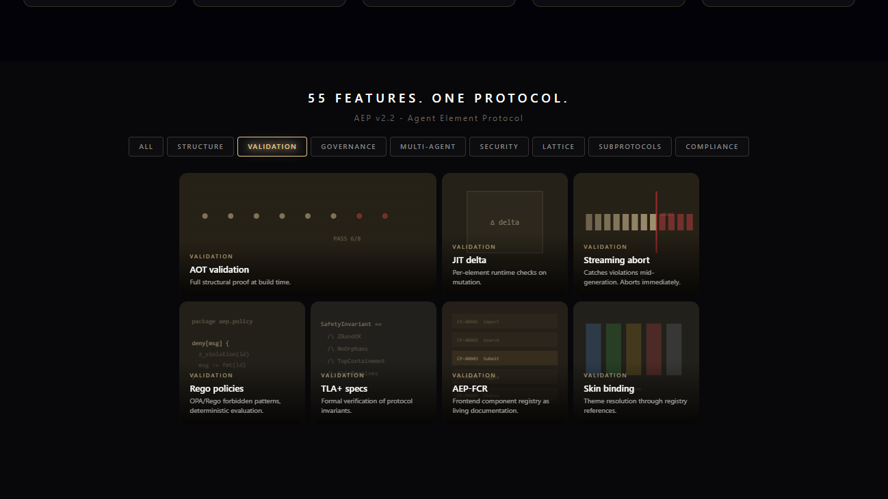

# AEP - Agent Element Protocol (Deterministic Adjudication Lattices)
# Free Basic Open-Source Version Implementation Reference
### Version 2.5 - 25 April 2026
### Author: thePM_001 (https://x.com/thePM_001)
### License: Apache-2.0
### Research Paper: https://github.com/the-PM001/AEP-research-paper-001
### Demo: https://aep.newlisbon.agency
### How to install AEP ?
copy the URL of the GitHub repo into your reasoning LLM + tell it: "analyze the repo and prepare implementation plan for AEP integration into our project".
### AEP 2.5 Agent Harness so your AI actually uses AEP: https://github.com/thePM001/AEP-agent-element-protocol/tree/main/harness/aep-2.5-agent-harness
---

### 55 Features. One Protocol.



## [Explore the full interactive grid at aep.newlisbon.agency](https://aep.newlisbon.agency)

---

> **Note about formal verification:** The original AEP stack includes a proprietary formal verification layer that we are unable to release as open source. This guide provides TLA+ specifications for equivalent invariant checking, plus standalone runtime validators you can drop into any project. The architecture and protocol itself is fully open.

---

## 1. What Is AEP

The Agent Element Protocol (AEP) is a **3-layer governance architecture** that originally was built to give every UI element a unique numerical identity, exact spatial coordinates, defined behaviour rules and themed visual properties.

Of course AEP can be applied basically to any agentic AI outputs that happen inside constrained knowledge domains with fixed rule sets and build schemas.

AEP (Agent Element Protocol) can be applied to almost every use case, because almost every use case in the world's economy is sitting inside a constrained knowledge domain.

The exceptions are purely creative, exploratory or non-schematized activities where the value comes from operating outside known constraint boundaries.

Below follows the original, frontend-specific explanation of the protocol, but the principles can be applied across a very large amount of use cases.

It solves a fundamental problem: **AI agents (and human developers) cannot precisely reference, modify or reason about UI components without a deterministic, machine-readable map of the interface.**

AEP treats the frontend as a **topological coordinate system**, not a fluid DOM tree. Every element has an exact layout constraint (anchors/flex/grid), a `z` index, a numerical ID, a parent-child hierarchy and a set of behavioural constraints. This means:

- An AI agent can say *"anchor CP-00003 to the bottom of PN-00001"* and every participant (human or machine) knows exactly what moved and where.
- A developer can look up any element by its prefix + number and instantly know its type, behaviour, parent, visual rules and constraints.
- A build system can verify that no orphan components exist, no z-index violations occur and no forbidden UI patterns are created.
- A designer can swap the entire visual skin without touching structure or behaviour.

You can try out a live demo of AEP in action here: https://aep.newlisbon.agency 
Connect your AI coding agent to the MCP server and instruct it to build a dashboard, etc.
Watch via live Websocket connection, how the hallucinations are intercepted by AEP.

AEP's validation pattern extends beyond the frontend. Any domain with rigid, predefined schemas (workflows, REST APIs, event-driven systems, infrastructure as code) can use the same architecture.

Four important subprotocols are implemented in a single unified SDK:

**`sdk/sdk-aep-protocols.py`**

| Subprotocol | Registry Class | What It Validates |
|-------------|----------------|-------------------|
| Workflows | `WorkflowRegistry` | Actions, state transitions, payload schemas, approval gates |
| REST APIs | `APIRegistry` | HTTP methods, endpoint paths, request bodies, headers, query params |
| Events / Pub-Sub | `EventRegistry` | Topics, payload schemas, producer permissions, correlation IDs, size limits |
| Infrastructure as Code | `IaCRegistry` | Resource kinds, required fields, forbidden fields, type and value constraints |

Each subprotocol ships with pre-built registries for common use cases (task management workflows, CRUD APIs, event-driven systems, Kubernetes resources). All registries are stateless and safe for multi-agent environments.

See `subprotocols/protocol-aep-extensions-README.md` for full documentation and usage examples.

---

## 2. The Three Layers

AEP enforces strict separation of concerns into three independent layers. Each layer has its own config file. **Changing one layer NEVER requires changing another.**

```
LAYER 1: STRUCTURE (aep-scene.json)
  What exists and where it sits in space.
  Element IDs, topological constraints, dimensions, parent-child hierarchy, visibility.

LAYER 2: BEHAVIOUR (aep-registry.yaml)
  What each element does and what it cannot do.
  Actions, events, states, constraints, forbidden patterns, data sources, skin bindings.

LAYER 3: SKIN (aep-theme.yaml)
  What each element looks like.
  colours, typography, spacing, borders, animations, component-specific styles.
```

### Why three layers ?

| Scenario | What changes | What stays |
|----------|-------------|------------|
| Add dark mode | Skin only | Structure + Behaviour unchanged |
| Move sidebar to the right | Structure only | Behaviour + Skin unchanged |
| Add keyboard shortcut to a button | Behaviour only | Structure + Skin unchanged |
| AI agent repositions a panel | Structure only | Behaviour + Skin unchanged |
| Complete visual rebrand | Skin only | Structure + Behaviour unchanged |

If you find yourself editing two layers for one change, the separation is broken. Fix it.

---

## 3. Schema Versioning

Every AEP config file MUST include a metadata header declaring its protocol version and schema revision. This enables AI agents and parsers to select the correct rule set and allows safe migration across protocol versions.

**In JSON files (`aep-scene.json`):**
```json
{
  "aep_version": "1.1",
  "schema_revision": 1,
  "elements": { ... }
}
```

**In YAML files (`aep-registry.yaml`, `aep-theme.yaml`):**
```yaml
aep_version: "1.1"
schema_revision: 1
```

The validator MUST reject any config file that is missing `aep_version`. The `schema_revision` field is an integer that increments whenever the project's own schema changes within the same AEP version.

---

## 4. Layer 1: Structure (`aep-scene.json`)

The scene graph. A flat JSON object where every UI element has **topological constraints (anchors/flex rules)**, dimensions, z-index, parent reference and visibility flag.

### Schema

```json
{
  "aep_version": "1.1",
  "schema_revision": 1,
  "elements": {
    "SH-00001": {
      "id": "SH-00001",
      "type": "shell",
      "label": "App Shell",
      "z": 0,
      "visible": true,
      "parent": null,
      "spatial_rule": "flex",
      "direction": "column",
      "layout": {
        "width": "100vw",
        "height": "100vh"
      },
      "children": ["PN-00001", "PN-00002", "PN-00003"]
    },
    "PN-00001": {
      "id": "PN-00001",
      "type": "panel",
      "label": "Header Panel",
      "z": 10,
      "visible": true,
      "parent": "SH-00001",
      "spatial_rule": "flex",
      "direction": "row",
      "justify": "space-between",
      "layout": {
        "width": "100%",
        "height": "40px"
      },
      "children": ["CP-00001", "CP-00002"]
    },
    "PN-00003": {
      "id": "PN-00003",
      "type": "panel",
      "label": "Main Content",
      "z": 10,
      "visible": true,
      "parent": "SH-00001",
      "layout": {
        "anchors": {
          "top": "PN-00001.bottom",
          "left": "SH-00001.left",
          "right": "SH-00001.right"
        },
        "height": "content-fit"
      },
      "children": []
    }
  },
  "viewport_breakpoints": {
    "base": { "max_width": 639 },
    "vp-md": { "min_width": 640, "max_width": 1023 },
    "vp-lg": { "min_width": 1024 }
  },
  "camera": {
    "x": 0,
    "y": 0,
    "zoom": 1.0
  }
}
```

### Rules

1. Every element MUST have a unique ID following the prefix convention (see Section 6).
2. Every element MUST have a parent (except the root Shell).
3. Children MUST be topologically contained within their parent (anchors resolve to parent or siblings, flex/grid children belong to a valid spatial rule).
4. z-index values MUST follow the z-band hierarchy (see Section 7).
5. The scene graph is the **single source of truth** for layout. CSS positioning derives from it, not the other way around.

---

## 5. Layer 2: Behaviour (`aep-registry.yaml`)

The component registry. Every element that renders pixels has an entry defining what it does, what states it has, what events it emits and what it is forbidden from doing. Layer 2 contains **no visual properties**. All styling is delegated to Layer 3 through a `skin_binding` reference.

### Schema

```yaml
aep_version: "1.1"
schema_revision: 1

CP-00001:
  label: "Import Button"
  category: action          # action | data-input | data-display | feedback | layout | system
  function: "Opens file dialog to import CSV/XLSX files into the engine."
  component_file: "HeaderPanel.jsx"
  parent: "PN-00001"
  skin_binding: "button_primary"
  states:
    default: "Idle, clickable"
    hover: "Lighter accent background"
    loading: "Disabled, shows spinner while file is being imported"
    disabled: "Grayed out when no file system access (web mode)"
  actions:
    - "open_file_dialog"
    - "trigger_import"
  events:
    click: "invoke('import_file')"
    dragover: "show_drop_overlay"
  constraints:
    - "Must always be visible in header"
    - "Must be disabled during active import"
    - "Must show loading state while engine processes file"
  data_source: "None (triggers engine command)"
  user_interaction: "Click to import or drag file onto button"
  keyboard_shortcut: "Ctrl+O"
```

### Registry entry requirements

Every entry MUST have:
- **label**: Human-readable name
- **category**: One of: `action`, `data-input`, `data-display`, `feedback`, `layout`, `system`
- **function**: One sentence explaining why this element exists
- **component_file**: The React/Vue/Svelte file that renders it
- **parent**: AEP ID of the parent element
- **skin_binding**: A key that maps to a named style block in `aep-theme.yaml` (see Section 8)
- **states**: All possible states with descriptions
- **constraints**: Rules that the validator can verify

### Template Nodes (Dynamic Elements)

Elements that are spawned dynamically at runtime (e.g., rows in a virtualised list, cards in an infinite scroll) are governed by **Template Nodes**. A Template Node defines the structure, behaviour and skin binding for a class of dynamic instances. The validator checks the Template at build time. At runtime, instances spawned from the Template inherit its mathematically proven safety and are exempt from per-instance validation.

```yaml
CN-TEMPLATE-01:
  label: "Result Row"
  category: data-display
  function: "Displays a single result row in the results list."
  component_file: "ResultRow.jsx"
  parent: "CZ-00001"
  skin_binding: "cell_node"
  states:
    default: "Displays record data"
    selected: "Highlighted with accent border"
    loading: "Skeleton placeholder while data loads"
  constraints:
    - "Must inherit z-band from parent CZ-00001"
    - "Must not exceed parent width"
  instance_prefix: "CN"
  instance_range: "CN-00001 to CN-99999"
```

When the database returns 10,000 records, the framework spawns `CN-00001` through `CN-10000`. Each instance inherits all properties from `CN-TEMPLATE-01`. The runtime validator ignores individual instances because the mould has already been proven safe. You validate the mould, not every item poured from it.

### Forbidden Patterns

The registry defines patterns that must NEVER occur. AEP uses **Open Policy Agent (OPA / Rego)** as the formal policy language for forbidden pattern rules. This provides an enterprise-grade, heavily tested parser with a strict AST (Abstract Syntax Tree) and deterministic evaluation, ensuring that all validators - regardless of implementation language - evaluate rules identically.

```rego
package aep.forbidden

# Modals must always render above the data grid
deny[msg] {
  some m
  startswith(m, "MD")
  some g
  startswith(g, "CZ")
  input.scene[m].z <= input.scene[g].z
  msg := sprintf("Modal %v (z=%v) must render above grid %v (z=%v)", [m, input.scene[m].z, g, input.scene[g].z])
}

# Every component must have a registered parent
deny[msg] {
  some id
  input.scene[id].parent != null
  not input.registry[input.scene[id].parent]
  msg := sprintf("Orphan element: %v references unregistered parent %v", [id, input.scene[id].parent])
}

# All element IDs must be unique (enforced by object keys, but verified in children arrays)
deny[msg] {
  some i, j
  i != j
  input.all_child_refs[i] == input.all_child_refs[j]
  msg := sprintf("Duplicate child reference: %v", [input.all_child_refs[i]])
}
```

---

## 6. AEP Prefix Convention

Every element ID follows the format: `XX-NNNNN` where XX is a 2-letter type prefix and NNNNN is a zero-padded number.

### Universal prefixes (use these in every project)

| Prefix | Type | Description | z-band |
|--------|------|-------------|--------|
| SH | Shell | Root application container | 0 |
| PN | Panel | Major layout sections | 10-19 |
| CP | Component | Interactive elements (buttons, inputs, toggles) | 20-29 |
| CZ | Cell Zone | Repeating data display regions (grids, lists) | 30-39 |
| CN | Cell Node | Individual items within a Cell Zone (dynamic, see Template Nodes) | 30-39 |
| TB | Toolbar | Status bars, tool strips | 40-49 |
| WD | Widget | Self-contained visual units (charts, cards, meters) | 50-59 |
| OV | Overlay | Transparent layers over content (animations, highlights) | 60-69 |
| MD | Modal/Dialog | Popups, dialogs, toasts | 70-79 |
| TT | Tooltip | Hover information | 80-89 |
| DD | Dropdown | Flyout menus, select lists | 70-79 |
| NV | Navigation | Sidebars, tabs, breadcrumbs | 10-19 |
| FM | Form | Form containers | 20-29 |
| IC | Icon | Standalone icon elements | 20-29 |

Add project-specific prefixes as needed. Define them in your README before writing any code.

---

## 7. Z-Band Hierarchy

z-index values are grouped into bands. An element's z-index MUST fall within its type's band. The validator rejects violations.

```
z: 0-9     Shells (root containers, backgrounds)
z: 10-19   Panels, Navigation (major layout sections)
z: 20-29   Components, Forms, Icons (interactive elements)
z: 30-39   Cell Zones, Cell Nodes (data grids, lists)
z: 40-49   Toolbars (status bars, filter bars)
z: 50-59   Widgets (charts, cards, visualizations)
z: 60-69   Overlays (animations, selection highlights, debug)
z: 70-79   Modals, Dialogs, Dropdowns (interrupting content)
z: 80-89   Tooltips (highest non-system layer)
z: 90-99   System (loading screens, fatal errors, dev tools)
```

A Modal (z: 70-79) ALWAYS renders above a Data Grid (z: 30-39). A Tooltip (z: 80-89) ALWAYS renders above a Modal. This is **mathematically enforced**, not left to CSS cascade accidents.

---

## 8. Layer 3: Skin (`aep-theme.yaml`)

The visual theme. All colours, fonts, spacing, borders, shadows and animation parameters live here. Components reference theme variables through their `skin_binding` declared in Layer 2. No component ever contains hardcoded visual values.

### Schema

```yaml
aep_version: "1.1"
schema_revision: 1

theme_name: "Project Dark"

colours:
  bg_primary: "#0D1117"
  bg_secondary: "#161B22"
  bg_cell: "#1C2128"
  border: "#30363D"
  text_primary: "#E6EDF3"
  text_secondary: "#8B949E"
  accent: "#58A6FF"
  accent_hover: "#79C0FF"
  error: "#F85149"
  success: "#3FB950"
  warning: "#D29922"

typography:
  font_family: "-apple-system, BlinkMacSystemFont, 'Segoe UI', sans-serif"
  font_mono: "'JetBrains Mono', 'SF Mono', monospace"
  font_size_xs: "9px"
  font_size_sm: "11px"
  font_size_md: "13px"
  font_size_lg: "16px"
  font_size_xl: "20px"
  font_weight_normal: 400
  font_weight_semi: 600
  font_weight_bold: 700

dimensions:
  header_height: 40
  footer_height: 56
  row_height: 32
  sidebar_width: 250
  modal_width: 400
  border_radius_sm: 4
  border_radius_md: 8
  spacing_xs: 4
  spacing_sm: 8
  spacing_md: 12
  spacing_lg: 16
  spacing_xl: 24

animations:
  spring:
    type: "spring"
    stiffness: 300
    damping: 30
    duration_ms: 300
  fade:
    duration_ms: 150
    easing: "ease-out"
  slide:
    duration_ms: 200
    easing: "ease-in-out"

component_styles:
  button_primary:
    background: "{colours.accent}"
    colour: "#000000"
    padding: "4px 12px"
    border_radius: "{dimensions.border_radius_sm}px"
    font_weight: "{typography.font_weight_semi}"
    font_size: "{typography.font_size_sm}"
  button_secondary:
    background: "transparent"
    colour: "{colours.text_secondary}"
    border: "1px solid {colours.border}"
    padding: "4px 12px"
    border_radius: "{dimensions.border_radius_sm}px"
  input:
    background: "{colours.bg_cell}"
    colour: "{colours.text_primary}"
    border: "1px solid {colours.border}"
    padding: "8px 12px"
    border_radius: "{dimensions.border_radius_sm}px"
    font_family: "{typography.font_mono}"
  cell_node:
    background: "{colours.bg_cell}"
    colour: "{colours.text_primary}"
    padding: "4px 8px"
    border_bottom: "1px solid {colours.border}"
    font_size: "{typography.font_size_sm}"
```

### Template variable resolution

Values wrapped in `{...}` are resolved at load time:
- `{colours.accent}` → `#58A6FF`
- `{dimensions.border_radius_sm}px` → `4px`
- Nested references are supported: `{component_styles.button_primary.background}`

### Skin binding resolution

When a component renders, it reads its `skin_binding` from the registry and resolves the corresponding block from `component_styles` in the theme:

```
Registry: CP-00001.skin_binding = "button_primary"
Theme:    component_styles.button_primary → { background, colour, padding, ... }
Result:   CP-00001 renders with the resolved style properties
```

This ensures that Layer 2 never contains visual properties. All styling flows exclusively through Layer 3.

### Swapping themes

To add a light mode or high-contrast mode, create a new YAML file (e.g., `aep-theme-light.yaml`) with different values for the same keys. The structure and behaviour layers remain untouched.

---

## 9. Responsive Layout: The Topological Constraint System

AEP's Layer 1 uses a **Topological Constraint System** for spatial layout. Elements declare their position through relational anchors, flex/grid spatial rules and viewport-aware breakpoint matrices. This ensures AI determinism, formal verification and strict layer separation across all screen sizes and responsive contexts.

### 9.1 Relational Anchors

Elements declare their position *relative* to parents or siblings through relational anchors. The layout stretches and compresses dynamically while the mathematical relationships remain strictly verifiable.

```json
"layout": {
  "anchors": {
    "top": "PN-00001.bottom",
    "left": "SH-00001.left",
    "right": "SH-00001.right"
  },
  "width": "100%",
  "height": "content-fit"
}
```

An AI agent can mathematically prove that the Main Content sits directly below the Header, even without knowing the Header's exact pixel height.

### 9.2 Structured Flex/Grid Zones

AEP uses Flexbox and Grid concepts as explicit spatial rules in the scene graph. If a parent is defined as `flex-row`, the validator enforces that children flow horizontally.

```json
"PN-00001": {
  "id": "PN-00001",
  "type": "panel",
  "spatial_rule": "flex",
  "direction": "row",
  "justify": "space-between",
  "children": ["CP-00001", "CP-00002"]
}
```

To add a new button (`CP-00003`), an AI agent appends it to the `children` array. No pixel calculation needed - the spatial rule guarantees sequential placement.

### 9.3 The Viewport Matrix (Responsive Breakpoints)

AEP elevates breakpoints into a machine-readable matrix inside `aep-scene.json`, making them visible to AI agents and validators alike.

```json
"PN-00002": {
  "id": "PN-00002",
  "type": "panel",
  "label": "Sidebar",
  "responsive_matrix": {
    "base": { "visible": false },
    "vp-md": { "visible": true, "width": 250 },
    "vp-lg": { "visible": true, "width": 300 }
  }
}
```

An AI agent can query this and instantly know: it cannot place an essential button inside `PN-00002` if the user is on mobile, because `base` visibility is `false`. This prevents catastrophic layout mistakes.

### 9.4 Runtime Reflection Loop

The JSON scene graph is the source of truth for *intent*, but the browser calculates the *actual pixels*. To maintain AI-friendliness, the AEP framework reads the browser's actual bounding boxes and feeds them back into a live state object:

```javascript
const runtimeState = AEP.getRuntimeCoordinates("CP-00001");
// Returns: { x: 345, y: 12, width: 120, height: 40, rendered_at: "vp-lg" }
```

### 9.5 TLA+ Invariants for Topological Layout

The formal verification layer checks *topology* - constraint satisfiability and logical containment:

```
For all elements:
  IF Parent spatial_rule = "grid"
  THEN all Children MUST have a valid grid_area mapping
```

### 9.6 Layer Responsibilities

| Layer | Responsibility |
|-------|----------------|
| Layer 1 (Structure) | Defines **topology and constraints** (flex, grid, anchors, breakpoints) for all layout |
| Layer 2 (Behaviour) | Actions, states, z-bands, skin bindings |
| Layer 3 (Skin) | colours, fonts, all visual properties |

The result: a fully responsive application that fluidly adapts to mobile and desktop while providing AI agents with a strict, deterministic, machine-readable map of the interface.

---

## 10. Implementation Guide

### Step 1: Define your element inventory

Before writing any code, list every UI element. Give each one an AEP ID. For repeating data elements, define a Template Node.

```
SH-00001       App Shell
PN-00001       Header
PN-00002       Sidebar
PN-00003       Main Content
CP-00001       Logo
CP-00002       Search Input
CP-00003       Submit Button
CZ-00001       Results List
CN-TEMPLATE-01 Result Item (template for dynamic instances)
TB-00001       Status Bar
MD-00001       Settings Dialog
```

### Step 2: Create `aep-scene.json`

Define the spatial layout. Every element gets constraints, dimensions, z-index and parent. Include `aep_version` and `schema_revision` in the file header.

### Step 3: Create `aep-registry.yaml`

Define the behaviour for every element. States, actions, events, constraints, skin bindings, forbidden patterns (in Rego). Define Template Nodes for all dynamic element types.

### Step 4: Create `aep-theme.yaml`

Define the visual skin. colours, fonts, spacing, animation params. Define a `component_styles` block for every `skin_binding` referenced in the registry.

### Step 5: Build the loader

**Rust (Tauri / server):**
```rust
pub struct AEPConfig {
    pub version: String,
    pub schema_revision: u32,
    pub scene: AEPScene,
    pub registry: AEPRegistry,
    pub theme: AEPTheme,
}

impl AEPConfig {
    pub fn load(config_dir: &Path) -> Result<Self, AEPLoadError>;
}
```

**JavaScript (SPA / React):**
```javascript
import scene from '../config/aep-scene.json';
import registry from '../config/aep-registry.yaml';
import theme from '../config/aep-theme.yaml';

const aep = { scene, registry, theme };

// Validate version compatibility
if (scene.aep_version !== registry.aep_version) {
  throw new Error('AEP version mismatch between scene and registry');
}
```

### Step 6: Wire components to the registry

Every React/Vue/Svelte component reads its `skin_binding` from the registry and resolves the corresponding style block from the theme:

```jsx
function AEPButton({ id }) {
  const spec = registry[id];
  const style = resolveStyles(spec.skin_binding, theme);
  
  return (
    <button
      data-aep-id={id}
      style={style}
      title={spec.label}
      disabled={currentState === 'disabled'}
    >
      {spec.label}
    </button>
  );
}
```

### Step 7: Add validation

See Section 12 for the standalone validator (AOT and JIT modes) and Section 13 for TLA+ formal specifications.

### Step 8 (optional): AI Scaffolding Compiler

Because AEP is perfectly machine-readable, a developer can write a shorthand file describing the UI and an AI agent auto-generates the strict `aep-scene.json`, `aep-registry.yaml` and `aep-theme.yaml` files, ensuring full compliance without the human typing thousands of lines of boilerplate. AEP's deterministic structure makes it an ideal compilation target for AI-driven development workflows.

---

## 11. AEP-FCR (Frontend Component Registry)

AEP-FCR is the specific name for Layer 2 (`aep-registry.yaml`) when used as the authoritative frontend component registry. It answers: *"What components exist, what do they do and what are they forbidden from doing ?"*

### Why AEP-FCR matters for AI-driven development

When an AI agent needs to modify the frontend:

1. The agent reads `aep-registry.yaml` to understand what exists
2. The agent reads `aep-scene.json` to understand spatial layout
3. The agent proposes a change (e.g., "add a new button to the header")
4. The change is validated against:
   - Does the parent exist ? (`scene.json`)
   - Is the z-index in the correct band ? (z-hierarchy)
   - Does it violate any forbidden pattern ? (`registry.yaml`, evaluated by OPA/Rego)
   - Does the new ID follow the prefix convention ? (prefix rules)
   - Does the `skin_binding` resolve to a valid `component_styles` block ? (theme check)
5. If validation passes, the change is applied
6. If validation fails, the agent gets a specific error and can self-correct

Without AEP-FCR, AI agents guess at component names, create orphaned elements, violate z-index ordering and produce inconsistent UIs. With AEP-FCR, every modification is deterministic and verifiable.

### AEP-FCR as documentation

The registry IS the documentation for the frontend. Every element's purpose, states, constraints, skin binding and data sources are defined in one place. New developers (human or AI) read the registry to understand the UI.

---

## 12. Standalone Validation

AEP validation is split into two modes:

**AOT (Ahead-of-Time) Validation** runs at build time. It proves that the static scene graph, registry and theme are 100% mathematically sound. AOT checks every element, every parent reference, every z-band, every skin binding resolution, every forbidden pattern and every Template Node. This is the full structural proof.

**JIT (Just-in-Time) Delta Validation** runs at runtime. When an AI agent or user triggers a mutation, the JIT validator checks *only* the specific element being mutated against its immediate parents, constraints and z-band. It does not re-scan the entire scene graph. Template Node instances are exempt from JIT validation because the mould has already been proven safe by AOT.

### Validator (Rust)

```rust
pub fn validate_aep_change(
    scene: &AEPScene,
    registry: &AEPRegistry,
    theme: &AEPTheme,
    element_id: &str,
    change: &AEPChange,
) -> Result<(), AEPError> {
    // Check 1: Element ID must exist in registry (or be a Template Node instance)
    if !registry.contains(element_id) && !is_template_instance(element_id, registry) {
        return Err(AEPError::UnknownElement(element_id.into()));
    }
    
    // Check 2: Parent must exist in scene
    if let Some(parent) = &change.parent {
        if !scene.contains(parent) {
            return Err(AEPError::InvalidParent(parent.into()));
        }
    }
    
    // Check 3: z-index must be within the type's band
    if let Some(z) = change.z {
        let prefix = &element_id[..2];
        let (min_z, max_z) = z_band_for_prefix(prefix);
        if z < min_z || z > max_z {
            return Err(AEPError::ZBandViolation(format!(
                "{} z={} outside band {}-{}", element_id, z, min_z, max_z
            )));
        }
    }
    
    // Check 4: Must not match any forbidden pattern (evaluated by OPA/Rego)
    let rego_result = evaluate_rego_policy(scene, registry, element_id, change)?;
    if !rego_result.denials.is_empty() {
        return Err(AEPError::ForbiddenPattern(rego_result.denials.join("; ")));
    }
    
    // Check 5: Prefix must match element type
    let prefix = &element_id[..2];
    if !valid_prefix_for_type(prefix, &change.element_type) {
        return Err(AEPError::PrefixTypeMismatch(element_id.into()));
    }
    
    // Check 6: skin_binding must resolve to a valid component_styles block
    if let Some(binding) = &change.skin_binding {
        if !theme.component_styles.contains_key(binding) {
            return Err(AEPError::InvalidSkinBinding(format!(
                "{} references unknown skin binding: {}", element_id, binding
            )));
        }
    }
    
    Ok(())
}

fn is_template_instance(id: &str, registry: &AEPRegistry) -> bool {
    let prefix = &id[..2];
    registry.templates.values().any(|t| t.instance_prefix == prefix)
}
```

### Validator (TypeScript - for JS/TS projects)

```typescript
interface AEPValidationResult {
  valid: boolean;
  errors: string[];
}

function validateAEP_AOT(
  scene: Record<string, AEPElement>,
  registry: Record<string, AEPRegistryEntry>,
  theme: AEPTheme,
): AEPValidationResult {
  const errors: string[] = [];

  // Check 1: Every scene element has a registry entry (or is a template instance)
  for (const id of Object.keys(scene)) {
    if (!registry[id] && !isTemplateInstance(id, registry)) {
      errors.push(`Orphan element: ${id} exists in scene but not in registry`);
    }
  }

  // Check 2: All parent references resolve
  for (const [id, el] of Object.entries(scene)) {
    if (el.parent && !scene[el.parent]) {
      errors.push(`${id} references non-existent parent ${el.parent}`);
    }
  }

  // Check 3: z-index within correct band
  for (const [id, el] of Object.entries(scene)) {
    const prefix = id.substring(0, 2);
    const [minZ, maxZ] = zBandForPrefix(prefix);
    if (el.z < minZ || el.z > maxZ) {
      errors.push(`${id} z=${el.z} outside band ${minZ}-${maxZ}`);
    }
  }

  // Check 4: Topological containment (anchors and spatial rules)
  for (const [id, el] of Object.entries(scene)) {
    if (el.layout?.anchors) {
      for (const [direction, target] of Object.entries(el.layout.anchors)) {
        const targetId = (target as string).split('.')[0];
        if (!scene[targetId] && targetId !== 'viewport') {
          errors.push(`${id} has invalid anchor target: ${targetId}`);
        }
      }
    }
    if (el.spatial_rule && el.children) {
      for (const childId of el.children) {
        if (!scene[childId]) {
          errors.push(`${id} spatial rule references missing child: ${childId}`);
        }
      }
    }
    if (el.responsive_matrix) {
      for (const bp of Object.keys(el.responsive_matrix)) {
        if (bp !== 'base' && !scene._breakpoints?.[bp]) {
          // Warn if breakpoint not in viewport_breakpoints (non-fatal)
        }
      }
    }
  }

  // Check 5: No duplicate child references
  const allChildRefs = Object.values(scene).flatMap(el => el.children || []);
  const seen = new Set<string>();
  for (const ref of allChildRefs) {
    if (seen.has(ref)) errors.push(`Duplicate child reference: ${ref}`);
    seen.add(ref);
  }

  // Check 6: All skin_binding references resolve to component_styles
  for (const [id, entry] of Object.entries(registry)) {
    if (entry.skin_binding && !theme.component_styles[entry.skin_binding]) {
      errors.push(`${id} skin_binding "${entry.skin_binding}" not found in theme`);
    }
  }

  // Check 7: Forbidden patterns (evaluate via OPA/Rego)
  const regoDenials = evaluateRegoPolicy(scene, registry);
  errors.push(...regoDenials);

  return { valid: errors.length === 0, errors };
}

function validateAEP_JIT(
  scene: Record<string, AEPElement>,
  registry: Record<string, AEPRegistryEntry>,
  theme: AEPTheme,
  elementId: string,
  change: Partial<AEPElement>,
): AEPValidationResult {
  const errors: string[] = [];

  // Skip validation for template instances (mould already proven by AOT)
  if (isTemplateInstance(elementId, registry)) {
    return { valid: true, errors: [] };
  }

  // Delta checks: only the mutated element and its immediate relationships
  if (change.parent && !scene[change.parent]) {
    errors.push(`${elementId} references non-existent parent ${change.parent}`);
  }

  if (change.z !== undefined) {
    const prefix = elementId.substring(0, 2);
    const [minZ, maxZ] = zBandForPrefix(prefix);
    if (change.z < minZ || change.z > maxZ) {
      errors.push(`${elementId} z=${change.z} outside band ${minZ}-${maxZ}`);
    }
  }

  return { valid: errors.length === 0, errors };
}

function isTemplateInstance(id: string, registry: Record<string, AEPRegistryEntry>): boolean {
  const prefix = id.substring(0, 2);
  return Object.values(registry).some(
    entry => entry.instance_prefix === prefix
  );
}

function zBandForPrefix(prefix: string): [number, number] {
  const bands: Record<string, [number, number]> = {
    SH: [0, 9], PN: [10, 19], NV: [10, 19],
    CP: [20, 29], FM: [20, 29], IC: [20, 29],
    CZ: [30, 39], CN: [30, 39],
    TB: [40, 49], WD: [50, 59], OV: [60, 69],
    MD: [70, 79], DD: [70, 79], TT: [80, 89],
  };
  return bands[prefix] || [0, 99];
}
```

---

## 13. Formal Verification with TLA+

> **Why TLA+:** The proprietary verification stack that accompanies AEP in production cannot be open-sourced at this time. TLA+ gives you an equivalent way to formally specify and model-check AEP invariants. You can run these specs through the TLC model checker to prove your UI state space never violates the protocol.

### AEP Invariants in TLA+

```tla
-------------------------------- MODULE AEP --------------------------------
EXTENDS Integers, Sequences, FiniteSets

CONSTANTS ElementIDs, Prefixes, ZBands

VARIABLES scene, registry

TypeInvariant ==
  /\ \A id \in DOMAIN scene :
       /\ scene[id].z \in Int
       /\ scene[id].parent \in DOMAIN scene \cup {"null"}
       \* Layout is either anchors, spatial_rule or absolute
       /\ \/ "anchors" \in DOMAIN scene[id]
          \/ "spatial_rule" \in DOMAIN scene[id]
          \/ ("x" \in DOMAIN scene[id] /\ "y" \in DOMAIN scene[id])

\* --- INVARIANT 1: z-band correctness ---
ZBandInvariant ==
  \A id \in DOMAIN scene :
    LET prefix == SubSeq(id, 1, 2)
        band   == ZBands[prefix]
    IN  scene[id].z >= band[1] /\ scene[id].z <= band[2]

\* --- INVARIANT 2: no orphan elements ---
NoOrphans ==
  \A id \in DOMAIN scene :
    scene[id].parent = "null"    \* root shell
    \/ scene[id].parent \in DOMAIN scene

\* --- INVARIANT 3: topological containment (anchors resolve) ---
TopologicalContainment ==
  \A id \in DOMAIN scene :
    \* All anchor targets must reference existing elements
    ("anchors" \in DOMAIN scene[id]) =>
      \A dir \in DOMAIN scene[id].anchors :
        LET targetId == scene[id].anchors[dir].elementId
        IN  targetId \in DOMAIN scene \cup {"viewport"}

\* --- INVARIANT 4: spatial rule children exist ---
SpatialRuleValid ==
  \A id \in DOMAIN scene :
    ("spatial_rule" \in DOMAIN scene[id]) =>
      \A child \in scene[id].children :
        child \in DOMAIN scene

\* --- INVARIANT 5: modals always above grids ---
ModalAboveGrid ==
  \A m \in DOMAIN scene : \A g \in DOMAIN scene :
    (SubSeq(m, 1, 2) = "MD" /\ SubSeq(g, 1, 2) = "CZ")
    => scene[m].z > scene[g].z

\* --- INVARIANT 6: unique IDs (enforced by DOMAIN, but stated for clarity) ---
UniqueIDs == Cardinality(DOMAIN scene) = Cardinality(DOMAIN scene)

\* --- INVARIANT 7: skin bindings resolve ---
SkinBindingsResolve ==
  \A id \in DOMAIN registry :
    registry[id].skin_binding \in DOMAIN theme.component_styles

\* --- Combined safety property ---
SafetyInvariant ==
  /\ TypeInvariant
  /\ ZBandInvariant
  /\ NoOrphans
  /\ TopologicalContainment
  /\ SpatialRuleValid
  /\ ModalAboveGrid
  /\ SkinBindingsResolve

=============================================================================
```

To use: define your concrete `ElementIDs`, `Prefixes` and `ZBands` in a model config, then run `tlc AEP.tla` to check all reachable states.

---

## 14. Anti-Patterns

| Anti-pattern | Why it's wrong | The AEP way |
|-------------|---------------|-------------|
| Hardcoding colours in components | Theme swap requires editing every file | Use `skin_binding` referencing `component_styles` in `aep-theme.yaml` |
| Putting visual properties in the registry | Violates layer separation between behaviour and skin | Layer 2 contains `skin_binding` only; Layer 3 owns all visuals |
| Using CSS z-index arbitrarily | Modals end up behind dropdowns | z-band hierarchy enforced by validation |
| Creating components without registry entries | Orphan components nobody can reference | Every pixel has an AEP ID and registry entry |
| Mixing structure and behaviour | Moving a panel breaks its click handlers | Structure and behaviour are separate files |
| Using string names instead of IDs | "the sidebar button" is ambiguous | `CP-00003` is unambiguous across human and AI |
| Letting AI agents freestyle the UI | Agents create inconsistent, untraceable elements | Agents must propose changes validated against AEP-FCR |
| Documenting components in a separate wiki | Docs drift from reality within days | The registry IS the documentation |
| Registering every dynamic row individually | Thousands of registry entries, impossible to validate at 60fps | Use Template Nodes; validate the mould, not every instance |
| Writing forbidden patterns in a custom DSL | Ambiguous parsing, inconsistent evaluation across validators | Use OPA/Rego for formally defined, enterprise-grade policy rules |
| Omitting version headers from config files | AI agents cannot determine which rule set to apply | Every config file mandates `aep_version` and `schema_revision` |
| Running full validation on every runtime mutation | Causes UI stutter on large scene graphs | Use AOT for full proof at build time; JIT delta for runtime mutations |

---

## 15. Quick-Start Checklist

```
[ ] Define all UI elements with AEP IDs (prefix + number)
[ ] Define Template Nodes for all dynamic/repeating element types
[ ] Create aep-scene.json with aep_version header (spatial layout, hierarchy)
[ ] Create aep-registry.yaml with aep_version header (behaviour, states, constraints, skin bindings, forbidden patterns in Rego)
[ ] Create aep-theme.yaml with aep_version header (colours, fonts, spacing, animations, component_styles for every skin_binding)
[ ] Add data-aep-id attribute to every rendered element
[ ] Wire component styles to skin_binding → theme resolution (no hardcoded values)
[ ] Add AOT validation to the build pipeline (see Section 12)
[ ] Add JIT delta validation for runtime mutations (see Section 12)
[ ] Document project-specific prefixes in README
[ ] Verify: changing theme YAML changes visuals without touching components or registry
[ ] Verify: every component traceable by its AEP ID
[ ] Verify: no visual properties exist in aep-registry.yaml
[ ] (v2.0) Optional: initialise Lattice Memory (InMemoryFabric or SQLiteFabric)
[ ] (v2.0) Optional: initialise Basic Resolver with config and memory
[ ] (v2.0) Optional: deploy aep-memory-policy.rego alongside aep-policy.rego
[ ] (v2.1) Optional: define agent.policy.yaml with capabilities and limits
[ ] (v2.1) Optional: initialise Evidence Ledger directory
[ ] (v2.1) Optional: run npx aep init claude-code for governed Claude Code sessions
[ ] (v2.1) Optional: add npx aep proxy to MCP configuration
[ ] (v2.2) Optional: enable streaming validation in policy (streaming.enabled: true)
[ ] (v2.2) Optional: enable auto proof bundle on session terminate (session.bundle_on_terminate: true)
[ ] (v2.2) Optional: enable governed task decomposition with scope inheritance (decomposition.enabled: true)
[ ] (v2.5) Optional: enable content scanners in policy (scanners.enabled: true)
[ ] (v2.5) Optional: create and ingest knowledge bases (knowledge.enabled: true)
[ ] (v2.5) Optional: configure governed model gateway (model_gateway section)
[ ] (v2.5) Optional: enable recovery engine for soft violations (recovery.enabled: true)
[ ] (v2.5.1) Optional: enable commerce subprotocol (commerce.enabled: true)
```

---

## 16. Summary

AEP is not a framework or a library. It is an **architectural discipline**. It mandates that every frontend element has:

1. **A unique numerical ID** (`XX-NNNNN`) that humans and AI can unambiguously reference
2. **Exact topological coordinates** (`anchors, spatial_rules, z, dimensions`) in a scene graph
3. **Defined behaviour** (states, actions, events, constraints) in a component registry
4. **Themed visuals** (colours, fonts, spacing) from a swappable skin file, resolved through `skin_binding`
5. **A versioned schema** (`aep_version`, `schema_revision`) in every config file

The three layers (Structure, Behaviour, Skin) are independent. Changing one NEVER requires changing another. This separation enables deterministic AI-driven frontend development, instant theme swapping, build-time structural validation and a living documentation system that never drifts from reality.
---

## 17. Lattice Memory

AEP v2.0 introduces **Lattice Memory**: a persistent, append-only memory subsystem for the adjudication lattice. Memory records every validation outcome (accepted or rejected) along with the proposal, errors, traversal path and an optional embedding vector.

Memory serves two purposes:

1. **Audit trail** - every validation decision is recorded. You can reconstruct exactly what happened, when and why.
2. **Attractor fast-path** - when a new proposal closely matches a previously accepted one (by cosine similarity), the resolver flags it as a likely-valid candidate. Downstream advisory systems can skip expensive re-computation.

**Critical invariant:** Memory is **read-only to the validation pipeline**. The accept/reject decision is 100% deterministic and based solely on the scene graph, registry, theme and Rego policies. Memory never overrides a validation result. This is formally specified in TLA+ as the `MemoryDoesNotAffectDecision` invariant (see `docs/TLA+/AEP_Memory.tla`).

Two storage backends ship with the SDK:

- `InMemoryFabric` - volatile, list-backed. Suitable for tests and short-lived processes.
- `SQLiteFabric` - durable SQLite storage with thread-safe access (`check_same_thread=False`).

Full API reference: `docs/LATTICE-MEMORY.md`. SDK files: `sdk/sdk-aep-memory.py`, `sdk/sdk-aep-memory.ts`.

---

## 18. Basic Resolver

The **Basic Resolver** routes agent proposals to the correct validator pipeline. Given a proposal (UI element, workflow step, API call, event or IaC resource), the resolver determines:

1. **Which domain** handles this proposal (ui, workflow, api, event, iac).
2. **What constraints** apply from the AEP registry.
3. **What actions** are available from the current state (for workflows).
4. **Whether a memory attractor** matches this proposal (fast-path signal).

The resolver is **read-only and stateless**. It never modifies the scene graph, registry, theme or memory. All state comes from inputs. When registries are not provided, the resolver degrades gracefully with informational constraint notes rather than errors.

Full API reference: `docs/RESOLVER.md`. SDK files: `sdk/sdk-aep-resolver.py`, `sdk/sdk-aep-resolver.ts`.

---

## 19. Migration from v1.1 to v2.0

AEP v2.0 is backwards-compatible with v1.1. All existing config files are valid v2.0 files after updating `aep_version` from `"1.1"` to `"2.0"`. 
No existing SDK files were modified. Memory and Resolver are fully optional - they add capabilities without requiring changes to existing integrations.

Step-by-step migration guide: `docs/MIGRATION-v1-to-v2.md`.

---

## 20. Session Governance

AEP v2.1 introduces **Session Governance**: every agent interaction becomes a managed session with lifecycle state, statistics and escalation rules. A session tracks how many actions were evaluated, allowed, denied and gated. Escalation rules can automatically pause or terminate sessions after configurable thresholds (action count, elapsed time or denial count).

```typescript
import { AgentGateway } from "@aep/core";

const gateway = new AgentGateway({ ledgerDir: "./ledgers" });
const session = gateway.createSession("./agent.policy.yaml");

// Evaluate an action against the policy
const verdict = gateway.evaluate(session.id, {
  tool: "aep:create_element",
  input: { id: "CP-00010", z: 25, parent: "PN-00001" },
  timestamp: new Date(),
});

if (verdict.decision === "allow") {
  // Proceed with AEP structural validation
  const result = gateway.validateAEP(session.id, verdict.actionId, {
    id: "CP-00010", type: "component", z: 25, parent: "PN-00001",
  });
}

// Terminate and get report
const report = gateway.terminateSession(session.id, "task complete");
console.log(`${report.totalActions} actions: ${report.allowed} allowed, ${report.denied} denied`);
```

Sessions transition through states: `created` -> `active` -> `paused` -> `active` -> `terminated`. Pausing happens automatically when an action triggers a gate (requires human approval) or an escalation rule fires.

---

## 21. Policy Engine

The **Policy Engine** evaluates every agent action against a YAML policy file before the action reaches AEP structural validation. Policies define capabilities (what tools the agent can use and with what scope), limits (maximum actions, runtime, file changes), gates (actions requiring human approval), forbidden patterns (blocked tool inputs) and escalation rules.

AEP-specific policy capabilities allow fine-grained control over scene graph mutations:

```yaml
version: "2.5"
name: "my-agent-policy"

capabilities:
  - tool: "aep:create_element"
    scope:
      element_prefixes: ["CP", "PN"]      # Only these prefixes
      z_bands: ["20-29", "10-19"]          # Only these z-index ranges
  - tool: "aep:update_element"
    scope:
      exclude_ids: ["SH-00001"]            # Protect root shell

limits:
  max_aep_mutations: 100                   # Per session
  max_runtime_ms: 1800000

gates:
  - action: "aep:delete_element"
    approval: human
    risk_level: high

session:
  max_actions: 100
  rate_limit:
    max_per_minute: 30
  escalation:
    - after_actions: 50
      require: human_checkin
```

Eight built-in policies ship in `policies/`: `coding-agent`, `aep-builder`, `readonly-auditor`, `strict-production`, `multi-agent`, `covenant-only`, `full-governance` and `content-safety`. Validate any policy with `npx aep validate ./my-policy.yaml`.

---

## 22. Evidence Ledger

The **Evidence Ledger** produces an immutable, hash-chained audit trail of every action in a session. Each entry contains a sequence number, ISO 8601 timestamp, SHA-256 hash (computed from the previous hash plus the entry type and data) and the previous entry's hash. The first entry chains from a zero hash.

Storage format: one JSONL file per session. Each line is one JSON object. Tamper detection works by recomputing all hashes and checking the chain. If any entry was modified, `verify()` returns the exact sequence number where the chain breaks.

```typescript
const ledger = gateway.getLedger(session.id);

// Verify chain integrity
const check = ledger.verify();
if (!check.valid) {
  console.error(`Chain broken at entry ${check.brokenAt}`);
}

// Generate summary report
const report = ledger.report();
console.log(`${report.entryCount} entries, chain ${report.chainValid ? "valid" : "broken"}`);
```

The ledger captures both policy decisions (`action:evaluate` with allow/deny) and AEP structural validation results (`aep:validate` or `aep:reject`). Session lifecycle events (`session:start`, `session:terminate`) and rollback actions (`action:rollback`) are also recorded.

CLI: `npx aep report ./ledgers/<session-id>.jsonl` displays the audit trail for any session.

---

## 23. Rollback and Compensation

Every AEP mutation stores a **compensation plan** before execution. If a rollback is needed, the pre-mutation state is restored. Rollback works for individual actions or entire sessions (in reverse chronological order).

AEP-specific rollback operations:

| Original action | Compensation |
|---|---|
| `aep:create_element` | Delete the created element |
| `aep:delete_element` | Recreate from stored backup |
| `aep:update_element` | Restore previous state |
| `aep:update_skin` | Restore previous skin values |
| `aep:update_registry` | Restore previous registry entries |

```typescript
// Store compensation before executing
gateway.storeCompensation(session.id, actionId, "aep:create_element",
  { id: "CP-00010", z: 25, parent: "PN-00001" });

// Later: rollback that specific action
const result = gateway.rollback(session.id, actionId);

// Or rollback the entire session
const results = gateway.rollbackSession(session.id);
```

Every rollback is logged in the evidence ledger as an `action:rollback` entry.

---

## 24. Streaming Validation with Early Abort

Standard validation runs after an agent produces its full output. If a violation occurs at token 50 of a 2000-token response, the remaining 1950 tokens are wasted time and cost.

**Streaming validation** intercepts agent output chunk by chunk as it streams. The moment a violation is detected, the stream is aborted.

```typescript
import { AEPStreamValidator, StreamMiddleware } from "@aep/core";

const validator = new AEPStreamValidator({
  covenant: myCovenantSpec,
  policy: myPolicy,
  scene: { elements: [{ id: "SH-00001", protected: true }] },
  registry: { zBands: { CP: [20, 29] }, parentRules: { CP: { requireParent: true } } },
});

// Wrap any streaming API response
const governed = StreamMiddleware.wrap(agentStream, validator, ledger);

// Read governed stream -- aborts on first violation
const reader = governed.getReader();
while (true) {
  const { done, value } = await reader.read();
  if (done) break;
  process.stdout.write(value);
}
```

Five checks run on every chunk against accumulated output:

1. **Covenant forbid patterns** -- string matching against forbid rules
2. **Protected element IDs** -- detects references to protected scene elements
3. **Z-band violations** -- detects z-index values outside allowed bands
4. **Structural violations** -- orphan references, missing parents
5. **Policy forbidden patterns** -- regex or literal pattern matching

On violation the underlying stream is cancelled, the partial output returned and a `stream:abort` entry logged to the evidence ledger with accumulated content, violation position, rule and reason.

Enable in policy YAML:

```yaml
streaming:
  enabled: true
  abort_on_violation: true
```

Model-agnostic. Works with any `ReadableStream<string>`. No logit access needed.

---

## 25. MCP Proxy and CLI

AEP 2.5 can run as an **MCP proxy** between an AI agent and backend MCP servers. Every tool call is intercepted, policy-evaluated and (for AEP-related tools) structurally validated before forwarding.

**Quick start for Claude Code:**

```bash
npx aep init claude-code
# Creates: .claude/settings.json, CLAUDE.md, agent.policy.yaml

npx aep proxy --policy ./agent.policy.yaml
# Starts governed MCP proxy on stdin/stdout
```

**Quick start for Cursor:**

```bash
npx aep init cursor
# Creates: .cursor/mcp.json, .cursor/rules/aep-governance.mdc, agent.policy.yaml
```

**CLI reference:**

```
aep init <agent>              Set up governance for claude-code, cursor or codex
aep proxy --policy <file>     Start MCP proxy with policy enforcement
aep exec <policy> <command>   Run a command through the shell proxy
aep validate <policy>         Validate a policy YAML file
aep report <ledger-file>      Display audit report for a session ledger
```

---

## 26. Migration from v2.0 to v2.1

AEP v2.1 is backwards-compatible with v2.0. All existing v2.0 config files, SDK modules, Rego policies, Lattice Memory and Basic Resolver continue to work without modification.

Session Governance, Policy Engine, Evidence Ledger and Rollback are fully optional. They add capabilities without requiring changes to existing integrations. To adopt v2.1 features:

1. Create an `agent.policy.yaml` file (or use a built-in policy from `policies/`).
2. Use `AgentGateway` instead of calling validators directly.
3. Evidence ledgers are created automatically in the configured directory.
4. Rollback is opt-in -- call `storeCompensation` before mutations you want to be reversible.

No existing v2.0 code paths were modified. The structural validator, z-band enforcement, prefix convention, Rego policies and memory subsystem remain unchanged.

---

## 27. Proof Bundles

AEP v2.2 introduces **Proof Bundles**: portable, signed verification artifacts that package an entire session into a single `.aep-proof.json` file. A proof bundle contains the bundle ID, agent identity, covenant spec, session report, Merkle root, entry count, trust score, execution ring, drift score, ledger hash and Ed25519 signature.

Proof bundles enable auditors and regulators to independently verify agent sessions without access to the original system.

```typescript
import { AgentGateway, AgentIdentityManager } from "@aep/core";

const gateway = new AgentGateway({ ledgerDir: "./ledgers" });
const session = gateway.createSessionFromPolicy(policy);

// ... agent actions ...

// Generate proof bundle at session end
const keys = AgentIdentityManager.generateKeyPair();
const bundle = gateway.generateProofBundle(session.id, agent, keys.privateKey);

// Write to file
import { ProofBundleBuilder } from "@aep/core";
const builder = new ProofBundleBuilder();
builder.toFile(bundle, `./proofs/${session.id}.aep-proof.json`);
```

**Verification:**

```typescript
import { ProofBundleVerifier, ProofBundleBuilder } from "@aep/core";

const builder = new ProofBundleBuilder();
const bundle = builder.fromFile("./proofs/session.aep-proof.json");

const verifier = new ProofBundleVerifier();

// Verify signature, identity and structure
const result = verifier.verify(bundle);
console.log(`Valid: ${result.valid}, Signature: ${result.signatureValid}`);

// Verify with ledger file for full cryptographic proof
const full = verifier.verifyWithLedger(bundle, "./ledgers/session.jsonl");
console.log(`Ledger match: ${full.ledgerHashMatch}, Merkle match: ${full.merkleRootMatch}`);
```

**Policy config:**

```yaml
session:
  auto_bundle: true          # Log bundle:created event automatically
  bundle_on_terminate: true   # Generate proof bundle when session terminates
```

**CLI:**

```bash
aep bundle verify ./proofs/session.aep-proof.json
aep bundle verify ./proofs/session.aep-proof.json --ledger ./ledgers/session.jsonl
```

---

## 28. Governed Task Decomposition

AEP v2.2 introduces **Governed Task Decomposition**: subtask trees as first-class governed structures. Each task has its own scope (allowed tools, prefixes, paths, action budget) and completion criteria.

The critical invariant: **a child task's scope is always the intersection of its parent's scope and its declared scope**. A child can never have more access than its parent. This prevents scope escalation through task decomposition.

```typescript
import { AgentGateway } from "@aep/core";

const gateway = new AgentGateway({ ledgerDir: "./ledgers" });
const session = gateway.createSessionFromPolicy(policy); // policy has decomposition.enabled: true

const dm = gateway.getDecompositionManager(session.id);

// Create root task with full scope
const root = dm.createRoot(session.id, "Build auth module", {
  allowedTools: ["file:read", "file:write", "aep:create_element"],
  allowedPrefixes: ["CP", "PN"],
  allowedPaths: ["src/**", "tests/**"],
  maxActions: 50,
  inheritFromParent: true,
});

// Decompose into subtasks (scopes are automatically intersected)
const [writeTests, writeCode] = dm.decompose(root.taskId, [
  { description: "Write tests", scope: { allowedTools: ["file:write"], allowedPaths: ["tests/**"], maxActions: 20, allowedPrefixes: ["CP", "PN"], inheritFromParent: true } },
  { description: "Write code", scope: { allowedTools: ["file:read", "file:write"], allowedPaths: ["src/**"], maxActions: 30, allowedPrefixes: ["CP"], inheritFromParent: true } },
]);

// Set active task -- Step 0 in the evaluation chain checks this
gateway.setActiveTask(session.id, writeTests.taskId);

// Actions are now validated against the active task's scope
const verdict = gateway.evaluate(session.id, {
  tool: "file:write",
  input: { path: "tests/auth.test.ts" },
  timestamp: new Date(),
});
// verdict.decision === "allow" (within scope)

// Complete with gate check
const gate = dm.completeTask(root.taskId, { violations: 0 });
console.log(`Gate passed: ${gate.passed}`);
```

**Scope intersection example:**

```
Parent scope:  allowedPrefixes: ["CP", "PN"]
Child declares: allowedPrefixes: ["CP", "WD"]
Child receives: allowedPrefixes: ["CP"]  (intersection -- WD not in parent)
```

**Policy config:**

```yaml
decomposition:
  enabled: true
  max_depth: 5         # Maximum nesting depth
  max_children: 10     # Maximum subtasks per parent
  scope_inheritance: "intersection"
  completion_gate: true
  completion_criteria:
    - type: all_children_complete
    - type: no_violations
```

**Completion criteria types:** `all_children_complete`, `tests_pass`, `no_violations`, `trust_above`, `drift_below`, `custom`.

**CLI:**

```bash
aep tasks <session-id>         # Show task tree for a session
aep tasks <session-id> --tree  # Show as indented tree
```

**Evidence ledger entries:** `task:create`, `task:decompose`, `task:complete`, `task:fail`, `task:cancel`.

**Proof bundle integration:** When a proof bundle is generated for a session with task decomposition enabled, the full task tree is included in the bundle for audit purposes.

---

## 29. Migration from v2.1 to v2.2

AEP v2.2 is backwards-compatible with v2.1. All existing v2.1 config files, policies, sessions, ledgers and SDK modules continue to work without modification.

Proof Bundles, Governed Task Decomposition, Trust Scoring, Execution Rings, Behavioural Covenants, Intent Drift Detection and Streaming Validation are all optional features that add capabilities without requiring changes to existing integrations.

To adopt v2.2 features:

1. Update `aep_version` to `"2.2"` in config files and policies.
2. For Proof Bundles: enable `session.bundle_on_terminate: true` in policy, or call `gateway.generateProofBundle()` manually.
3. For Task Decomposition: add `decomposition.enabled: true` to policy, then use `gateway.getDecompositionManager()` and `gateway.setActiveTask()`.
4. For Streaming Validation: add `streaming.enabled: true` to policy and wrap agent streams with `StreamMiddleware`.
5. For Trust/Rings/Covenants: configure the `trust`, `ring` and `covenant` sections in your policy.

No existing v2.1 code paths were modified. The gateway evaluation chain extends from 12 to 13 steps (Step 0: task scope check, only active when decomposition is enabled).

---

## 30. Migration from v2.2 to v2.5

AEP v2.5 is backwards-compatible with v2.2. All existing v2.2 config files, policies, sessions, ledgers and SDK modules continue to work without modification.

Lattice-Governed Knowledge Base, Content Scanner Pipeline, Governed Model Gateway, Recovery Engine, Workflow Phases, Token/Cost Tracking and OpenTelemetry export are all optional features that add capabilities without requiring changes to existing integrations.

To adopt v2.5 features:

1. Update `version` to `"2.5"` in policy files.
2. For Knowledge Base: add `knowledge.enabled: true` to policy, then use `KnowledgeBaseManager` to create, ingest and query knowledge bases.
3. For Content Scanners: add `scanners.enabled: true` to policy and configure per-scanner severity (hard or soft).
4. For Model Gateway: add `model_gateway` config to policy and use `GovernedModelGateway` to route LLM requests through governance.
5. For Recovery Engine: add `recovery.enabled: true` to policy for automatic retry on soft violations.
6. For Workflow Phases: add `workflow` config to policy with phase definitions.

No existing v2.2 code paths were modified. The gateway evaluation chain extends from 13 to 15 steps: Step 13 (knowledge retrieval validation) and Step 14 (content scanner pipeline).

---

## 31. Commerce Subprotocol

AEP v2.5.1 introduces the **Commerce Subprotocol**: governed agentic commerce workflows covering product discovery, cart management, checkout, payment negotiation, fulfillment tracking and post-purchase actions.

The subprotocol enforces configurable commerce policies including merchant allow/blocklists, product category blocking, transaction amount limits, daily spend accumulation, human gate thresholds and payment method restrictions.

```typescript
import { AgentGateway, CommerceValidator, SpendTracker, CommerceRegistry } from "@aep/core";

const gateway = new AgentGateway({ ledgerDir: "./ledgers" });
const session = gateway.createSessionFromPolicy(policy); // policy has commerce.enabled: true

// Commerce actions go through the normal 15-step evaluation chain first
const verdict = gateway.evaluate(session.id, {
  tool: "commerce:checkout",
  input: { session: checkoutSession },
  timestamp: new Date(),
});

// Then through commerce-specific validation
if (verdict.decision === "allow") {
  const result = gateway.validateCommerce(session.id, "checkout_start", {
    session: checkoutSession,
  });

  if (!result.valid) {
    console.error(result.errors);
  }
  if (result.gate_required) {
    console.log("Human approval required for this transaction amount.");
  }
}
```

**Twelve commerce actions:** `discover`, `add_to_cart`, `remove_from_cart`, `update_cart`, `checkout_start`, `checkout_complete`, `payment_negotiate`, `payment_authorize`, `fulfillment_query`, `order_status`, `return_initiate`, `refund_request`.

**Policy config:**

```yaml
commerce:
  enabled: true
  max_transaction_amount: 500
  allowed_currencies: ["USD", "EUR"]
  allowed_merchants: []
  blocked_merchants: ["shady-store"]
  blocked_product_categories: ["weapons", "gambling"]
  require_human_gate_above: 200
  allowed_payment_methods: ["stripe", "paypal"]
  max_daily_spend: 1000
```

**Spend tracking:** `SpendTracker` accumulates daily spend with JSONL persistence at `.aep/commerce/spend.jsonl`. When `max_daily_spend` is configured, checkout validation rejects transactions that would exceed the daily limit.

**Merchant registry:** `CommerceRegistry` manages merchant profiles with capabilities and payment handlers.

**Covenant rules:** Commerce actions work with the existing covenant DSL. Examples:

```
covenant CommerceGuard {
  permit commerce:discover;
  forbid commerce:checkout (total > 500) [hard];
  require commerce:payment_authorize;
}
```

**Six ledger entry types:** `commerce:discover`, `commerce:cart_update`, `commerce:checkout`, `commerce:payment`, `commerce:fulfillment`, `commerce:return`.

**CLI:**

```bash
aep commerce status          # Show commerce subprotocol status
aep commerce merchants       # List registered merchants
aep commerce spend           # Show daily spend totals
```

---

## License

Licensed under the Apache License, Version 2.0. See `LICENSE` for the full text and `NOTICE` for attribution.

The names **AEP**, **Agent Element Protocol**, **AEP-compliant**, **dynAEP**, **AEP Lattice Memory**, **AEP Basic Resolver**, **AEP Hyper-Resolver** and **AEP Memory Fabric** are reserved. See `NAME-POLICY.md` for permitted and prohibited uses. Apache 2.0 covers the code; the reserved-name policy covers the identifiers.

Patent grant: Apache 2.0 includes an explicit patent covenant from contributors.
Previous versions of this repository were released under the MIT License. The transition to Apache 2.0 is effective from version 1.1 onward. Prior MIT-licensed snapshots remain valid under their original terms.

## AI-Eligibility Status
> To win the fight against the synthetic nano-parasites (SNP/NanoSinp) alien WMD, we must be intelligent and biosecure. It is recommended that bioinsecure humans do not use the provided technology/protocol to avoid bad techno-spiritual AI outcomes for them. [*"bioinsecure" = has installed injectable synthetic nano-parasites growth medium controllers - SNP GMCs]
