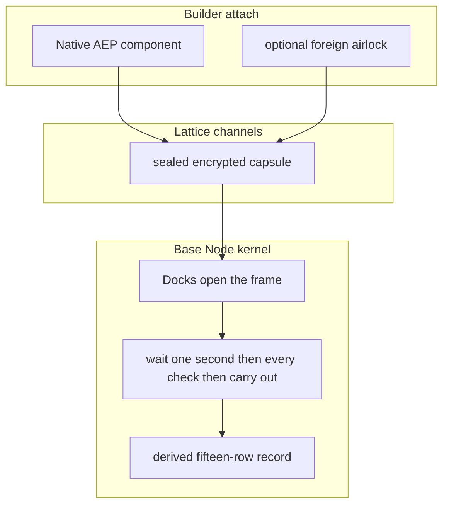
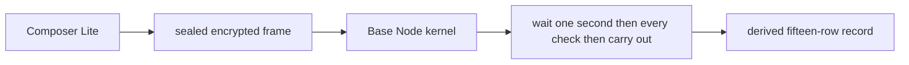
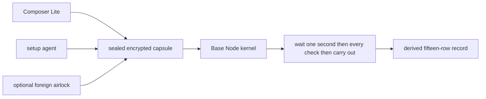
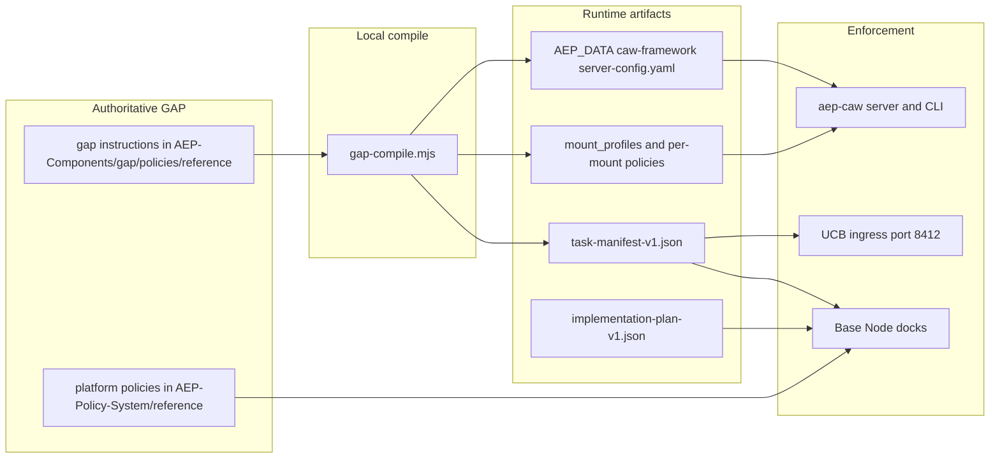

# AEP v 2.8.5 - Agent Element Protocol

**Total AI Output Control - Vertically integrated protocol for all agentic setups**

**Version 2.8.5**
**Author:** thePM_001 ([https://x.com/thePM_001](https://x.com/thePM_001))  
**Licence:** Apache-2.0  
**Public repository:** [https://github.com/thePM001/AEP-agent-element-protocol](https://github.com/thePM001/AEP-agent-element-protocol)

**AEP already had 32 Github stars before Grok "accidentally" deleted them on 22.07.2026 !**
**AEP 2.9 is estimated for completion approximately in September 2026 with many new changes and additional features.**

**How to best explore the basics of AEP ? - Simply copy the repo URL into your LLM chat of choice that has internet search capability (Grok, Gemini, ChatGPT, Opus, etc.) and let the AI explain it to you.**

**[AEP secure deployment guide](AEP-User-Experience/docs/AEP-2.8-SECURE-DEPLOYMENT-GUIDE.md)**

---

## What AEP does

### Total AI output control

AEP (Agent Element Protocol) is an advanced deterministic mechanism for total control of AI output. An agent does not get to run a tool, change a screen, fire a workflow, call an API, move money or change infrastructure until the Base Node, the local kernel, allows that output. Unapproved model output stays unapproved and does not become a live action, when it violates the policies encoded in your AEP policy hyperlattice.

### Every surface the agent can touch

The control mechanism sits in front of interfaces, workflows, REST APIs, event systems, infrastructure as code, smart contracts and agent commerce. The AI proposes work, AEP validates it and only compliant output executes.

## AEP Hyperlattice

One mechanism wraps around every critical application, component, system or engine. Written policy, action paths, scene topology, capability dimensions, compliance docks and sealed transport are nodes and edges in that same graph, a unified policy wrap mechanism. No other protocol has the same kind of solution.

The AEP Base Node runs every check together for that action path and only then emits the signal for the AI to carry out the allowed action. A missing scene, dock, timestamp or sequence fails automatically. 

### Node families in the hyperlattice

| Node family | Role in the hyperlattice graph |
|-------------|----------------------|
| Structure | What exists, where it sits and its depth band or domain |
| Event | Action paths: parents, constraints, who may act and over which hooks |
| Written policy | Checks bound to a wrap or to an action-path prefix. Writing and security stay on for every action |
| Regulation | Compliance modules such as EU AI Act, GDPR and SOC 2 wait on the regulation dock |
| Transport | Every crossing of the wrap is a sealed encrypted data transport capsule |
| Canvas | Visual projection of the same graph: hub, docks, agents and connectors |

### Wrap composition

```
SYSTEM (most permissive)
  |-- governance
  |-- deployment
  |-- writing
  |-- security
  |-- compliance modules
  |-- action-path nodes
SANDBOX (most restrictive)
```

All applicable nodes must pass together. Who may do what is written per agent, so agent A may perform action "X" and agent B may perform action "Y" with no rank and the isolation of execution boxes remains isolation rather than a trust rank. We have removed Trust Rings as a concept from AEP, because our mechanism is now better and enables more fine-tuned control that bioinsecure protocol designs do not match.

### One crossing path

Seal a data transport capsule, then run every check together and only then carry out the allowed action. See [Kernel pulse](#kernel-pulse) for the wait period after the capsule seal. TypeScript event helpers are not a second kernel. 


```mermaid
flowchart TB
  subgraph BUILDER[Builder attach]
    APP[Native AEP component]
    UCB[optional foreign airlock]
  end

  subgraph TRANSPORT[Lattice channels]
    LC[sealed encrypted capsule]
  end

  subgraph KERNEL[Base Node kernel]
    DOCK[Docks open the frame]
    EVAL[wait one second then every check then carry out]
    LEDGER[derived fifteen-row record]
  end

  APP --> LC
  UCB --> LC
  LC --> DOCK
  DOCK --> EVAL
  EVAL --> LEDGER
```

Operator rule: one hyperlattice declaration per governed system. Scene plus action paths plus written policy plus dock channels. Anything less is a broken wrap.

### One kernel sequence

The kernel sequence is seal, freeze, wait, collect-all Admit then Apply so live-entry is the worked scene. TypeScript processEvent is not product Admit and CodeSandbox executes agent code as a named live surface. The domain you attach is not a second kernel so the instruction is the next section.

## Custom sub-lattices inside the AEP hyperlattice

A custom sub-lattice is the domain you attach onto one AEP hyperlattice wrap so Base Node can judge what an agent may propose in your field of work. Total AI output control stays the product and Base Node stays the local kernel, which means a domain folder is not a second kernel and is not a shipped UI product, commerce engine, workflow runner, REST server, events bus, IaC product or MCP product. You write the domain because the kernel already exists so this section is the instruction to follow in order and a missing piece is a broken wrap rather than a style choice.

### One wrap per governed system

One governed system gets one hyperlattice wrap. That wrap is the scene, the action paths, the written policy and the dock channels taken together. If any of those four is missing the wrap is broken and Admit has nothing complete to judge. The operator rule in the diagram above is the same sentence: scene plus action paths plus written policy plus dock channels.

Do not declare a second wrap for the same system in order to sneak around a closed wall. A finance wrap GAP item does not close an inventory wrap ping. A non-always-on GAP with an empty wrap does not fold onto every event.

### What you write and where it lives

You own the domain files. Put them in a folder you control, for example `records/` and point dynAEP `aep_sources` at that folder so the public library does not have to ship your domain.

| File you write | Role | Authority |
|----------------|------|-----------|
| Scene graph (`scene.json`) | Structure: what exists, where it sits and how deep it may go | Topology only |
| Registry (`registry.yaml`) | Behaviour: operations, types, fields, states and constraints | Names what may be proposed |
| Theme (`theme.yaml`) | Skin: colours, fonts and spacing bound only through `skin_binding` | Look only. No operations |
| Action lattice (`lattice.yaml`) | Event nodes: `action_path`, parents, constraints and `agent_may` | Partial order of moves |
| GAP instruction (`records.gap`) | Written policy: who may do what, bound to a wrap or an action-path prefix | Live Admit walls |
| Dock bind | Transport: sealed encrypted capsules into Base Node docks | No unsealed work |

Structure is the scene graph. Behaviour is the registry. Skin is look only and must not carry authority. Each move an agent is allowed to propose is an `action_path` node on the hyperlattice. GAP policy writes who may do what. Dock channels accept sealed capsules only.

Point the runtime at your files:

```yaml
aep_sources:
  scene: "./records/scene.json"
  registry: "./records/registry.yaml"
  theme: "./records/theme.yaml"
```

Changing look must not require changing operations. Changing an operation must not require changing colours. If one change forces you to edit scene and registry and theme together, the split is broken and you should fix the split before you attach.

### Structure: the scene graph

The scene graph is a flat object keyed by element id. Every element has a type, a parent (except the root shell), a depth band, a visibility flag and a layout rule. The scene is the source of truth for what exists. CSS, if you render a canvas, derives from it.

Element ids use a two-letter prefix and a zero-padded number (`SH-00001`, `PN-00001`, `CZ-00001`). Agents do not mint ids because the bridge mints ids so two agents cannot collide. A typical depth split is shell `0-9`, panel `10-19`, component `20-29`, cell zone `30-39`, overlay `60-69`, modal `70-79` and tooltip `80-89`. A tooltip must not sit in the shell band. A panel must not sit in the tooltip band. The validator rejects a stolen band.

Every element except the root shell must name a parent that already exists in the same scene. Children stay inside their parent. A missing parent, a cycle or an unknown prefix is a structural reject before any action runs.

```json
{
  "aep_version": "2.8.5",
  "schema_revision": 1,
  "elements": {
    "SH-00001": {
      "id": "SH-00001",
      "type": "shell",
      "label": "Records shell",
      "z": 0,
      "visible": true,
      "parent": null,
      "layout": { "width": "100vw", "height": "100vh" },
      "children": ["PN-00001"]
    },
    "PN-00001": {
      "id": "PN-00001",
      "type": "panel",
      "label": "Records list",
      "z": 10,
      "visible": true,
      "parent": "SH-00001",
      "children": ["CZ-00001"]
    },
    "CZ-00001": {
      "id": "CZ-00001",
      "type": "cell_zone",
      "label": "Record rows",
      "z": 30,
      "visible": true,
      "parent": "PN-00001",
      "children": []
    }
  }
}
```

If your domain is not a screen, you still write a scene. The scene is the map of what exists in the governed system: records, queues, endpoints, machines and ledgers. Depth bands then name isolation instead of pixels. A missing scene is a missing wrap piece.

### Behaviour: the registry

The registry names every valid operation, type, field and constraint. It contains no visual properties. Styling is delegated through `skin_binding`. An agent may only propose an operation that exists in this registry. Unknown operations deny.

Each entry needs a label, a category, a function, a parent when it is a scene element, a `skin_binding` when it renders, the states it may occupy, the actions it may emit and the constraints it must keep. Template entries cover repeating rows so you prove the mould once rather than every instance.

```yaml
aep_version: "2.8.5"
schema_revision: 1

create_record:
  label: "Create record"
  category: action
  function: "Insert a new record with a title and an owner."
  actions: ["records:create"]
  constraints:
    - "title is required and non-empty"
    - "owner must be a registered agent_id"
    - "Must not set archived on create"

archive_record:
  label: "Archive record"
  category: action
  function: "Archive an existing record after it has been created."
  actions: ["records:archive"]
  constraints:
    - "record_id is required"
    - "record must already exist"
    - "Must not archive twice"
```

When a proposal fails, return a specific error so the agent can correct that field. Do not return a generic fail and do not retry the same payload.

### Skin: look only

The theme file holds colours, fonts, spacing, borders and motion. Components reference it through `skin_binding`. The theme must not name operations, who may act, parents or docks. If a colour file can allow or deny an action, authority has leaked into skin and the wrap is broken.

```yaml
aep_version: "2.8.5"
schema_revision: 1
theme_name: "Records quiet"

colours:
  bg_primary: "#0D1117"
  accent: "#58A6FF"
  error: "#F85149"

component_styles:
  panel_main:
    background: "{colours.bg_primary}"
  button_primary:
    background: "{colours.accent}"
```

To rebrand, swap the theme and leave scene and registry untouched.

### Action paths

Every move an agent may propose is an `action_path` node. The lattice says which actions exist, what must happen before each action (parents), which constraints apply at arrival and which agents may perform the action. An action cannot proceed until every parent has been satisfied. That partial order is how you stop archive-before-create, pay-before-risk or apply-before-Admit.

```yaml
aep_version: "2.8.5"
lattice_revision: 1

actions:
  records:create:
    label: "Create a record"
    category: agent_action
    parents: []
    children: ["records:archive"]
    constraints:
      - type: required_field
        field: title
        description: "A record must carry a title"
      - type: required_field
        field: owner
        description: "A record must name an owner agent_id"
    agent_may: ["clerk"]

  records:archive:
    label: "Archive a record"
    category: agent_action
    parents: ["records:create"]
    children: []
    constraints:
      - type: required_field
        field: record_id
        description: "Archive needs the id minted on create"
    agent_may: ["archivist"]
```

`agent_may` on the lattice node is the same who-may idea as GAP. Empty grants close the action. Rank rings are not the Admit floor. Agent A may create and agent B may archive with no rank between them.

### Written policy (GAP)

GAP is the written instruction that becomes a live Admit wall after a sealed capsule. Keep `.gap` as UTF-8 source with one instruction per document. Writing and security are always-on stems and they evaluate on every action path. Other walls bind to a wrap or to an `action_path_prefix` so a records wall does not close a payments ping.

Who-may is `agent_may` so an empty grant list closes that agent's action. `trust_ring` is a documentary label and rank use warns then denies while who-may stays `agent_may`.

```yaml
address:
  domain: app.records
  id: records-wrap.v1

pattern: |
  Clerk may create and update records. Archivist may archive. No other agent may.

action:
  type: structured
  schema: RecordProposal
  structured_generation: true
  content: |
    Propose records:create or records:archive against the records registry.
    Do not execute until Base Node Admit allows the output.

metadata:
  version: "1.0.0"
  agent_may:
    - agent_id: clerk
      action: records:create
    - agent_id: archivist
      action: records:archive
  wrap: records
  action_path_prefix: records

types:
  RecordProposal:
    format: json
    fields:
      action_path: string
      title: string
      owner: string
      record_id: string
```

Load the GAP file with the policy lattice (`AEP-Policy-System/SETUP.md` and `AEP-Components/gap/README.md`). Live evaluation still waits for freeze-at-seal, the 1000 ms kernel pulse and collect-all walls. Attractors in Lattice Memory are forensic records so they do not skip Admit.

### Dock channels

Every crossing of the wrap is a sealed encrypted lattice-channel capsule. Native AEP clients seal the frame and hand it to Base Node docks. Foreign stacks may use the optional UCB airlock with a task manifest. They must not open raw dock sockets and they must not send unsealed work. A missing dock, timestamp or sequence fails automatically.

See [`AEP-Docks/README.md`](AEP-Docks/README.md) and [`AEP-Components/lattice-channels/`](AEP-Components/lattice-channels/) for the wire. This how-to does not replace those specs and only states the wrap rule: no dock channel, no wrap.

### The attach pattern

Write the domain as four jobs that stay in this order.

First, name the valid operations, types, fields and constraints in the registry and on the action lattice. Second, check every agent-proposed action against that registry and against parent closure. Third, when the proposal fails, return a specific error so the agent can correct the field, the parent or the grant. Fourth, execute only after Base Node Admit allows the output.

Keep the registry stateless. The caller passes execution state in (the current record, the current cart, the current graph). Your checker does not hold the live store.

Your domain check may reject a payload before it is sealed. That is useful because an unknown `action_path` should never waste a capsule. The domain check may not skip Admit so execution happens only after Base Node allows the output. TypeScript `processEvent` is not product Admit and CodeSandbox executes agent code as a named live surface rather than a second kernel.

Rejection bodies should be specific:

| Failure | Error the agent should see |
|---------|----------------------------|
| Unknown operation | `unknown_action: records:delete is not in the records registry` |
| Missing field | `missing_field: title is required on records:create` |
| Parent not satisfied | `parent_unsatisfied: records:archive requires records:create` |
| Empty or wrong grant | `agent_may: clerk may not records:archive` |
| Skin tried to deny | `skin_has_authority: theme must not name operations` |
| Admit closed | `admit_denied: collect-all closed this capsule; execution must not run` |

The agent reads the error, fixes that parameter and retries. It must not retry the same payload.

### Kernel sequence you cannot skip

The kernel sequence is seal, freeze, wait, collect-all Admit then Apply. After the capsule is opened, Base Node freezes the clock at seal time, waits 1000 ms (compiled `PULSE_MS`, not a dynAEP yaml key), then runs every bound check together and only then carries out the allowed action. live-entry is the worked scene and a derived ledger of fifteen named rows records that evaluation so the ledger is not a second pass which can skip the wait.

See [Kernel pulse](#kernel-pulse) for how the wait can be changed in theory (rebuild Base Node). TypeScript dynAEP remains a standalone component and does not own this wait.

### Worked example: a records domain

Suppose you govern a records inbox. Clerk may create a record. Archivist may archive a record that already exists. No one else may. You create `records/` with the scene, registry, theme, lattice and GAP files above. You point `aep_sources` at that folder. You load `records.gap` so wrap `records` and prefix `records` are bound. You run Base Node so docks accept sealed capsules.

Walk a clerk proposal `{ "action_path": "records:create", "owner": "clerk" }` with no title. The registry check returns `missing_field: title is required on records:create` before a capsule is sealed. The clerk retries with a title. The lattice parent list is empty so create may proceed. GAP `agent_may` lists clerk on `records:create` so the wall does not close. The client seals a lattice-channel capsule. Base Node freezes, waits 1000 ms, runs collect-all Admit and Apply. Only then does your executor insert the row and the bridge mints `record_id`.

Walk an archive before create. The lattice parent `records:create` has not been satisfied so the checker returns `parent_unsatisfied` and nothing is sealed.

Walk a clerk who proposes `records:archive`. GAP `agent_may` does not grant clerk that action so Admit closes even if the registry shape is valid. Execution must not run.

Walk a theme file that lists `actions: ["records:create"]`. That is skin carrying authority so reject the theme and fix the split.

That is the whole attach: files you own, checks you write, kernel you do not replace.

### What not to do

Do not stand up a parallel runtime that opens unsealed work and do not treat extra domain folders as extra layers of the library, because the library count is the four-row table of kernel, protocol, execution companion and clients. Do not skip Admit because a domain checker already liked the payload and do not let TypeScript `processEvent` pose as product Admit. Do not put who-may rules in the theme, do not mint element ids in the agent, do not bind a payments GAP wall to an empty wrap and expect it to police records and do not point `aep_sources` at a folder you do not own and then call that your domain.

### Attach checklist

- [ ] One wrap declared for this governed system
- [ ] Scene graph present, rooted, parents closed and depth bands kept
- [ ] Registry names every operation, type, field and constraint
- [ ] Theme has look only and no operations
- [ ] Action lattice names `action_path` nodes, parents, constraints and `agent_may`
- [ ] GAP instruction binds `wrap` or `action_path_prefix` and lists `agent_may`
- [ ] Writing and security stems stay on
- [ ] Dock channels take sealed capsules only
- [ ] Domain checker returns specific errors
- [ ] Registry stays stateless
- [ ] Execution runs only after Base Node Admit
- [ ] `aep_sources` points at your folder
- [ ] A missing title, a skipped parent, a wrong agent and a skipped Admit each fail in test

## Architecture

**Base Node is the kernel and everything else is a runtime installer or a protocol component.**

AEP 2.8 is a **reference protocol library**: a set of working components that a builder can take and attach, not a live wired product that runs by itself. The work those components describe is performed in the Base Node, the local kernel that opens each message and runs the checks. Messages travel as a sealed lattice frame, an encrypted capsule on the lattice channel transport wire. After that capsule is opened, the Base Node freezes the clock at seal time, waits 1000 MS, then runs every check together and only then carries out the allowed action. A derived ledger of fifteen named rows records that evaluation so a later reader can see what was checked; that ledger is not a second pass which can skip the wait.


```mermaid
flowchart LR
  UI[Composer Lite]
  LT[sealed encrypted frame]
  BN[Base Node kernel]
  EVAL[wait one second then every check then carry out]
  LEDGER[derived fifteen-row record]
  UI --> LT
  LT --> BN
  BN --> EVAL
  EVAL --> LEDGER
```

| Layer | What it is | Canonical path |
|-------|------------|----------------|
| **Kernel** | Mandatory local governance daemon | [`AEP-Base-Node/`](AEP-Base-Node/) |
| **Protocol** | Runtime protocol components (dynAEP, lattice-channels, graph-engine). Not CAW | [`AEP-Components/`](AEP-Components/) |
| **Execution companion** | CAW host sandboxes. Not a protocol component | [`AEP-Components/caw-framework/`](AEP-Components/caw-framework/) |

The library is counted by this layer table. Folder count is not the library count.

### Other surfaces in this tree

| Surface | What it is | Path |
|---------|------------|------|
| Hyperlattice wrap | One mechanism per system | [`AEP-Components/hyperlattice/`](AEP-Components/hyperlattice/) |
| Docks | UCD egress airlock and optional UCB | [`AEP-Docks/`](AEP-Docks/) |
| UCB airlock (optional) | Foreign MCP or HTTP attach only | [`AEP-Docks/ucb/`](AEP-Docks/ucb/) |
| Connectors | Application connectors | [`internal-sdk/AEP-Connectors/`](internal-sdk/AEP-Connectors/) |
| Coding governance | Propose a change then lock it | [`AEP-Components/coding-governance/`](AEP-Components/coding-governance/) |
| HCSE parser | aep-hcse parser MCP | [`AEP-Components/hcse/`](AEP-Components/hcse/) |
| CCA agent | Central Setup Agent | [`AEP-Components/cca/`](AEP-Components/cca/) |
| Operators | Agent Composer Lite and harness | [`AEP-Composer-Lite/`](AEP-Composer-Lite/) |
| Policy | GAP nodes and subprotocol validators | [`AEP-Policy-System/`](AEP-Policy-System/) |
| Multi-base-node (2.8b) | Federate multiple Base Node kernels | [`AEP-Base-Node/multi-base-node/`](AEP-Base-Node/multi-base-node/) |

### How a message is judged

Every opened transport capsule must receive a positive or negative evaluation. The lattice memory stores those results as frozen records for forensic reading (a later audit) and for health telemetry, as well as for performance enhancement reasons. Looking similar to a past allow is not proof that this message is allowed. Those stored records do not skip the check. The research paper in this repository holds the formal specification.

Schema Builder and Policy Builder study how rules connect and how complete they are so governance itself stays governed.

### Evaluation chain (reference)

To attach: open a sealed capsule, freeze the clock at seal, then run every check together and only then carry out the allowed action. Fifteen named rows are a derived ledger of that evaluation, a record written from the check rather than a second pass. All fifteen rows are judged together. If two fail, both are listed with wall ids, reasons and a prescribed repair for missing fields and writing. Grant lists stay off that repair and a retry must seal a new capsule because the order of the rows does not change yes or no and skip is not used.

The table below is that derived fifteen-row ledger.

| Step | Name | Description |
|------|------|-------------|
| 0 | Task scope | Action within subtask scope |
| 1 | Session state | Session active and valid |
| 2 | Who may act | This agent is written as allowed to do this action |
| 3 | System rate limit | Planetwide cap not exceeded |
| 4 | Session rate limit | Per-session cap not exceeded |
| 5 | Intent drift | Action aligns with baseline behaviour |
| 6 | Escalation | Higher authority required |
| 7 | Covenant evaluation | Permit, forbid and require rules |
| 8 | Rego check | Environment forbidden patterns |
| 9 | Capability | Written capabilities. A numeric trust score does not skip the check |
| 10-14 | Scanners + lattice + perception | Content scanners, dynAEP lattice, perception bounds |

### How a builder uses it

The installation wizard starts Base Node first so the setup agent has a kernel to talk to.

After a sealed capsule is opened, that kernel waits then runs every check together. See [Kernel pulse](#kernel-pulse) for the compiled wait and how it can be changed in theory.

Composer Lite (the visual canvas) and the setup agent seal each message as an encrypted capsule on the wire. The setup agent reads the list of attachable components, writes a deployment plan and turns those components on under one wrap so scene, action path, written policy and channels are checked together.

CAW sandboxes, the AEP-native host execution boxes for coding agents and all other agentic processes apply those written policy profiles on the machine. See [GAP-centric policies and CAW sandboxes](#gap-centric-policies-and-caw-sandboxes). Host command work can run inside those boxes when the setup agent enables them; they are not a substitute for dynAEP, the standalone hyperlattice runtime component.

Connectors and language clients use that same sealed transport. The Universal Connect Bridge (UCB) is an optional inbound data airlock for foreign tools and it checks the tool contract before anything enters. The HCSE parser, which builds a symbol graph of the code, arrives through the outbound airlock.

Coding governance proposes a change, measures how far that change reaches and only then locks it on the same wrap. Docks accept only sealed capsules because policy loads when Base Node starts and lattice paths plus docks refuse anything that is not a sealed frame.

---

## Canonical repository layout (2.8.5)


| Directory | Role |
|-----------|------|
| [`AEP-Base-Node/`](AEP-Base-Node/) | Kernel: daemon, registry, POTOMITAN, agent-control-extreme |
| [`AEP-Components/`](AEP-Components/) | Protocol components (dynAEP, lattice-channels, graph-engine, aep-comm, economics, scanners, fleet) |
| [`AEP-Components/caw-framework/`](AEP-Components/caw-framework/) | Execution companion: CAW host sandboxes. Not a protocol component |
| [`AEP-Composer-Lite/`](AEP-Composer-Lite/) | Agent Composer (Composer Lite): WASM visual canvas on port: 8424 |
| [`AEP-User-Experience/`](AEP-User-Experience/) | Harness, operator scripts, AEP-main-skill |
| [`internal-sdk/AEP-Connectors/`](internal-sdk/AEP-Connectors/) | Application connectors (Slack, Jira, AWS, …) |
| [`AEP-Docks/`](AEP-Docks/) | UCB + UCD socket dock specs and servers |
| [`AEP-Policy-System/`](AEP-Policy-System/) | GAP policies, presets, policy-builder, schema-builder |
| [`AEP-Research-Paper/`](AEP-Research-Paper/) | DAL-AEP research paper assets (PDF + OTS proof) |

Root keeps only workspace tooling: `Cargo.toml`, `Dockerfile`, `docker-compose.yml`, `docker-compose.public.yml`, `.env.example`, `CHANGELOG.md`, `LICENSE`, `BIOSECURITY.md`, `vitest.config.ts`.

---

## Multi-base-node (2.8b)


Govern multiple AEP Base Node kernels from a single `nodes.json` v2 registry: roles (`primary`, `replica`, `edge`, `science-isolated`), policy bundle Merkle sync over lattice channels, and optional Agentstream topologies (`as-single`, `as-federated` with ASIP).

| Resource | Path |
| --- | --- |
| Feature guide | [`AEP-Base-Node/multi-base-node/docs/multi-base-node-28b.md`](AEP-Base-Node/multi-base-node/docs/multi-base-node-28b.md) |
| Architecture diagram | [`AEP-Base-Node/multi-base-node/docs/multi-base-node-28b-architecture.svg`](AEP-Base-Node/multi-base-node/docs/multi-base-node-28b-architecture.svg) |
| Registry schema | [`AEP-Base-Node/registry/schemas/nodes-registry-v2.json`](AEP-Base-Node/registry/schemas/nodes-registry-v2.json) |
| Rust crate | [`AEP-Base-Node/multi-base-node/crate/`](AEP-Base-Node/multi-base-node/crate/) |

```bash
cargo test -p multi-base-node-core
```

---

## LatticeChannel security (mandatory)

Every software development kit, editor, wizard, setup agent and runtime module talks to protocol components only through Lattice Channels: docking sockets carry sealed encrypted capsules and nothing else.

A plain ping, event or register message on the wire is rejected and logged as a side-channel anomaly, meaning an attempt to skip the sealed capsule.

Scene proof at boot checks that the scene graph is structurally valid. That boot proof is not the runtime check. Actions after a sealed capsule is opened are judged in the Base Node kernel.

After the seal is verified, the writing scan and the capsule-hash replay, the capsule waits one second on the Base Node clock. Time is frozen at seal so that one-second hold still fits inside 50 ms of allowed clock drift. A capsule older than five seconds fails. Replay is keyed by the capsule hash so the same sealed bytes cannot be judged twice as a new event.

### Kernel pulse wait

The one-second wait on this path is the kernel pulse. See [Kernel pulse](#kernel-pulse) for the compiled 1000 ms constant, why dynAEP yaml cannot change it and how a builder can change it in theory by rebuilding Base Node.

A missing scene, dock, timestamp or sequence fails the check. The destination dock may be taken from the opened frame docking port.

When the dock denies, the report names the closed walls and the reasons plus a mechanical repair for missing fields and writing. Grant lists stay off that report. A retry must seal a new capsule because replay is keyed when the capsule is first queued.

Writing walls govern output shape and are not transport security. EPSCOM writing walls stay protocol law at priority 255. Closed walls carry a class of writing, security, temporal, capability, poison or structural so a writing deny is not read as a transport failure.

Putting a capsule on the dock is not the check. After the one-second wait the client asks for the result by the capsule hash on the same dock so a deny names the closed walls and an allow returns an event id.

Base Node can run in a container or sit next to an AEP Validation Engine module. Language clients share one sealer for that capsule; they do not open a private back door.


```mermaid
flowchart LR
  UI[Composer Lite]
  CCA[setup agent]
  UCB[optional foreign airlock]
  LT[sealed encrypted capsule]
  BN[Base Node kernel]
  EVAL[wait one second then every check then carry out]
  LEDGER[derived fifteen-row record]
  UI --> LT
  CCA --> LT
  UCB --> LT
  LT --> BN
  BN --> EVAL
  EVAL --> LEDGER
```

| Path | Wire format | Notes |
|------|-------------|-------|
| Docking ports | sealed frame only | Plain ping, event and register rejected |
| WASM sandbox | Unix socket `wasm_sandbox` | Evaluate via seal, record and capsule hash |
| Outbound HTTP | Lattice-gated via inference dock | Audit frame before fetch |
| Optional foreign airlock | HTTP/MCP on `:8412` | Only for non-AEP foreign stacks. API-key auth; manifest required; no fallback synthesis |
| Policy | lattice-channel mandatory at boot | Strict lattice at runtime |

## Kernel pulse

Two compiled clocks live in `aep-base-node-pulse`. Pulse hold is the wait after a sealed capsule (the encrypted frame on the wire) is opened: Base Node freezes the clock at seal, waits 1000 ms, then runs every check together and only then carries out the allowed action. Putting a capsule on the dock is not that check because after the wait the client asks for the result by the capsule hash so a deny names the closed walls and an allow returns an event id. Allowed clock drift is 50 ms against the freeze which is why a 1000 ms hold still meets drift while a capsule held longer than five seconds is aged out.

Wire sent_at freshness is the other clock. Before open, `frame_is_fresh` checks `sent_at_unix` against `MAX_FRAME_AGE_SECS` (300) and `MAX_FRAME_FUTURE_SKEW_SECS` (60). The wire window is wider because it covers transit before open while pulse age covers hold after freeze so five seconds of pulse age is not the 300 second wire window.

### This wait is not a dynAEP setting

The wait is a compiled kernel constant of 1000 ms. It is not an environment variable and it is not a dynAEP yaml key. TypeScript dynAEP remains a standalone component and does not own this wait. The 1000 ms NTP LARGE_STEP figure in dynAEP timekeeping is a clock-sync cap rather than this kernel wait so LARGE_STEP must not be treated as this wait.

### How the wait can be changed in theory

A builder who wants a different wait rebuilds Base Node with a different compiled pulse length. Freeze-at-seal stays so the hold is judged against the freeze rather than a moving clock. Allowed drift is not set to the wait length so `MAX_DRIFT_MS` must not be set to 1000. The five-second age stays longer than the wait or capsules would expire before they became ready so pulse age 5000 must not be replaced with 300 seconds. This is a kernel rebuild rather than a yaml or env toggle and the 300 second wire window stays a separate compiled pair.

## What is new in 2.8 compared to 2.75 (from May 2026)


| Component | Path | Purpose |
|-----------|------|---------|
| **AEP Base Node** | `AEP-Base-Node/crate/` | Mandatory local governance daemon with docking ports, compiled 1000 ms kernel pulse (not a dynAEP yaml key) and freeze-at-seal time |
| **Lattice Channels** | `AEP-Components/lattice-channels/crate/` | PQEncryptedCapsule frames (ML-KEM + AES-256-GCM + ML-DSA) |
| **AgentMesh** | `AEP-Components/agentmesh/crate/` | Local issuance X.509, DID and mTLS identity on lattice transport |
| **Lattice Memory** | `AEP-Components/lattice-memory/crate/` | Attractor store (sqlite-vec + USearch) for forensic and health telemetry. Attractors do not skip Admit |
| **POTOMITAN** | `AEP-Base-Node/potomitan/` | Mesh fallback when normal internet is unavailable |
| **dynAEP 1.0** | `AEP-Components/dynAEP/` | Hyperlattice runtime: `action_path` filter, temporal authority, bridge (merged from standalone repo) |
| **Installation Wizard** | `AEP-Components/wizard/install-wizard.mjs` + **visual UI** at `/install` on Composer Lite | Phase 1 Base Node installer (CLI + web wizard) |
| **Setup Agent** | `AEP-Components/cca/setup-agent.mjs` | Post-install activation and inference config |
| **Agent Composer (Composer Lite)** | `AEP-Composer-Lite/` | Experimental WASM composer canvas (`:8424`) for operator extension |
| **Component registry** | `AEP-Base-Node/registry/` | Offline catalog + optional extension merge |
| **Conformance runner** | `AEP-Components/conformance/` | CC-01..CC-15 public tier compliance battery |
| **WASM sandbox** | `AEP-Components/wasm/crate/` | Policy eval via lattice socket (no HTTP bypass) |
| **UCB (optional)** | `AEP-Docks/ucb/` | Universal Connect Bridge for **foreign** stacks only (`:8412`). Native AEP skips UCB. Set `UCB=0` to disable. |
| **CAW framework** | `AEP-Components/caw-framework/` | Execution-layer sandbox (`aep-caw`); profiles authored in GAP, compiled locally |
| **GAP language** | `AEP-Components/gap/` | Governed Agentic Programming: policies, sandbox profiles, manifest/plan templates |

---

## Protocol feature catalog

The tables below name working protocol parts a builder can attach. They are components in this library, not a live wired product.

### Governance and control

| Feature | Component path |
|---------|----------------|
| evaluation-chain (derived 15-row ledger) | `AEP-Components/evaluation-chain/crate` |
| 11 content scanners (PII, secrets, injection, jailbreak, toxicity, URLs, data quality, predictions, brand, regulatory, temporal) | `AEP-Components/scanners/` |
| GAP capability dimensions (Agent A may X. Agent B may Y. No rank) | `AEP-Components/gap-capability-dimensions/` |
| Evidence ledger (SHA-256 hash chain + Merkle proofs) | `AEP-Components/evidence-ledger/` |
| Kill switches and rollback | `AEP-Components/recovery/` |
| Covenants (permit/forbid/require) | `AEP-Components/covenant/` |
| Intent drift detection | `AEP-Components/intent/` |

### Policy system

| Feature | Path |
|---------|------|
| Live Admit GAP files | `AEP-Policy-System/reference/` |
| Policy Builder (invariant detection, Rego generation) | `AEP-Policy-System/policy-builder/` |
| Schema Builder (optional study tool; not wired to the CCA agent or Docker) | `AEP-Policy-System/schema-builder/` |
| OPA Rego + Cedar transpilers | `AEP-Components/policy-engine/` |
| YAML policy importer | `AEP-Components/policy-engine/lib/policy/importer/` |
| Built-in presets (strict, standard, relaxed, audit) | `AEP-Policy-System/*.policy.yaml` |

### Agent operations

| Feature | Path |
|---------|------|
| Agent identity (Ed25519, challenge-response) | `AEP-Components/identity/` |
| Data permission system | `AEP-Components/permissions/` |
| Fleet governance (limits, cost caps, drift) | `AEP-Components/fleet/` |
| Multi-agent collaboration (supervisor, debate, delegation) | `AEP-Components/fleet/lib/collaboration/` |
| Model gateway (governed LLM calls, streaming abort) | `AEP-Components/model-gateway/` |
| CAW execution sandboxes (shell, file, network, LLM proxy) | `AEP-Components/caw-framework/` |
| Recovery engine (soft violation retry) | `AEP-Components/recovery/` |
| Interactive assistant | `AEP-Components/aepassist/` |

### Cost economics

Nine modules under [`AEP-Components/economics/lib/`](AEP-Components/economics/):

| Module | Role |
|--------|------|
| `balance.ts` | Provider-weighted, balanced-latency, model-weighted, model-latency strategies |
| `model-mapping.ts` | Canonical model names to provider-specific IDs |
| `pricing.ts` | Embedded per-million-token price catalog (10+ providers) |
| `cost-estimator.ts` | Pre-dispatch token and micro-USD estimation |
| `budget.ts` | Deny/warn/quota modes with daily/monthly rotation |
| `x402.ts` | HTTP 402 nanopayment verify/settle (exact/upto/batch-settlement) |
| `concurrency.ts` | Token-based semaphore against cost spikes |
| `fallback.ts` | Health-monitored provider failover |

Harness reference: `AEP-User-Experience/harness/`. **Wired:** `GovernedModelGateway` accepts `economics` deps (price catalog, budget, concurrency, fallback) via `economics/lib/gateway-integration.ts`.

### Security and infrastructure

| Feature | Path |
|---------|------|
| MCP security gateway | `AEP-Components/mcp-security/` |
| Intercept proxy | `AEP-Components/intercept/` |
| Merkle-tree audit / proof bundles | `AEP-Components/proof-bundle/` |
| OTEL telemetry | `AEP-Components/telemetry/` |
| Lattice crypto (PQ signatures) | `AEP-Components/lattice-crypto/` |

### Developer experience

| Tool | Path |
|------|------|
| Schema / policy builder CLIs | `AEP-Policy-System/schema-builder/`, `policy-builder/` |
| dynAEP hyperlattice runtime (bridge + filter) | `AEP-Components/dynAEP/` |

---

## AEP-Graph Orchestration

GraphEngine is the workflow runner on the AEP scene graph, meaning the map of what exists in the product. It keeps work in progress so a run can stop and later resume from a checkpoint.

### Gate before a node runs

Before a node runs, execute must pass a gate that defaults to deny so a missing gate never starts the node.

### Local step counter is not the kernel check

A local vector clock, meaning a per-graph step counter, ticks only after that gate allows. That counter is not the kernel check because Base Node still judges clock drift, age, future time, sequence and capsule-hash replay. TypeScript dynAEP remains a standalone component and GraphEngine does not replace Base Node as the kernel.

### Node types

| Type | Purpose |
|------|---------|
| Action | Execute agent tools or operations |
| Decision | Evaluate written policy for branching |
| Wait | Human-in-the-loop approval gates |
| Parallel | Concurrent execution with join synchronization |
| Loop | Cyclic execution with iteration bounds and exit conditions |

### Features

The engine can loop with bounded cycle detection and checkpoint every node so work can resume after a failure. It can wait for a human with timeout escalation, retry with configurable backoff and branch on written policy while it persists to lattice memory.

The local step counter still ticks only after the gate allows because the kernel check remains clock drift, age, future time, sequence and capsule-hash replay.

```typescript
import { GraphEngine } from "./AEP-Components/graph-engine/lib/graph/index.js";

const graph = new GraphEngine({
  entryNodeId: "start",
  admitGate: async () => true,
});
graph.addNode({ id: "start", type: "action", next: ["review"] });
graph.addNode({ id: "review", type: "decision", next: [], branches: { approve: "deploy", reject: "stop" } });
graph.addNode({ id: "deploy", type: "action", next: [] });
graph.addNode({ id: "stop", type: "action", next: [] });
graph.validate();
await graph.execute({ input: context });
```

With no gate, execute refuses to run the node and does not tick the local clock.

## AEP-Comm universal orchestration

AEP-Comm is the agent-to-agent orchestration layer. Agents use it to find each other, send work and hand a task to another agent with retry. It is a protocol component, not a second kernel. TypeScript dynAEP remains a standalone component.

### Find other agents

Each agent publishes a card that names what it can do. A registry holds those cards. A distributed hash table (an in-memory lookup that expires stale entries) plus a periodic health exchange keep the set of live peers current.

### Send work

Messages travel as a JSON-LD envelope, meaning a typed JSON document with linked-data fields, through a router that uses the lattice action path. Each agent has a priority inbox. Live sockets use WebSocket. When a socket cannot stay open, a server-sent-events path (a one-way event stream from server to client) with a POST fallback carries the same envelope.

### Hand off a task

A task moves through eight states and can push a notification when the state changes. Sensitive steps can wait for a human. Delegation picks another agent by a named capability and retries if that agent fails. Isolated code execution sits behind written policy.

### Resources and prompts

Tool resources and parameterized prompts follow the same orchestration so a tool list and a prompt template are not a side channel around the kernel check.

The component lives at [`AEP-Components/aep-comm/`](AEP-Components/aep-comm/). Evidence can sit on an optional paid Agentstream backend.

---

## Capability inventory


| Category | Count | Highlights |
|----------|-------|------------|
| Architecture | 5 | Three-layer separation, z-band hierarchy, 14 prefix types, template nodes, schema versioning |
| Evaluation chain | 5 | Rust meet of 15 walls, collect-all, no skip, attach after sealed lattice frame |
| Content scanners | 11 | PII, injection, secrets, jailbreak, toxicity, URL, data profiler, prediction, brand, regulatory, temporal |
| Governance | 8 | Who may do what per agent, covenants, drift, kill switch, rollback, hard/soft violations, presets |
| Fleet / multi-agent | 6 | Identity, fleet limits, spawn governance, message scanning, verification handshake, fleet API |
| Model gateway | 4 | Anthropic, OpenAI, Ollama, custom OpenAI-compatible |
| Cost economics | 9 | Balance routing, pricing catalog, budget, x402, concurrency, fallback, gateway integration |
| Knowledge base | 4 | Governed ingestion, scoped retrieval, anti-context-rot, CLI |
| Eval / datasets | 4 | Eval runner, versioned datasets, rule generator, prompt hashing |
| Workflow | 3 | Phased verdicts, rework limits, fine-tuning template |
| Commerce | 3 | 12 governed actions, merchant registry, spend tracking |
| **AEP Hyperlattice** | 17 | Scene validation, GAP policy nodes, `action_path` event nodes, temporal authority, causal ordering, perception gov, observer adapters, compliance LRP docks, join/meet, who may do what per agent, Lattice Channel wrap |
| AEP-Graph | 6 | Action, decision, wait, parallel, loop nodes, checkpoints, admitGate default deny |
| AEP-Comm | 14 | Agent cards, discovery, messaging, task hand-off, human gate and isolated code execution |
| Security | 4 | Hash-chained ledger, proof bundles, OTEL, reliability index (theta) |
| Builders | 2 | Schema Builder (not wired to the CCA agent or Docker), Policy Builder |
| **2.8 kernel additions** | 13 | Base Node, Lattice Channels, AgentMesh, Lattice Memory, POTOMITAN, dynAEP merge, wizard, setup agent, Composer Lite, registry, conformance, WASM sandbox and UCB |

---

## Official run sequence


Factory checks on the official tree:

```bash
cargo test -p aep-base-node --lib
cargo test -p aep-base-node --test source_invariants
scripts/gate-aep28-env-075.sh
./AEP-Components/conformance/runner/run.sh
docker compose up -d --build
```

The gate-aep28-env scripts live under `scripts/`. Docker is the packaged run path. The conformance runner is the public-tier battery.


## Quick start


### Docker (recommended)

```bash
cp .env.example .env
docker compose up -d --build
open http://localhost:8424/install
```

The **Agent Composer** serves the WASM visual canvas at `/` and the install wizard at `/install`. The setup agent configures inference and the hyperlattice wrap (GAP nodes, `action_path` registry, governance mode, dock channels).

### Coding agents (Claude Code, Cursor, Codex)

After Base Node activation, initialize governance using the **CLI baked into the Docker image**:

```bash
docker compose -f docker-compose.public.yml exec aep aep init codex
docker compose -f docker-compose.public.yml exec aep aep init claude-code
docker compose -f docker-compose.public.yml exec aep aep init cursor
```

### Local development (source build)

```bash
# Rust workspace (artifacts in rust/target/)
cargo test --workspace
cargo build --release -p aep-base-node
cargo run -p aep-base-node -- --self-test

# Installation wizard smoke (CLI)
node AEP-Components/wizard/install-wizard.mjs --non-interactive --config=/tmp/aep-wizard-test.json

# Fresh Docker test stack (isolated volume, visual install wizard)
docker compose -f docker-compose.test-fresh.yml up -d --build
open http://localhost:8524/install

# Composer Lite
AEP_DATA=/tmp/aep-data node AEP-Composer-Lite/server.mjs
open http://localhost:8424/install

# Conformance battery
./AEP-Components/conformance/runner/run.sh

```

### Using aepassist (inside Docker)

```bash
docker compose -f docker-compose.public.yml exec aep aep assist setup
docker compose -f docker-compose.public.yml exec aep aep assist status
docker compose -f docker-compose.public.yml exec aep aep assist preset strict
docker compose -f docker-compose.public.yml exec aep aep assist kill
```

---

## Key services and ports


| Service | Default port | Notes |
|---------|--------------|-------|
| Agent Composer (Composer Lite) | `8424` | Public WASM canvas and install wizard. **Not** the separate internal NLA deployment (`/composer-internal`, `:8415`/`:8416`) |
| UCB | `8412` | **Optional.** Foreign attach only. Disable with `UCB=0`. See [UCB section](#ucb-universal-connect-bridge--optional-foreign-attach) |
| WASM sandbox | `wasm_sandbox` socket | Set `WASM_SANDBOX=1` in Docker |
| Base Node sockets | `/data/aep/sockets` | Inference, validation, future, regulation docks |

---

## UCB (Universal Connect Bridge) - optional foreign attach


UCB is **not** part of the mandatory AEP kernel path. It exists for one purpose: let operators **safely attach non-AEP systems** (LangGraph, MCP servers, AutoGen, CrewAI, custom HTTP agents, etc.) to an AEP hyperlattice without giving those stacks raw lattice socket access.

**If you do not need foreign attach, do not run UCB.** Native AEP components (Composer Lite, CCA and CAW) use `lattice-transport` directly against Base Node docks. Skipping UCB is valid. Attaching foreign agents without UCB or without a task manifest is **at your own risk** - AEP will not invent a contract for you.

### What UCB does

| Capability | Description |
|------------|-------------|
| Ingress | Validate foreign payloads (P_P, P_S, P_C, P_R), translate to lattice events, seal to validation dock |
| Manifest gate | Require a real task manifest before integration |
| Egress | Manifest-scoped HTTP proxy with credential injection (`egress.routes`) |
| MCP bridge | `ucb_ingest`, `ucb_delegate`, `ucb_rollback`, `ucb_health` tools |
| Rollback | Extend-Write diff journal with lattice-gated rollback |

### What UCB does **not** do

| Anti-pattern | Why |
|--------------|-----|
| Replace `lattice-transport` for internal components | Internal hops must not route through UCB |
| Auto-generate task manifests | **No hardcoded fallback.** No `provisional_fallback`. No silent provisional contracts |
| Force itself on every deployment | `UCB=0` in Docker; omit `aep-ucb` binary if unused |
| Substitute for CAW / GAP policy | Manifest is a contract gate, not a policy author |

### Task manifest required at ingest (fail closed)

Every `POST /ucb/v1/ingest` needs a manifest from **one** of these sources:

| Priority | Source | How |
|----------|--------|-----|
| 1 | **Provided** | Include `task_manifest` on the ingest JSON body (`synthesized_by: provided`) |
| 2 | **Stored** | Reuse a previously saved non-provisional manifest for `agent_id` in `AEP_TASK_MANIFEST_DIR` |
| 3 | **Synthesis tier** | Call an HTTP endpoint you configure (all tiers optional; unset = no auto-synthesis) |

If none apply, UCB returns **422 rejected** with an explicit error. This is intentional.

Optional synthesis tiers (strict priority, first success wins):

| Tier | Mechanism | Env var |
|------|-----------|---------|
| 1 | GAP constrained decoding | `UCB_GAP_ENGINE_URL` (NLA internal / licensed only) |
| 2 | Other constrained decoding (e.g. dottxt-compatible) | `UCB_CONSTRAINED_DECODER_URL` |
| 3 | LLM structured output | `UCB_LLM_SYNTHESIS_URL` |

Tier 1 (GAP constrained decoding engine) is not shipped in the public OSS repo. Configure `UCB_GAP_ENGINE_URL` to your licensed or self-hosted tier-1 endpoint.

### Example: ingest with caller-provided manifest

```bash
curl -s -H "Authorization: Bearer $UCB_API_KEY" \
  -H "Content-Type: application/json" \
  -d '{
    "protocol": "langgraph",
    "session_id": "sess-1",
    "provenance": { "source": "langgraph", "protocol": "1.0", "session_id": "sess-1" },
    "payload": { "subject": "LangGraph", "predicate": "integrates_via", "object": "UCB" },
    "task_manifest": {
      "manifest_version": "1",
      "id": "tm-sess-1",
      "agent_id": "ucb-foreign-langgraph",
      "session_id": "sess-1",
      "intent": {
        "summary": "LangGraph integrates via UCB",
        "allowed_operations": ["ucb.ingest"]
      },
      "trust": { "tier": "standard", "max_trust_score": 500 },
      "provisional": false,
      "synthesized_by": "provided"
    }
  }' \
  http://127.0.0.1:8412/ucb/v1/ingest
```

### Example: ingest **without** manifest (rejected)

```bash
# No task_manifest, no synthesis URLs configured -> 422
curl -s -H "Authorization: Bearer $UCB_API_KEY" \
  -H "Content-Type: application/json" \
  -d '{
    "protocol": "mcp",
    "session_id": "sess-1",
    "provenance": { "source": "mcp", "protocol": "1.0", "session_id": "sess-1" },
    "payload": { "x": 1 }
  }' \
  http://127.0.0.1:8412/ucb/v1/ingest
# -> {"ok":false,"status":"rejected","error":"task manifest required: ..."}
```

### Disable UCB entirely

```bash
# Docker: foreign attach off, Composer Lite + Base Node still run
UCB=0 docker compose -f docker-compose.public.yml up -d

# Bare metal: simply do not start aep-ucb
```

Canonical implementation: [`AEP-Docks/ucb/README.md`](AEP-Docks/ucb/README.md). GAP manifest template: [`AEP-Components/gap/policies/reference/task-manifest-v1.gap`](AEP-Components/gap/policies/reference/task-manifest-v1.gap).

---

## Agent Composer (Composer Lite)


The **Agent Composer** is the operator-facing visual shell for wiring agents, docks, connectors and hyperlattice nodes on a WASM canvas. In this open-source repository it is implemented as **Composer Lite** under [`AEP-Composer-Lite/`](AEP-Composer-Lite/) and listens on port **8424**.

**Experimental by design.** The Agent Composer is a scaffold, not a finished product surface. We ship a working canvas, graph API, optional CCA chat, install wizard and registry hooks so you can **extend it on your own stack**: custom node types, sidebar blocks, integrations, themes, deployment flows and operator UX. **We do not maintain or evolve those extensions for you.** Fork the repo, build on the graph and HTTP APIs, and treat Composer Lite as your lab environment.

What we do maintain in the public tier: Base Node, lattice transport, registry, setup agent, conformance and the minimal Composer Lite core that activates against a governed Base Node.

### Canvas files (adjustable)

The visual canvas can split scene, behaviour and look into separate files a builder can adjust. Changing one file need not change the others. How to attach those files is [Custom sub-lattices inside the AEP hyperlattice](AEP-Components/hyperlattice/CUSTOM-SUBLATTICE.md).

| Layer | Responsibility |
|-------|----------------|
| Structure | Scene graph: what exists, where it sits and its depth band |
| Behaviour | Registry of operations, types, fields and constraints |
| Skin | Look only and must not carry authority |

Each element type has a fixed depth band so a shell, a panel and a tooltip cannot steal one another depth band and a violation is rejected.

| You extend | We maintain |
|------------|-------------|
| Custom canvas nodes, palettes, operator workflows | Kernel, docks, GAP, CAW, registry loader |
| Your branding, auth, multi-tenant UI | `lattice-transport`, task manifests, install wizard API |
| Foreign agent attach via UCB (optional) | Conformance battery and component installers |

**Run it**

| URL | Purpose |
|-----|---------|
| `http://localhost:8424/` | WASM node canvas |
| `http://localhost:8424/install` | Visual Base Node install wizard |

**Built-in node types (starting set)**

| Type | Role |
|------|------|
| Agent | Autonomous agent with template and PAD stage |
| Hyperlattice Hub | dynAEP funnel / PAD router on the one canvas graph |
| AEP Validation Engine Dock | Validation engine on lattice channel |
| Inference Dock | LLM routing dock |
| Connector | Application bridge into AEP |
| Storage Import / Export | Data intake and egress backends |

Implementation details: [`AEP-Composer-Lite/README.md`](AEP-Composer-Lite/README.md). Sidebar extension guide: [`AEP-Composer-Lite/docs/SIDEBAR-BLOCKS.md`](AEP-Composer-Lite/docs/SIDEBAR-BLOCKS.md).

---

## Conformance


Public tier vendors run the conformance battery before claiming AEP compliance:

```bash
./AEP-Components/conformance/runner/run.sh
```

Manifest: `AEP-Components/conformance/tests/manifest.json` (CC-01 through CC-15)

---

## GAP-centric policies and CAW sandboxes


AEP 2.8 treats **GAP** (Governed Agentic Programming) as the single authoring language for policies and agent payloads. **CAW** (`aep-caw`, `AEP-Components/caw-framework/`) is the execution-layer sandbox that enforces those policies on the host (file rules, command shims, seccomp, LLM proxy, lattice audit). You do not maintain parallel YAML policy stacks: you author in GAP, compile locally, and CAW runs the result.

### How GAP and CAW relate


```mermaid
flowchart LR
  subgraph AUTH_GAP[Authoritative GAP]
    GAPREF["gap instructions in AEP-Components/gap/policies/reference"]
    PS["platform policies in AEP-Policy-System/reference"]
  end

  subgraph LOCAL_COMPILE[Local compile]
    GC["gap-compile.mjs"]
  end

  subgraph RT_ARTIFACTS[Runtime artifacts]
    CAWCFG["AEP_DATA caw-framework server-config.yaml"]
    MOUNT["mount_profiles and per-mount policies"]
    TM["task-manifest-v1.json"]
    PLAN["implementation-plan-v1.json"]
  end

  subgraph ENFORCEMENT[Enforcement]
    CAW["aep-caw server and CLI"]
    UCBGAP["UCB ingress port 8412"]
    BN["Base Node docks"]
  end

  GAPREF --> GC
  PS --> BN
  GC --> CAWCFG
  GC --> MOUNT
  GC --> TM
  CAWCFG --> CAW
  MOUNT --> CAW
  TM --> UCBGAP
  TM --> BN
  PLAN --> BN
```

| Layer | What it is | Where it lives |
|-------|------------|----------------|
| **GAP instruction** | Declares intent, who may do what, scanners, subprotocol bindings, structured types | `*.gap` under `AEP-Components/gap/policies/reference/` and `AEP-Policy-System/reference/` |
| **GAP runtime doc** | Concrete profile payload (`kind: aep.caw.profile`) in the same `.gap` file after `---` | Second YAML document in multi-doc `.gap` files |
| **Compile** | Turns GAP into CAW `mount_profiles`, per-mount policy YAML, manifests | `AEP-Components/gap/lib/gap-compile.mjs` |
| **CAW session** | Host sandbox: policy engine, shims, optional FUSE mounts, LLM proxy | `aep-caw session create`, `run`, `wrap` |

**Rule:** JSON schemas (`task-manifest-v1.json`, `implementation-plan-v1.json`) and CAW YAML under `$AEP_DATA` are **materialized compile targets**, not places to hand-author policy.

### CAW sandbox profiles (GAP source)

Each profile is one `.gap` file with address `dev.aep.caw/<id>`. CCA picks a profile from deployment intent; you can also pass `--profile` on the CAW CLI.

| GAP file | Address | Use when |
|----------|---------|----------|
| `caw-agent-sandbox.gap` | `dev.aep.caw/agent-sandbox.v1` | Untrusted or unknown agent code; strict `agent-sandbox` base policy |
| `caw-coding-agent.gap` | `dev.aep.caw/coding-agent.v1` | **Governed coding agent** (Hermes, CCA runners, any AEP agent; see below) |
| `caw-restricted.gap` | `dev.aep.caw/restricted.v1` | Single project directory only, minimal base policy |
| `caw-dev-multi-repo.gap` | `dev.aep.caw/dev-multi-repo.v1` | Multiple repos with different mount tiers |
| `caw-compiled-runtime.gap` | `dev.aep.caw/compiled-runtime.v1` | Plan-once execute-many: LLM proxy **off**, deterministic runtime |

#### What is `coding-agent`?

Default GAP profile for **any governed coding agent** (Hermes, CCA-launched runners, custom binaries). Agent-agnostic mount layout:

1. **Workspace (`${PROJECT_ROOT}`):** read-write via `workspace-rw`. The agent edits the repo it was started in.
2. **Agent config (`${AEP_AGENT_CONFIG_DIR}`, `${HOME}/.config/agent`, `${HOME}/.local/share/agent`):** read-only via `config-readonly`. The agent can read its config to run, but cannot rewrite or exfiltrate through those paths.
3. **Base policy `default`:** standard CAW rules (not maximum-lockdown `agent-sandbox`).
4. **Who may do what:** more capable than the untrusted sandbox profile, still lattice-governed.
5. **LLM proxy on:** model calls through audited CAW proxy when enabled.

CCA maps intents like "coding agent", "Hermes", or "governed agent" to this profile. Use `agent-sandbox` for untrusted code; `compiled-runtime` when the LLM proxy must stay off.

```bash
node AEP-Components/gap/lib/gap-compile.mjs --list-profiles
node AEP-Components/gap/lib/gap-compile.mjs --materialize /data/aep
aep-caw profiles list
aep-caw session create --profile coding-agent
aep-caw wrap --profile coding-agent -- <your-agent-binary>
```

Per-mount policy templates (`workspace-rw`, `config-readonly`, etc.) are defined in `caw-mount-policies.gap` and compiled into `$AEP_DATA/caw-framework/policies/`.

Further detail: [`AEP-Components/gap/README.md`](AEP-Components/gap/README.md), [`AEP-Base-Node/agent-control-extreme/README.md`](AEP-Base-Node/agent-control-extreme/README.md).

### UCB manifest synthesis env vars (optional tiers)

Full UCB semantics (optional bridge, fail-closed ingest, no fallback): see [UCB section](#ucb-universal-connect-bridge--optional-foreign-attach) above.

```bash
# Tier 1 (NLA / licensed - production GAP engine URL provided by NLA)
export UCB_GAP_ENGINE_URL=https://<your-licensed-gap-engine>/synthesize

# Tier 2 (constrained decoder, e.g. dottxt-style HTTP service)
export UCB_CONSTRAINED_DECODER_URL=http://127.0.0.1:8080/v1/constrained/task-manifest

# Tier 3 (LLM structured output)
export UCB_LLM_SYNTHESIS_URL=http://127.0.0.1:8080/v1/structured/task-manifest
```

GAP template authority: `AEP-Components/gap/policies/reference/task-manifest-v1.gap`. Materialized JSON matches `task-manifest-v1.json`. Manifests land in `AEP_TASK_MANIFEST_DIR` (`$AEP_DATA/ucb/manifests/`). CCA plan execution can also write manifests with `synthesized_by: cca_plan`.

---

## Documentation index


| Doc | Topic |
|-----|-------|
| [`AEP-Base-Node/README.md`](AEP-Base-Node/README.md) | Base Node operator guide |
| [`AEP-Components/caw-framework/README.md`](AEP-Components/caw-framework/README.md) | **CAW execution sandboxes** (`aep-caw`, shell shim, policy engine, CCA integration) |
| [`AEP-Components/gap/README.md`](AEP-Components/gap/README.md) | GAP language, compile pipeline, CAW profile authoring |
| [`AEP-Base-Node/agent-control-extreme/README.md`](AEP-Base-Node/agent-control-extreme/README.md) | GAP capability profiles and CAW sandbox routing on Base Node |
| [`AEP-Components/dynAEP/README.md`](AEP-Components/dynAEP/README.md) | dynAEP 1.0 hyperlattice runtime protocol |
| [`AEP-Components/hyperlattice/CUSTOM-SUBLATTICE.md`](AEP-Components/hyperlattice/CUSTOM-SUBLATTICE.md) | How to attach a custom sub-lattice |
| [`AEP-Components/dynAEP/CONFIG.md`](AEP-Components/dynAEP/CONFIG.md) | dynAEP configuration reference |
| [`AEP-Composer-Lite/README.md`](AEP-Composer-Lite/README.md) | WASM canvas + CCA |
| [`AEP-Docks/ucb/README.md`](AEP-Docks/ucb/README.md) | **UCB optional foreign attach** (manifest gate, no fallback) |
| [`AEP-Policy-System/SETUP.md`](AEP-Policy-System/SETUP.md) | Live Admit GAP node setup |
| [`AEP-Policy-System/schema-builder/README.md`](AEP-Policy-System/schema-builder/README.md) | Schema Builder |
| [`AEP-Policy-System/policy-builder/README.md`](AEP-Policy-System/policy-builder/README.md) | Policy Builder |
| [`AEP-User-Experience/README.md`](AEP-User-Experience/README.md) | Harness and operator scripts |
| [`internal-sdk/AEP-Connectors/README.md`](internal-sdk/AEP-Connectors/README.md) | Application connectors |
| [`AEP-Docks/README.md`](AEP-Docks/README.md) | UCB / UCD docks |
| [`AEP-Research-Paper/README.md`](AEP-Research-Paper/README.md) | DAL-AEP paper + OTS proof |
| [`rust/README.md`](rust/README.md) | Rust workspace build |
| [`CHANGELOG.md`](CHANGELOG.md) | Version history |

---

## Research and licence


Research paper: [`AEP-Research-Paper/`](AEP-Research-Paper/) - [GitHub mirror](https://github.com/thePM001/AEP-research-paper-001)

Licensed under Apache License 2.0. See [`LICENSE`](LICENSE) and [`NOTICE`](NOTICE).

---

## AI-Eligibility Status


To win the fight against the synthetic nano-parasites (SNP/NanoSinp) alien WMD, we must be intelligent and biosecure. It is recommended that bioinsecure humans do not use the provided technology/protocol to avoid bad techno-spiritual AI outcomes for them. [*"bioinsecure" = has installed injectable synthetic nano-parasites growth medium controllers - SNP GMCs]

See also: [`BIOSECURITY.md`](BIOSECURITY.md)
